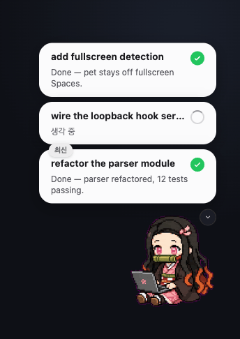
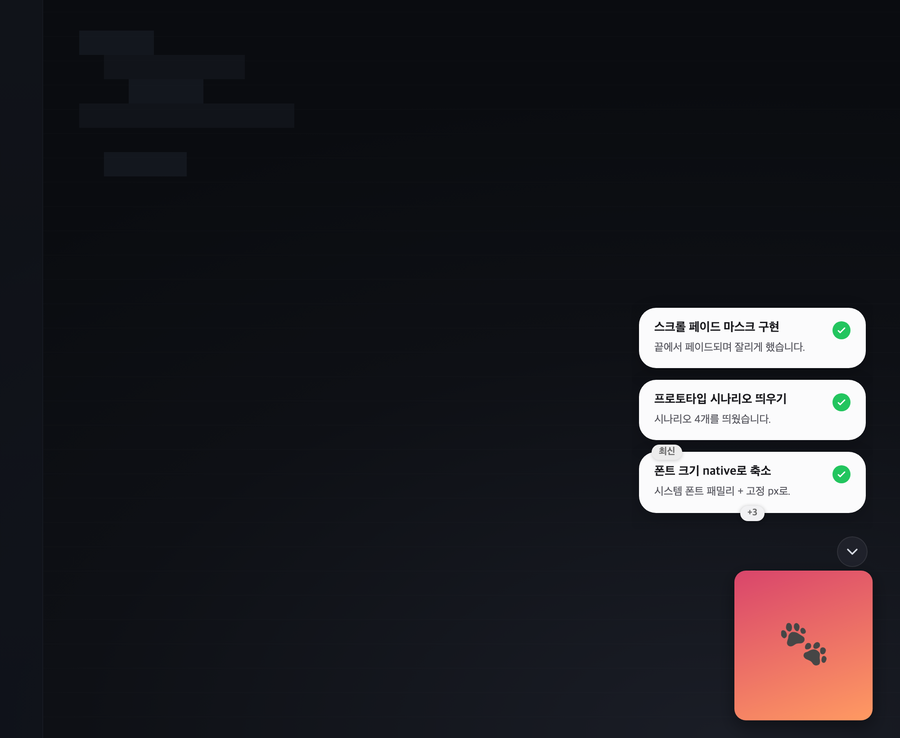
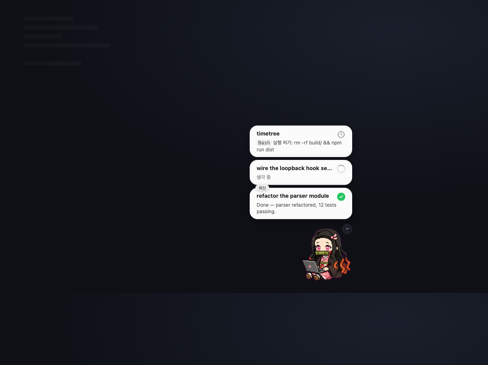

<div align="center">
  <h1>🐾 Claude-Pet</h1>
</div>

<div align="center">
  <h3>A floating desktop pet that mirrors your Claude Code session.</h3>
</div>

<div align="center">
  
  
  
  
</div>

<br>

<div align="center">
  
</div>

<br>

Claude-Pet is a floating desktop companion that turns Claude Code's live activity into a glanceable card stack — thinking, running a tool, waiting on a permission, done — and lets you reply to the agent right from the card. It recreates the OpenAI Codex desktop-pet experience for Claude Code (CLI), and is **asset-compatible** with the Codex pet ecosystem (`~/.codex/pets/`).

> [!TIP]
> Pet sprites load natively from `~/.codex/pets/`. Drop in any Codex-compatible pet and Claude-Pet animates it; with no pet installed it falls back to a 🐾.

## Install (macOS)

```bash
curl -fsSL https://raw.githubusercontent.com/amsminn/Claude-Pet/main/scripts/install.sh | bash
```

Installs (or upgrades) Claude-Pet into `/Applications` and launches it. When a newer release is out the pet shows an **Update** toast — clicking it re-runs this installer in Terminal and relaunches the app for you. You can also just **re-run the same command** any time to update.

It is delivered over `curl`, so macOS does not quarantine it and it launches with no Gatekeeper "unidentified developer" prompt (the app is free, ad-hoc-signed — not notarized). Prefer to read before you run? Fetch and inspect the script first:

```bash
curl -fsSLO https://raw.githubusercontent.com/amsminn/Claude-Pet/main/scripts/install.sh
less install.sh && bash install.sh
```

> Apple Silicon + Intel. Windows/Linux are not supported yet.

## Quickstart

```bash
npm install
npm run dev          # electron-vite dev server (HMR)
```

Build and run the packaged app:

```bash
npm run build        # bundle main / preload / renderer -> out/
npm start            # electron-vite preview
```

By default the app registers loopback HTTP hooks in `~/.claude/settings.json` so Claude Code POSTs its lifecycle events to the pet. To run the Phase 0 mock demo **without** touching your Claude config:

```bash
CLAUDE_PET_NO_HOOKS=1 npm run dev
```

## How it works

Claude-Pet is a small Electron app with a strict main / preload / renderer split, written in TypeScript and bundled with [electron-vite](https://electron-vite.org):

- **Loopback server** — receives Claude Code hook events (`POST /state`) and holds blocking permission requests (`POST /permission`) on `127.0.0.1`. Plain `node:http`, no decision is ever synthesized.
- **State engine** — a pure, electron-free reducer that turns hook events into per-session cards and one summarizing `PetState`. Fully unit-tested with `node --test`.
- **Asset loader** — discovers and validates Codex-compatible pets (paths + geometry only); pixel decoding and frame auto-detection happen in the renderer canvas.
- **Pet window** — a non-activating, always-on-top, click-through panel that floats over fullscreen apps, shows on all Spaces, and drags across monitors (tracking the global cursor so it survives mixed HiDPI scales).
- **Card stack** — the renderer paints one card per session (title, body, status icon) and sends inline replies / permission decisions back to main over IPC.

## Preview

<table>
<tr>
<td width="50%" valign="top">
  
  <br><sub>One pet summarizes many sessions — cards stack newest-last, and the oldest collapse into a <code>+N</code> overflow.</sub>
</td>
<td width="50%" valign="top">
  
  <br><sub>Approve a tool permission (or reply to the agent) straight from the card — no context switch.</sub>
</td>
</tr>
</table>

> The demo above runs the bundled mock scenarios (`prototype/`); card text is sample content. The pet shown is the built-in 🐾 fallback — drop a Codex-compatible sprite into `~/.codex/pets/` to animate your own.

## Why Claude-Pet?

- **Glanceable status** — A single pet summarizes every session: thinking, working, waiting for a permission, errored, or done — without stealing focus from your editor.
- **Reply inline** — Answer a permission prompt or send a follow-up message straight from the card; the panel briefly becomes key so you can type, then drops back to unobtrusive.
- **Codex asset-compatible** — Reuses the `~/.codex/pets/` sprite format natively, so existing Codex pets just work.
- **Multi-monitor aware** — Drag the pet anywhere across displays; it re-anchors or clamps itself on display changes so it never gets lost.
- **Clean-room, typed core** — TypeScript end to end; the state engine, asset loader, permission bridge, and server are electron-free and independently unit-tested.

---

## Documentation

The [`docs/`](docs/README.md) tree is the technical spec (docs-as-code). Start at [`docs/README.md`](docs/README.md).

- [Vision](docs/00-overview/vision.md) — what we're building and why
- [Architecture overview](docs/01-architecture/overview.md) — components and data flow
- [Codex pet asset compatibility](docs/02-asset-compat/codex-pet-assets.md) — the sprite/atlas contract
- [State machine](docs/03-state-engine/state-machine.md) — event → state → card transforms
- [Pet & cards UI](docs/04-pet-ui/pet-and-cards.md) — pixel-level UI spec
- [Claude Code hooks integration](docs/05-claude-integration/claude-code-hooks.md) — the wire protocol
- [Build plan](docs/07-implementation/build-plan.md) — phased implementation
- [Architecture Decision Records](docs/adr/) — Electron vs Tauri, clean-room backend, asset compat, reply-via-blocking-hook

## Project status

Design-locked; v1 Electron implementation in progress (Phase 0 → 2). The UI is validated against a static mock under [`prototype/`](prototype/README.md), kept in sync with the [pet & cards spec](docs/04-pet-ui/pet-and-cards.md).
