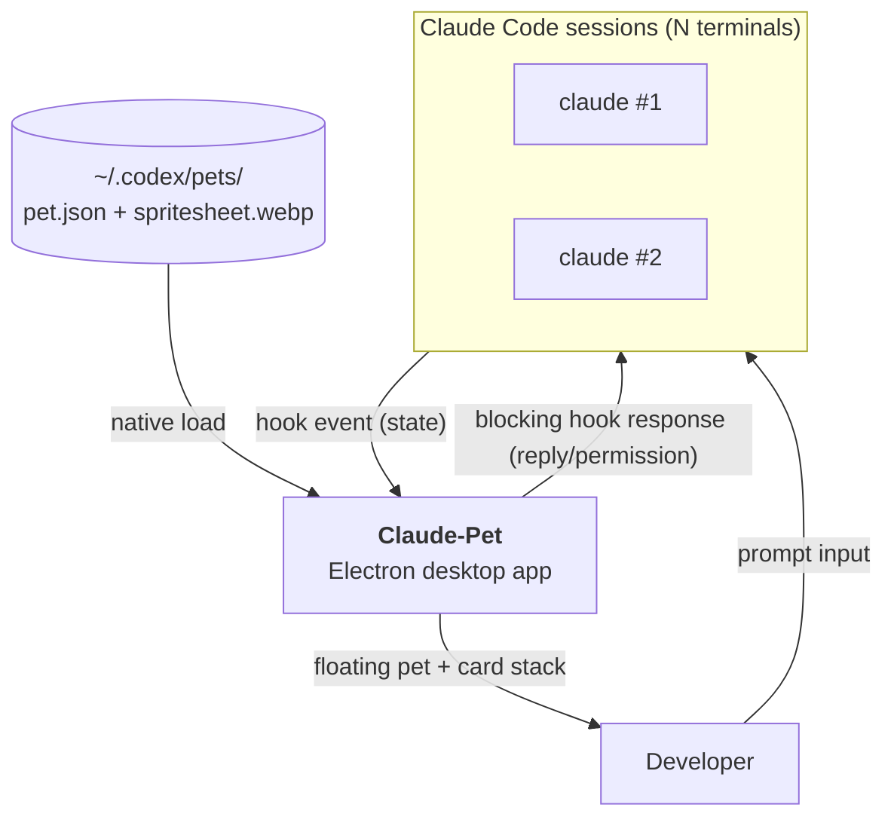
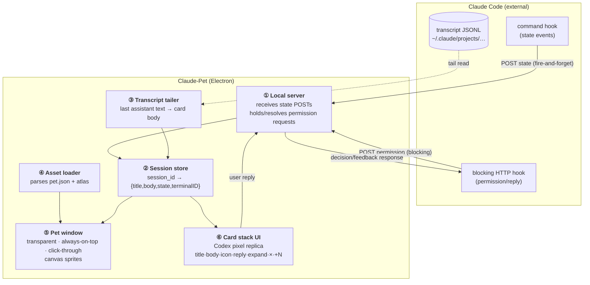
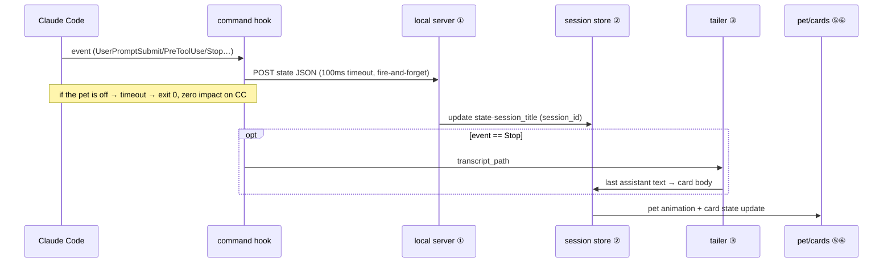
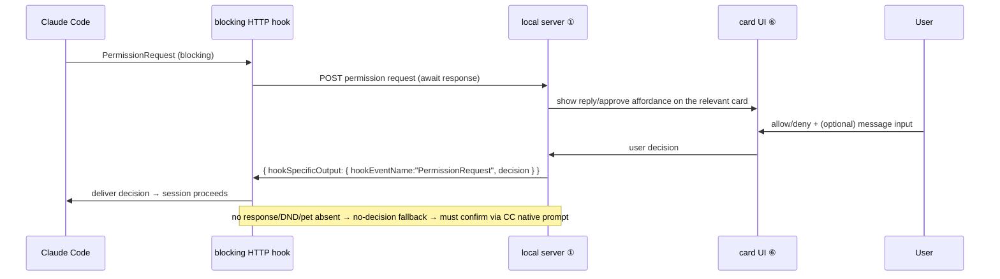

# Architecture Overview

> Basis: official [Claude Code hooks](https://docs.anthropic.com/en/docs/claude-code/hooks) and [settings](https://docs.anthropic.com/en/docs/claude-code/settings) docs, [`refs/codex-pet-ux-teardown.md`](../../refs/codex-pet-ux-teardown.md)
> Related: [ADR-0001](../adr/0001-electron-over-tauri.md), [ADR-0002](../adr/0002-backend-clean-room.md), [05-claude-integration](../05-claude-integration/claude-code-hooks.md)

This is a **single-process Electron** app. Claude Code is an external process we don't control, so all
integration arrives as **loose, harmless** one-way signals (hook → local server), and replies are sent
back only through the official back-channel of a **blocking hook response**. The backend (hooks, server,
permissions) is a clean-room implementation grounded in the **official Claude Code hooks/SDK docs**, while
our differentiating effort goes into a **Codex-faithful UI** (pet + cards).

## System Context (Level 1)

## Containers (Level 2)

The deployment unit is a single Electron app. Internally it is split into 6 components, each with a single responsibility.

**Component responsibilities**

| # | Component | Responsibility | Source |
|---|---|---|---|
| ① | Local server | Receives state POSTs; holds permission hooks and responds with the user's decision | New (per official hook docs) |
| ② | Session store | `session_id` = one card. Multiple sessions → stack. Holds state, title, body, terminal ID | New |
| ③ | Transcript tailer | On Stop, extracts the last assistant text from the tail of the JSONL (card body) | New (official transcript schema) |
| ④ | Asset loader | Parses and validates `~/.codex/pets/<slug>/{pet.json,spritesheet.webp}` | New ([02](../02-asset-compat/codex-pet-assets.md)) |
| ⑤ | Pet window | Transparent / click-through / always-on-top window + atlas 8×9 frame animation | New |
| ⑥ | Card stack UI | Pixel replica of Codex cards — the core differentiator | New ([04](../04-pet-ui/pet-and-cards.md)) |

## Key data flows

### Flow 1 — Observe (state → pet/cards)

The most frequent path. When Claude Code emits an event, the pet/cards update immediately.

### Flow 2 — Reply (blocking hook back-channel)

A synchronous path that opens only when Claude Code asks for a permission/decision. The answer returns
through the official channel without any key injection.

## Non-functional requirements (NFR)

| Category | Requirement | Target (Inferred) | Basis |
|---|---|---|---|
| **Harmlessness** | Impact on CC when pet is absent/delayed | 0 | State hook is fire-and-forget with 100ms timeout `Verified` ([05](../05-claude-integration/claude-code-hooks.md)) |
| **Responsiveness** | event → pet reflection | perceptibly instant (<200ms target) | local server receives directly |
| **Reply safety** | when pet does not respond | falls back to CC native prompt | blocking-hook no-decision smoke test required ([05](../05-claude-integration/claude-code-hooks.md)) |
| **Fidelity** | visual difference vs. Codex | aims for pixel-level match | per the screens in [`refs/`](../../refs/README.md) |
| **Compatibility** | Codex pet assets | zero conversion · native | loads `~/.codex/pets/` directly ([02](../02-asset-compat/codex-pet-assets.md)) |
| **Portability** | macOS → Win/Linux | without rewrite | single Electron codebase ([ADR-0001](../adr/0001-electron-over-tauri.md)) |
| **Performance** | resources when idle | lightweight | throttle animation frames when idle |

## Implementation boundary (clean-room)

The backend is **derived from official first-party docs**, and the differentiating value is concentrated in **new UI/loader** ([ADR-0002](../adr/0002-backend-clean-room.md)).

| Implemented per official docs (backend) | New (differentiating value) |
|---|---|
| Hook event → state mapping/POST, local server, permission bridge, transcript tail and session identification (all from official hooks/settings docs) | **Codex-faithful pet window + card stack UI**, Codex-atlas-faithful rendering in the asset loader |
