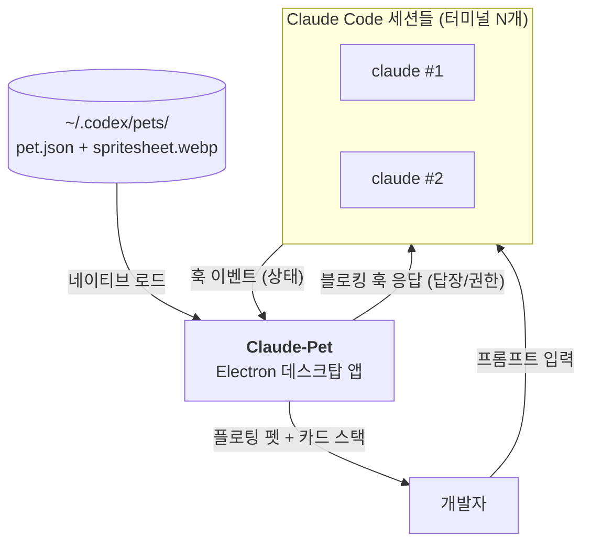
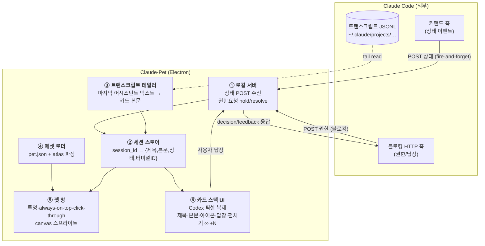
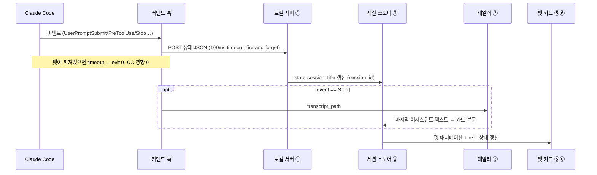
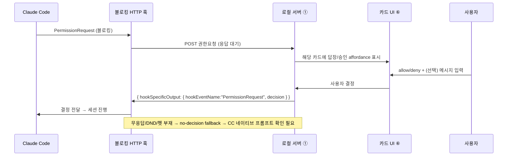

# 아키텍처 개요 (Architecture Overview)

> 근거: 공식 [Claude Code hooks](https://docs.anthropic.com/en/docs/claude-code/hooks)·[settings](https://docs.anthropic.com/en/docs/claude-code/settings) 문서, [`refs/codex-pet-ux-teardown.md`](../../refs/codex-pet-ux-teardown.md)
> 관련: [ADR-0001](../adr/0001-electron-over-tauri.md), [ADR-0002](../adr/0002-backend-clean-room.md), [05-claude-integration](../05-claude-integration/claude-code-hooks.md)

**Electron 단일 프로세스** 앱이다. Claude Code는 우리가 제어하지 않는 외부 프로세스이므로, 연동은
모두 **느슨하고 무해한** 단방향 신호(훅 → 로컬 서버)로 받고, 답장만 **블로킹 훅 응답**이라는 공식
역채널로 돌려보낸다. 백엔드(훅·서버·권한)는 **공식 Claude Code 훅/SDK 문서**를 근거로 clean-room 구현하고, 역량은
**Codex 충실 UI**(펫+카드)에 집중한다.

## 시스템 컨텍스트 (Level 1)

## 컨테이너 (Level 2)

배포 단위는 Electron 앱 하나. 내부는 6개 컴포넌트로 나뉘고, 각각 단일 책임을 갖는다.

**컴포넌트 책임**

| # | 컴포넌트 | 책임 | 출처 |
|---|---|---|---|
| ① | 로컬 서버 | 상태 POST 수신, 권한 훅을 잡아뒀다 사용자 결정으로 응답 | 신규(공식 hook 문서 기준) |
| ② | 세션 스토어 | `session_id`=카드 1개. 다세션→스택. 상태·제목·본문·터미널ID 보관 | 신규 |
| ③ | 트랜스크립트 테일러 | Stop 시 JSONL 끝부분에서 마지막 어시스턴트 텍스트 추출(카드 본문) | 신규(공식 transcript 스키마) |
| ④ | 에셋 로더 | `~/.codex/pets/<slug>/{pet.json,spritesheet.webp}` 파싱·검증 | 신규([02](../02-asset-compat/codex-pet-assets.md)) |
| ⑤ | 펫 창 | 투명/클릭통과/always-on-top 창 + atlas 8×9 프레임 애니메이션 | 신규 |
| ⑥ | 카드 스택 UI | Codex 카드 픽셀 복제 — 핵심 차별 가치 | 신규([04](../04-pet-ui/pet-and-cards.md)) |

## 핵심 데이터 흐름

### 흐름 1 — 관찰 (상태 → 펫·카드)

가장 빈번한 경로. Claude Code가 이벤트를 쏘면 펫/카드가 즉시 갱신된다.

### 흐름 2 — 답장 (블로킹 훅 역채널)

Claude Code가 권한/결정을 물을 때만 열리는 동기 경로. 키 주입 없이 공식 채널로 답이 돌아간다.

## 비기능 요구사항 (NFR)

| 분류 | 요구 | 목표(추정) | 근거 |
|---|---|---|---|
| **무해성** | 펫 부재·지연 시 CC 영향 | 0 | 상태 훅 fire-and-forget·100ms timeout `확인`([05](../05-claude-integration/claude-code-hooks.md)) |
| **반응성** | 이벤트→펫 반영 | 체감 즉시(<200ms 목표) | 로컬 서버 직수신 |
| **답장 안전** | 펫 무응답 시 | CC 네이티브 프롬프트로 폴백 | 블로킹 훅 no-decision smoke test 필요([05](../05-claude-integration/claude-code-hooks.md)) |
| **충실도** | Codex 대비 시각 차이 | 픽셀 단위 일치 지향 | [`refs/`](../../refs/README.md) 화면 기준 |
| **호환성** | Codex 펫 에셋 | 변환 0·네이티브 | `~/.codex/pets/` 직접 로드([02](../02-asset-compat/codex-pet-assets.md)) |
| **이식성** | macOS→Win/Linux | 재작성 없이 | Electron 단일 코드베이스([ADR-0001](../adr/0001-electron-over-tauri.md)) |
| **성능** | 유휴 시 자원 | 가벼움 | idle 시 애니메이션 프레임 throttle |

## 구현 경계 (clean-room)

백엔드는 **공식 1차 문서에서 도출**하고, 차별 가치는 **새 UI/로더**에 집중한다([ADR-0002](../adr/0002-backend-clean-room.md)).

| 공식 문서 기준 구현 (백엔드) | 신규 (차별 가치) |
|---|---|
| 훅 이벤트→상태 매핑·POST, 로컬 서버, 권한 브릿지, 트랜스크립트 테일·세션 식별 (모두 공식 hooks/settings 문서) | **Codex 충실 펫 창 + 카드 스택 UI**, 에셋 로더의 Codex atlas 충실 렌더 |
