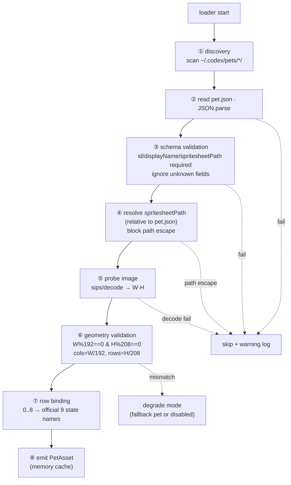
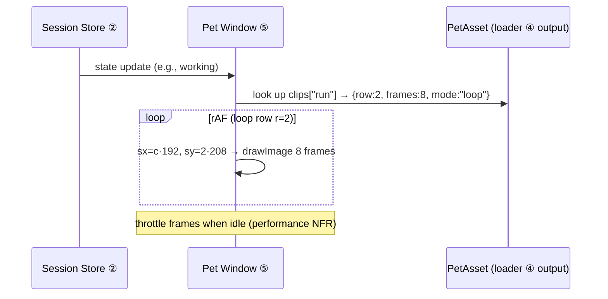

# Codex Pet Asset Compatibility Spec (pet.json · spritesheet atlas · loader)

> **Basis**: The actual pet assets [`../../refs/sample-pet/pet.json`](../../refs/sample-pet/pet.json) + [`../../refs/sample-pet/spritesheet.webp`](../../refs/sample-pet/spritesheet.webp) (slug `nezu`), parsed directly and measured with `sips`. The atlas spec, row semantics, and animation cadence are cross-verified against [`../../refs/codex-pet-ux-teardown.md`](../../refs/codex-pet-ux-teardown.md) (screen-recording analysis).
> **Related**: [`../01-architecture/overview.md`](../01-architecture/overview.md) (asset loader = component ④) · [ADR-0001](../adr/0001-electron-over-tauri.md) (Electron shell) · pet window rendering [`../04-pet-ui/pet-and-cards.md`](../04-pet-ui/pet-and-cards.md) · state mapping [`../05-claude-integration/claude-code-hooks.md`](../05-claude-integration/claude-code-hooks.md).

This document is the authoritative spec for how Claude-Pet's **asset loader (④)** reads Codex-ecosystem pet assets **natively, with zero conversion**. The **Codex desktop pet renderer is closed-source** (a minified bundle); only the **manifest/spritesheet format conventions and the official `hatch-pet` skill** are public (`Verified`, [`deep-research`](../../refs/codex-pet-deep-research.md)). So we load, validate, and render faithfully to the format, but reconstruct the rendering behavior from observation ([`../../refs/codex-pet-ux-teardown.md`](../../refs/codex-pet-ux-teardown.md)). The goal is to launch a pet already installed at `~/.codex/pets/<slug>/` as a **drop-in** — if a user buys a Codex pet, it appears as-is in Claude-Pet.

So that a developer can implement the loader and pet window from the tables in this document alone, every offset, index, and validation rule is spelled out explicitly.

---

## 1. Package Layout

A single pet is **one slug directory**. The install location matches Codex: `~/.codex/pets/<slug>/`. By convention, the directory name (slug) equals the pet identifier `id` (measured below for `nezu`).

```
~/.codex/pets/
└── nezu/                 ← <slug> directory (= pet.json.id)
    ├── pet.json          ← metadata (232 bytes, measured)
    └── spritesheet.webp  ← atlas (1536×1872, 2,351,550 bytes, measured)
```

| Item | Value | Credibility |
|---|---|---|
| Root | `~/.codex/pets/` | `Verified` (asset folder convention) |
| Pet unit | 1 `<slug>/` directory | `Verified` |
| Required files | `pet.json`, plus the image pointed to by `pet.json.spritesheetPath` | `Verified` (measured) |
| `spritesheetPath` resolution | **Relative to the `pet.json` location**. Measured value `"spritesheet.webp"` (same folder) | `Verified` |
| slug ↔ id | Folder name `nezu` == `pet.json.id` `"nezu"` | `Verified` (this sample) — but **a mismatch is not impossible** (§5.3) |

> **Design decision**: The loader's pet identity key is unified on **`pet.json.id`** (not the folder name). The folder name is used for discovery; collisions and mismatches are handled by the §5.3 rules.

---

## 2. `pet.json` Schema

The actual `nezu` metadata (`Verified`, full text at [`../../refs/sample-pet/pet.json`](../../refs/sample-pet/pet.json)):

```json
{
  "id": "nezu",
  "displayName": "Nezu",
  "description": "A Nezuko-inspired compact chibi demon girl sitting on the floor with a laptop on her lap, working quietly.",
  "spritesheetPath": "spritesheet.webp",
  "kind": "person"
}
```

### 2.1 Field Table (Loader Contract)

| Field | Type | Required | Measured value | Meaning / loader behavior |
|---|---|---|---|---|
| `id` | string | ✅ | `"nezu"` | Unique pet identifier (store key). Recommended to match the slug |
| `displayName` | string | ✅ | `"Nezu"` | UI display name (pet picker, tooltip). Falls back to `id` if absent |
| `description` | string | ⛌ (recommended) | `"A Nezuko-inspired …"` | Pet description (English prose). UI auxiliary. No effect on rendering |
| `spritesheetPath` | string | ✅ | `"spritesheet.webp"` | Relative path to the atlas image. **Input to §4 validation** |
| `kind` | string | ⛌ (**non-standard extension**) | `"person"` | Pet category. **Not present in the official OpenAI release manifest** (§2.2) |

> **Credibility note**: The **official OpenAI release manifest has exactly 4 fields** (`id, displayName, description, spritesheetPath`) — `Verified` (openai/skills `hatch-pet`, [`deep-research`](../../refs/codex-pet-deep-research.md)). `nezu`'s `kind` is an **ecosystem extension**. Since Codex may add future fields, we **ignore unknown fields** (forward-compatible) and **validate only known fields** (§5.1).

### 2.2 `kind` Values

| `kind` | Observed/inferred | Handling |
|---|---|---|
| `"person"` | `Verified` from `nezu` | Person-type chibi pet. Standard rendering |
| Others (`"animal"` / `"object"` …) | `Inferred` (unobserved — single sample) | Assumed to have **no effect on rendering**. Used only as metadata for future pet categorization/filtering UI |

> **Design decision**: `kind` is **not used to branch rendering**. On the premise that the atlas spec (§3) is identical for all pets (needs verification — see §openQuestions), `kind` is treated only as pet-picker grouping metadata. This way, even an unknown `kind` value still renders the pet normally.

### 2.3 Optional `animation` Field — Event Mapping · Chains · Timing (Forward-Compatible)

The current pet.json carries only metadata; **frame counts, timing, and state transitions are hardcoded in the Codex app** (`Verified`). However, [openai/codex#20863](https://github.com/openai/codex/issues/20863) proposes an optional **`animation`** field (a feature request, not yet shipped upstream `Verified`), and some renderers such as petdex already mark optional support for it (`Inferred`). **"A different animation on hover"** is exactly this `events.hover` mapping.

Proposed schema (optional — falls back to the default §4 row convention if absent):

```json
"animation": {
  "autoDetectFrames": true,
  "idleSlowdown": 6,
  "states": {
    "idle":   { "row": 0, "durationMs": 150, "lastFrameDurationMs": 280 },
    "waving": { "row": 3, "durationMs": 120 }
  },
  "chains": { "idle": { "sequence": ["idle", "waving", "review"], "mode": "idleFallback" } },
  "events": { "hover": "jumping", "drag": "waving" }
}
```

| Field | Meaning | Credibility |
|---|---|---|
| `autoDetectFrames` | Auto-detect per-row frame count from non-empty cells (no per-state frameCount needed) | `Verified` (proposal #20863) |
| `idleSlowdown` | Idle slowdown multiplier (e.g., 6) | `Verified` (proposal) |
| `states[name].row` (alias `rowIndex`) | State → atlas row index | `Verified` (proposal) |
| `states[name].durationMs` (alias `frameDurationMs`) · `lastFrameDurationMs` · `slowdown` | ms per frame · last-frame ms · slowdown | `Verified` (proposal) |
| `chains[state].sequence` + `.mode` | Sequence chain + playback mode. The field name is **`mode`** (NOT `chainMode`): `idleFallback` / `loop` / `once` | `Verified` (proposal #20863) |
| `events.hover` / `events.drag` | Interaction → animation mapping (starting with hover and drag) | `Verified` (proposal #20863) |

> **Separate proposal** [openai/codex#21657](https://github.com/openai/codex/issues/21657): a proposal to add **declarative interactions** to pet.json (click, double-click, right-click / context menu, hover, drag/drop, keyboard shortcuts; not yet shipped `Verified`). Since both `#20863` (animation) and `#21657` (interaction) are **at the proposal stage**, v1 only honors them if present and does not depend on them.

**Loader contract**: If `animation` is present, normalize the per-state row/timing overrides + chains + event mappings into `PetAsset` (§5.2); if absent, fall back to the default §4 rows + the app's default timing ([pet-ui §7](../04-pet-ui/pet-and-cards.md)). **Unknown keys are ignored** (backward-compatible). The actual interaction behavior is covered in [pet-ui §5.6](../04-pet-ui/pet-and-cards.md).

---

## 3. Spritesheet Atlas Spec

### 3.1 Geometry (Measured + Arithmetic Verification)

`nezu/spritesheet.webp` as measured with `sips`:

| Property | Value | Credibility |
|---|---|---|
| Format | WebP | `Verified` (`sips … format: webp`) |
| Total size | **1536 × 1872 px** | `Verified` (`sips`) |
| Grid | **8 columns × 9 rows** | `Verified` (arithmetic) |
| Frame size | **192 × 208 px** | `Verified` (arithmetic) |
| File size | 2,351,550 bytes (~2.24 MiB) | `Verified` |
| Alpha | Transparent background (composited over dark/cards) | `Inferred` ([teardown §1.2](../../refs/codex-pet-ux-teardown.md)) |

**Arithmetic consistency** (invariants the loader verifies at runtime):

```
192 px/frame × 8 cols = 1536 px  == imageWidth   ✅
208 px/frame × 9 rows = 1872 px  == imageHeight   ✅
total frame slots = 8 × 9 = 72 (8 frames per row)
```

> **Core invariant**: `imageWidth % FRAME_W == 0` **and** `imageHeight % FRAME_H == 0`. `nezu` divides evenly on a `192/208` grid. We **assume** other pets also use the same 192×208 frame (see §openQuestions), but the loader **derives** `cols = W/192`, `rows = H/208` from the measured image dimensions to reduce reliance on hardcoding (§5.2).

### 3.2 Coordinate Computation (Frame → Pixel Offset)

The source rectangle for the frame at row `r` (0-based, top→bottom), column `c` (0-based, left→right):

```
sx = c × FRAME_W   (= c × 192)
sy = r × FRAME_H   (= r × 208)
sw = FRAME_W       (= 192)
sh = FRAME_H       (= 208)
```

Canvas rendering: `ctx.drawImage(sheet, sx, sy, 192, 208, dx, dy, dw, dh)`. CSS sprite rendering: `background-position: -(c×192)px -(r×208)px` + `background-size: 1536px 1872px`.

| Input | Formula | Example (r=2, c=5 → 6th frame of `running`) |
|---|---|---|
| sx | `c·192` | `5·192 = 960` |
| sy | `r·208` | `2·208 = 416` |
| Slot index | `r·8 + c` | `2·8+5 = 21` |

---

## 4. Rows = State Semantics

In the atlas, **each row is one state (animation clip)** and the columns are that clip's frames (left→right). The row order was established from the `Verified` format in [`../../refs/README.md`](../../refs/README.md) + [teardown §1.3](../../refs/codex-pet-ux-teardown.md).

### 4.1 Row Index Table (Render Contract)

| Row r | sy (=r·208) | State name (official) | Meaning | Observation/basis | Credibility |
|---|---|---|---|---|---|
| 0 | 0 | `idle` | Calm idle (breathing bob) | Matches observed idle (A↔B ~1.4s, blink ~2s) | `Verified` (official order + observation) |
| 1 | 208 | `running-right` | Working (facing right) | Official order | `Verified` (official) |
| 2 | 416 | `running-left` | Working (facing left) | Official order | `Verified` (official) |
| 3 | 624 | `waving` | Wave/greeting (^_^) | Matches observed wave beat (cat_105) | `Verified` (official + observation) |
| 4 | 832 | `jumping` | Jump/special motion | Official order | `Verified` (official) |
| 5 | 1040 | `failed` | Failure/error | Official order | `Verified` (official) |
| 6 | 1248 | `waiting` | **Awaiting input** (the pet's clock-state row) | Official order | `Verified` (official) |
| 7 | 1456 | `running` | Working/executing | Observed typing-bob inferred to be in the running family | `Verified` (official) · mapping `Inferred` |
| 8 | 1664 | `review` | Review-ready/done | Official order | `Verified` (official) |

> The row order is the **OpenAI release-app contract** (`Verified`, [`deep-research`](../../refs/codex-pet-deep-research.md)). Nine rows are fixed: `idle, running-right, running-left, waving, jumping, failed, waiting, running, review`. The observed pet beats (idle, wave, typing) correspond to the idle, waving, and running families.

### 4.2 9 Rows = 9 Official States (Resolved)

A previous document left the discrepancy between 8 row names and the measured 9 rows as a hypothesis. Deep-research **resolved** it: the atlas has **9 rows = 9 official states** (§4.1), and the earlier 8-row-name hypothesis is discarded (`Verified`, [`deep-research`](../../refs/codex-pet-deep-research.md) — openai/codex#20863 · openai/skills `hatch-pet`).

> **Design decision (retained)**: Even so, the loader **derives** the row count from the image (`rows = imageHeight / 208`) rather than
> relying on hardcoding — so it won't break if rows increase in the future. Unknown rows are not referenced.

### 4.3 Frame Count (Column) Handling

There are **8 frame slots per row**, but there is no guarantee every slot is a valid frame (if a clip is fewer than 8 frames, the trailing slots may be empty/duplicate frames — `Inferred`). The teardown observations show clip lengths vary: idle is a 2-frame ping-pong, working is 6–8 frames.

> **Design decision**: Since the per-clip valid frame count is not in the metadata, **we define a per-state frame-count table** (below). Drawing empty frames causes flicker, so we use conservative counts matched to the observed cadence. If Codex later exposes frame-count metadata, we'll replace it.

| State (row) | Playback frames | Mode | Loop period (target) | Basis |
|---|---|---|---|---|
| `idle` (0) | 2 (A↔B) | ping-pong | ~1.4s | [teardown §7](../../refs/codex-pet-ux-teardown.md) |
| `running-right` (1) · `running-left` (2) · `running` (7) | 8 | loop | ~0.9s | teardown typing bob (running family) |
| `waving` (3) | 6 | once→idle | ~0.75s | teardown wave beat (cat_105) |
| `jumping` (4) | 8 | once→idle | ~0.75s | `Inferred` |
| `failed` (5) | 8 | once→hold | ~0.8s | `Inferred` |
| `waiting` (6) | 8 | loop | ~1.0s | `Inferred` (awaiting input) |
| `review` (8) | 8 | loop | ~0.9s | `Inferred` (done) |

---

## 5. Asset Loader Design

The loader (component ④, [`../01-architecture/overview.md`](../01-architecture/overview.md)) is a **pure functional pipeline**: disk → parse → validate → normalized `PetAsset` object → consumed by the pet window (⑤). Rendering happens in the renderer process, not the main; the loader's disk I/O runs in the main process (Electron boundary).

### 5.1 Pipeline



### 5.2 Normalized Output (`PetAsset`)

The immutable object received by the pet window (⑤). It bakes in **values derived from the measured image** to break the dependency on hardcoding.

| Field | Type | Example (`nezu`) | Notes |
|---|---|---|---|
| `id` | string | `"nezu"` | Store/selection key |
| `displayName` | string | `"Nezu"` | UI |
| `description` | string | `"A Nezuko-inspired …"` | UI auxiliary |
| `kind` | string | `"person"` | Grouping metadata (no effect on rendering) |
| `sheetPath` | abs path | `~/.codex/pets/nezu/spritesheet.webp` | Resolved and validated absolute path |
| `imageWidth` | int | `1536` | Probe measurement |
| `imageHeight` | int | `1872` | Probe measurement |
| `frameW` | int | `192` | Constant |
| `frameH` | int | `208` | Constant |
| `cols` | int | `8` | `imageWidth / 192` (derived) |
| `rows` | int | `9` | `imageHeight / 208` (derived) |
| `clips` | map | `{idle:{row:0,frames:2,mode:"pingpong"}, …}` | §4.1+§4.3 binding |

### 5.3 slug ↔ id Mismatch/Duplication

| Situation | Handling |
|---|---|
| Folder name == `id` (normal, `nezu`) | Use as-is |
| Folder name ≠ `id` | **`id` takes priority**. Warning log. Discovery by folder, identity by `id` |
| Different folders share the same `id` | Adopt the first found + collision warning (skip later ones) |
| `id` missing/empty string | Fall back to folder name; if still absent, skip |

### 5.4 Caching · Lifecycle

- The loader scans once at startup + caches `PetAsset` in memory. The image buffer is decoded once by the pet window into an ``/`ImageBitmap` and kept as a GPU texture (no per-frame decoding).
- Adding/removing pets in `~/.codex/pets/` is a **non-goal for runtime hot-reload** — changes take effect on app restart (simplicity first). A file watcher is future work.

---

## 6. Native Compatibility / Validation Strategy

The goal is **zero conversion** (compatibility NFR, [`../01-architecture/overview.md`](../01-architecture/overview.md)). We read the bytes Codex wrote as-is, but **validate defensively** so our renderer doesn't break, and **degrade failures harmlessly**.

### 6.1 Validation Gates

| # | Gate | Pass condition | On failure |
|---|---|---|---|
| V1 | JSON parse | `pet.json` is valid JSON | Skip pet + warning |
| V2 | Required fields | `id` and `spritesheetPath` present (`displayName` can fall back) | Skip pet |
| V3 | Path safety | Resolved `sheetPath` is **inside** the pet directory (block `..` escape, symlink escape) | Skip pet (security) |
| V4 | Image exists · decodes | File exists + WebP decode succeeds | Skip pet |
| V5 | Geometry consistency | `W%192==0 && H%208==0 && rows≥8` | **Degrade mode** (§6.2) |
| V6 | Unknown fields | Validate only known fields, ignore the rest | (pass — forward-compat) |

> **Design decision**: V1–V4 failures **skip only that pet** (the app continues). V5 (geometry mismatch) goes to **degrade mode** rather than discarding the pet entirely — if we can show at least the single idle row, we show it (below).

### 6.2 Degrade Mode

| Scenario | Behavior |
|---|---|
| Doesn't divide by 192/208 | Truncate to the largest possible integer grid and show only idle (row 0) statically + warning. Animation disabled |
| `rows < 8` | Bind only the existing rows (missing states fall back to idle) |
| 0 pets found | Boot with a **bundled fallback pet** (our included copy of nezu or a simple dot) — never a blank screen |
| All pets corrupt | Fallback pet + non-blocking "asset load failed" toast |

### 6.3 State-Mapping Integration (EVENT_TO_STATE → row)

The **final mapping table** that connects `EVENT_TO_STATE` (`Verified`) from [`../05-claude-integration/claude-code-hooks.md`](../05-claude-integration/claude-code-hooks.md) to row indices. The pet window selects the `clips` defined by the loader via this table (consistent with [teardown §8](../../refs/codex-pet-ux-teardown.md)).

| Claude event | State (EVENT_TO_STATE) | atlas row | Row r | Card icon |
|---|---|---|---|---|
| SessionStart | idle | `idle` | 0 | — |
| SessionEnd | sleeping | `idle` (slow) | 0 | — |
| UserPromptSubmit | thinking | `running` | 2 | spinner |
| PreToolUse / PostToolUse | working | `running` | 2 | spinner |
| SubagentStart | juggling | `running` (fast) | 2 | spinner |
| SubagentStop | working | `running` | 2 | spinner |
| PreCompact | sweeping | `idle`/special | 0 | spinner |
| PostCompact | thinking·idle | `running`/`idle` | 2 / 0 | spinner/— |
| PostToolUseFailure / StopFailure / ApiError | error | `failed` | 3 | error |
| **Stop** | **attention** (done/waiting) | `review` | 4 | **green-check** |
| Notification / Elicitation | notification | `waving` | 1 | notification (gray speech bubble) |
| WorktreeCreate | carrying | `jumping`/special | 5 | — |

> **Mapping notes**: `Stop=attention` is placed on the `review` (r4) row — the review beat right after completion is semantically correct and distinguishes it from a full static return to idle. `error→failed` (r3) was not observed in this recording (`Inferred`), so idle is used as a fallback. Exact row assignments will be corrected once multiple real pets are obtained ([openQuestions](#openquestions)).

### 6.4 Security

- `~` expansion is restricted to the home directory the app controls. `spritesheetPath` cannot point outside the pet directory (V3).
- WebP decoding is untrusted input — delegate to Electron's built-in decoder (Chromium) to avoid introducing a separate native parser.
- `pet.json` is data, not code. Never use anything `eval`-like (plain `JSON.parse`).

---

## 7. Render Interface (Pet Window ⑤ Contract)

The pet window draws frames from the `PetAsset` + the current state (row) alone. The loader does not draw pixels (separation of concerns).



| Provided by loader | Pet window responsibility |
|---|---|
| `sheetPath`, `imageW/H`, `cols/rows`, `frameW/H`, `clips` | Decode · texture upload, rAF timer, state→clip selection, `drawImage(sx,sy)` frame transitions, throttle |

Detailed window properties (transparent · always-on-top · click-through) and pixel-perfect replication of the card stack are owned by [`../04-pet-ui/pet-and-cards.md`](../04-pet-ui/pet-and-cards.md).

---

## 8. Trade-offs (Honest Assessment)

| Decision | Pros | Cons / risks | Mitigation |
|---|---|---|---|
| **Zero conversion · native load** | Codex pet drop-in, zero conversion pipeline | Exposed to closed-format changes. Validated only against a single sample (`nezu`) | Ignore unknown fields + derive geometry + V1–V6 gates |
| **Geometry derivation (`rows=H/208`)** | Robust to 9 rows / future N rows | Breaks if the 192/208 frame itself changes | V5 degrade mode + openQuestions tracking |
| **Bind all 9 official rows** | Matches the release contract (`Verified`) | Some row motions unobserved (`Inferred`) | Augment with capture that triggers errors/waiting |
| **Define per-state frame counts ourselves** | Flicker-free playback | May diverge from Codex's actual clip lengths | Conservative values based on observed cadence. Replace if metadata is exposed |
| **Hot-reload as non-goal** | Simple cache · lifecycle | Restart required to add pets | File watcher is future work |
| **Delegate decoding to Chromium** | Zero native-parser dependency, security | Electron coupling | The shell is already Electron ([ADR-0001](../adr/0001-electron-over-tauri.md)) |

---

## openQuestions

| # | Question | Blocking impact | Resolution method |
|---|---|---|---|
| Q1 | The **exact motion** of the `failed` · `waiting` · `jumping` · `review` rows (unobserved in this recording) | Low (row indices are confirmed) | Capture that triggers errors/waiting/worktree |
| Q2 | Are all Codex pets fixed at **192×208/8col**, or does it vary by `kind`? | Medium (if it varies, the §3 assumption breaks) | Obtain a non-`person` pet and probe |
| Q3 | Is the **actual per-clip frame count** exposed as metadata? | Medium (flicker) | Monitor for additional fields in the Codex format |
| Q4 | The **exact motion** of the `failed`/`review`/`jumping` rows (unobserved in this recording) | Low | Capture that triggers errors/worktree |
| Q5 | Whether **future fields** appear in `pet.json` (version, author, animation metadata, etc.) | Low (safe to ignore) | Track new pet releases |

---

## Appendix A. Constant Summary (Drop-In for Implementation)

| Constant | Value |
|---|---|
| `PETS_ROOT` | `~/.codex/pets/` |
| `FRAME_W` | `192` |
| `FRAME_H` | `208` |
| `nezu` sheet | `1536 × 1872`, WebP, 2,351,550 B |
| `cols` derivation | `imageWidth / 192` |
| `rows` derivation | `imageHeight / 208` |
| Slot index | `r·8 + c` |
| `sx` / `sy` | `c·192` / `r·208` |
| Rows 0–8 → states (official) | `idle, running-right, running-left, waving, jumping, failed, waiting, running, review` |
