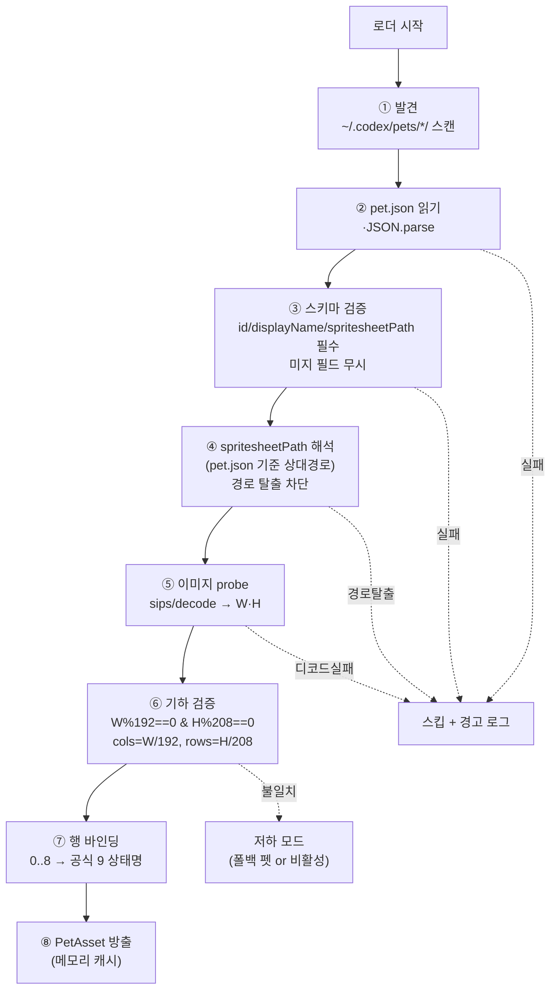
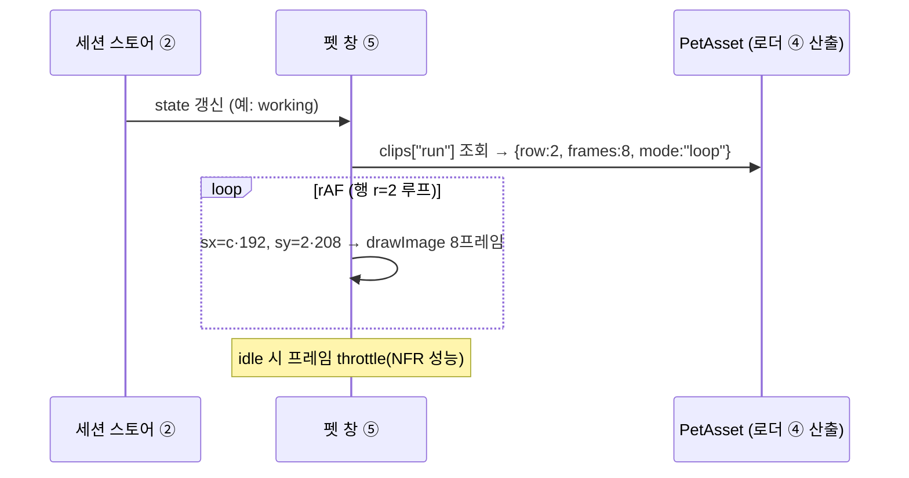

# Codex 펫 에셋 호환 명세 (pet.json · spritesheet atlas · 로더)

> **근거**: 실제 펫 에셋 [`../../refs/sample-pet/pet.json`](../../refs/sample-pet/pet.json) + [`../../refs/sample-pet/spritesheet.webp`](../../refs/sample-pet/spritesheet.webp)(slug `nezu`)를 직접 파싱·`sips`로 측정. atlas 규격·행 의미·애니메이션 케이던스는 [`../../refs/codex-pet-ux-teardown.md`](../../refs/codex-pet-ux-teardown.md)(스크린녹화 분석)에서 교차검증.
> **관련**: [`../01-architecture/overview.md`](../01-architecture/overview.md)(에셋 로더 = 컴포넌트 ④) · [ADR-0001](../adr/0001-electron-over-tauri.md)(Electron 셸) · 펫 창 렌더 [`../04-pet-ui/pet-and-cards.md`](../04-pet-ui/pet-and-cards.md) · 상태 매핑 [`../05-claude-integration/claude-code-hooks.md`](../05-claude-integration/claude-code-hooks.md).

이 문서는 Claude-Pet의 **에셋 로더(④)**가 Codex 생태계의 펫 에셋을 **변환 없이 네이티브로** 읽기 위한 권위 규격이다. **Codex 데스크탑 펫 렌더러는 비공개**(minified 번들)이고 공개된 것은 **매니페스트/스프라이트시트 포맷 규약과 공식 `hatch-pet` 스킬**뿐이므로(`확인`, [`deep-research`](../../refs/codex-pet-deep-research.md)), 우리는 포맷에 충실하게 로드·검증·렌더하되 렌더 동작은 관찰([`../../refs/codex-pet-ux-teardown.md`](../../refs/codex-pet-ux-teardown.md))로 재구성한다. 목표는 `~/.codex/pets/<slug>/`에 이미 설치된 펫을 **드롭인**으로 띄우는 것이다 — 사용자가 Codex 펫을 사면 Claude-Pet에서도 그대로 보인다.

개발자가 이 문서의 표만 보고 로더와 펫 창을 구현할 수 있도록, 모든 오프셋·인덱스·검증 규칙을 명시한다.

---

## 1. 패키지 레이아웃

펫 하나는 **slug 디렉토리 한 개**다. 설치 위치는 Codex와 동일한 `~/.codex/pets/<slug>/`이고, 디렉토리 이름(slug)이 곧 펫 식별자 `id`와 일치하는 것이 관례다(아래 `nezu` 실측).

```
~/.codex/pets/
└── nezu/                 ← <slug> 디렉토리 (= pet.json.id)
    ├── pet.json          ← 메타데이터 (232 bytes, 실측)
    └── spritesheet.webp  ← atlas (1536×1872, 2,351,550 bytes, 실측)
```

| 항목 | 값 | 신뢰도 |
|---|---|---|
| 루트 | `~/.codex/pets/` | `확인`(에셋 폴더 관례) |
| 펫 단위 | `<slug>/` 디렉토리 1개 | `확인` |
| 필수 파일 | `pet.json`, 그리고 `pet.json.spritesheetPath`가 가리키는 이미지 | `확인`(실측) |
| `spritesheetPath` 해석 | **`pet.json` 위치 기준 상대경로**. 실측값 `"spritesheet.webp"`(같은 폴더) | `확인` |
| slug ↔ id | 폴더명 `nezu` == `pet.json.id` `"nezu"` | `확인`(본 샘플) — 다만 **불일치 가능성 비-0**(§5.3) |

> **설계 결정**: 로더의 펫 식별 키는 **`pet.json.id`**(폴더명 아님)로 통일한다. 폴더명은 발견(discovery) 용도이고, 충돌·불일치 시 §5.3 규칙으로 처리한다.

---

## 2. `pet.json` 스키마

실제 `nezu` 메타데이터(`확인`, [`../../refs/sample-pet/pet.json`](../../refs/sample-pet/pet.json) 전문):

```json
{
  "id": "nezu",
  "displayName": "Nezu",
  "description": "A Nezuko-inspired compact chibi demon girl sitting on the floor with a laptop on her lap, working quietly.",
  "spritesheetPath": "spritesheet.webp",
  "kind": "person"
}
```

### 2.1 필드 표 (로더 계약)

| 필드 | 타입 | 필수 | 실측값 | 의미 / 로더 동작 |
|---|---|---|---|---|
| `id` | string | ✅ | `"nezu"` | 펫 고유 식별자(스토어 키). slug와 일치 권장 |
| `displayName` | string | ✅ | `"Nezu"` | UI 표기명(펫 선택기·툴팁). 미존재 시 `id` 폴백 |
| `description` | string | ⛌(권장) | `"A Nezuko-inspired …"` | 펫 설명(영문 산문). UI 보조. 렌더에 무영향 |
| `spritesheetPath` | string | ✅ | `"spritesheet.webp"` | atlas 이미지 상대경로. **§4 검증의 입력** |
| `kind` | string | ⛌(**비표준 확장**) | `"person"` | 펫 카테고리. **OpenAI 공식 출시 매니페스트엔 없음**(§2.2) |

> **신뢰도 주의**: **OpenAI 공식 출시 매니페스트는 정확히 4필드**(`id, displayName, description, spritesheetPath`)다 — `확인`(openai/skills `hatch-pet`, [`deep-research`](../../refs/codex-pet-deep-research.md)). `nezu`의 `kind`는 **생태계 확장**이다. Codex가 미래 필드를 넣을 수 있으니 **알 수 없는 필드는 무시**(forward-compatible)하고 **알려진 필드만 검증**한다(§5.1).

### 2.2 `kind` 값

| `kind` | 관찰/추정 | 처리 |
|---|---|---|
| `"person"` | `nezu`에서 `확인` | 사람형 치비 펫. 표준 렌더 |
| 그 외(`"animal"`/`"object"`…) | `추정`(미관찰 — 단일 샘플) | **렌더에는 무영향**으로 가정. 미래 펫 분류·필터 UI용 메타로만 사용 |

> **설계 결정**: `kind`는 **렌더링 분기에 쓰지 않는다**. atlas 규격(§3)이 모든 펫에 동일하다는 전제(§openQuestions에서 검증 필요)에서, `kind`는 선택기 그룹핑 메타로만 다룬다. 이렇게 두면 미지의 `kind` 값이 와도 펫이 정상적으로 뜬다.

### 2.3 선택적 `animation` 필드 — 이벤트 매핑 · 체인 · 타이밍 (포워드 호환)

현행 pet.json은 메타데이터만 담고 **프레임 수·타이밍·상태 전이는 Codex 앱이 하드코딩**한다(`확인`). 그러나 [openai/codex#20863](https://github.com/openai/codex/issues/20863)이 선택적 **`animation`** 필드를 제안 중이며(feature request, 본가 미출시 `확인`), petdex 등 일부 렌더러는 이미 선택 지원으로 표기한다(`추정`). **"마우스 올리면 다른 애니메이션"** 이 바로 이 `events.hover` 매핑이다.

제안 스키마(선택적 — 없으면 §4 기본 행 컨벤션으로 폴백):

```json
"animation": {
  "autoDetectFrames": true,
  "idleSlowdown": 6,
  "states": {
    "idle":   { "row": 0, "durationMs": 150, "lastFrameDurationMs": 280 },
    "waving": { "row": 3, "durationMs": 120 }
  },
  "chains": { "idle": { "sequence": ["idle", "waving", "review"], "mode": "idleFallback" } },
  "events": { "hover": "jumping", "drag": "waving" }
}
```

| 필드 | 의미 | 신뢰도 |
|---|---|---|
| `autoDetectFrames` | 비어있지 않은 셀로 행별 프레임 수 자동 감지(per-state frameCount 불필요) | `확인`(제안 #20863) |
| `idleSlowdown` | idle 감속 배수(예: 6) | `확인`(제안) |
| `states[name].row`(별칭 `rowIndex`) | 상태 → atlas 행 인덱스 | `확인`(제안) |
| `states[name].durationMs`(별칭 `frameDurationMs`) · `lastFrameDurationMs` · `slowdown` | 프레임당 ms · 마지막 프레임 ms · 감속 | `확인`(제안) |
| `chains[state].sequence` + `.mode` | 시퀀스 체인 + 재생 모드. 필드명은 **`mode`**(NOT `chainMode`): `idleFallback`/`loop`/`once` | `확인`(제안 #20863) |
| `events.hover` / `events.drag` | 인터랙션 → 애니메이션 매핑(hover·drag부터) | `확인`(제안 #20863) |

> **별도 제안** [openai/codex#21657](https://github.com/openai/codex/issues/21657): pet.json에 **선언적 인터랙션**(click·double-click·right-click/context menu·hover·drag/drop·키보드 단축키)을 추가하자는 제안(미출시 `확인`). `#20863`(애니메이션)과 `#21657`(인터랙션) **둘 다 제안 단계**이므로 v1은 있으면 honor만 하고 의존하지 않는다.

**로더 계약**: `animation`이 있으면 상태별 행/타이밍 override + 체인 + 이벤트 매핑을 `PetAsset`(§5.2)에 정규화해 싣고, 없으면 §4 기본 행 + 앱 디폴트 타이밍([pet-ui §7](../04-pet-ui/pet-and-cards.md))으로 폴백한다. **알 수 없는 키는 무시**(하위호환). 인터랙션 실제 동작은 [pet-ui §5.6](../04-pet-ui/pet-and-cards.md).

---

## 3. spritesheet atlas 규격

### 3.1 기하 (실측 + 산술 검증)

`sips`로 측정한 `nezu/spritesheet.webp`:

| 속성 | 값 | 신뢰도 |
|---|---|---|
| 포맷 | WebP | `확인`(`sips … format: webp`) |
| 전체 크기 | **1536 × 1872 px** | `확인`(`sips`) |
| 그리드 | **8 열 × 9 행** | `확인`(산술) |
| 프레임 크기 | **192 × 208 px** | `확인`(산술) |
| 파일 크기 | 2,351,550 bytes (~2.24 MiB) | `확인` |
| 알파 | 투명 배경(다크/카드 위 합성) | `추정`([teardown §1.2](../../refs/codex-pet-ux-teardown.md)) |

**산술 정합성**(로더가 런타임에 검증하는 불변식):

```
192 px/frame × 8 cols = 1536 px  == imageWidth   ✅
208 px/frame × 9 rows = 1872 px  == imageHeight   ✅
총 프레임 슬롯 = 8 × 9 = 72 (행당 8 프레임)
```

> **핵심 불변식**: `imageWidth % FRAME_W == 0` **그리고** `imageHeight % FRAME_H == 0`. `nezu`는 `192/208` 그리드로 정확히 떨어진다. 다른 펫도 같은 192×208 프레임을 쓴다고 **가정**하되(§openQuestions), 로더는 이미지 실측 크기에서 `cols = W/192`, `rows = H/208`을 **유도**해 하드코딩 의존을 줄인다(§5.2).

### 3.2 좌표 산출 (프레임 → 픽셀 오프셋)

행 `r`(0-based, 위→아래), 열 `c`(0-based, 좌→우)의 프레임 소스 사각형:

```
sx = c × FRAME_W   (= c × 192)
sy = r × FRAME_H   (= r × 208)
sw = FRAME_W       (= 192)
sh = FRAME_H       (= 208)
```

캔버스 렌더는 `ctx.drawImage(sheet, sx, sy, 192, 208, dx, dy, dw, dh)`. CSS sprite 렌더는 `background-position: -(c×192)px -(r×208)px` + `background-size: 1536px 1872px`.

| 입력 | 식 | 예 (r=2,c=5 → `running` 6번째 프레임) |
|---|---|---|
| sx | `c·192` | `5·192 = 960` |
| sy | `r·208` | `2·208 = 416` |
| 슬롯 인덱스 | `r·8 + c` | `2·8+5 = 21` |

---

## 4. 행 = 상태 의미

atlas의 **각 행이 한 상태(애니메이션 클립)**, 열이 그 클립의 프레임(좌→우)이다. 행 순서는 [`../../refs/README.md`](../../refs/README.md) 확인 포맷 + [teardown §1.3](../../refs/codex-pet-ux-teardown.md)에서 확립됐다.

### 4.1 행 인덱스 표 (렌더 계약)

| 행 r | sy (=r·208) | 상태명 (공식) | 의미 | 관찰/근거 | 신뢰도 |
|---|---|---|---|---|---|
| 0 | 0 | `idle` | 평온 대기 (호흡 bob) | 관찰 idle 일치(A↔B ~1.4s, blink ~2s) | `확인`(공식 순서 + 관찰) |
| 1 | 208 | `running-right` | 작업 중(우향) | 공식 순서 | `확인`(공식) |
| 2 | 416 | `running-left` | 작업 중(좌향) | 공식 순서 | `확인`(공식) |
| 3 | 624 | `waving` | 손 흔들기/인사 (^_^) | 관찰 wave 비트 일치(cat_105) | `확인`(공식 + 관찰) |
| 4 | 832 | `jumping` | 점프/특수 모션 | 공식 순서 | `확인`(공식) |
| 5 | 1040 | `failed` | 실패/에러 | 공식 순서 | `확인`(공식) |
| 6 | 1248 | `waiting` | **입력 대기** (펫의 clock 상태 행) | 공식 순서 | `확인`(공식) |
| 7 | 1456 | `running` | 작업/실행 | 관찰 typing-bob이 running 계열로 추정 | `확인`(공식)·매핑 `추정` |
| 8 | 1664 | `review` | 검토 준비/완료 (done) | 공식 순서 | `확인`(공식) |

> 행 순서는 **OpenAI 출시 앱 계약**이다(`확인`, [`deep-research`](../../refs/codex-pet-deep-research.md)). `idle, running-right, running-left, waving, jumping, failed, waiting, running, review` 9행 고정. 관찰된 펫 비트(idle·wave·typing)는 idle·waving·running 계열에 대응한다.

### 4.2 9행 = 9 공식 상태 (해소됨)

이전 문서는 8개 행명과 실측 9행 사이의 불일치를 가설로 남겼었다. deep-research로 **해소**됐다:
atlas는 **9행 = 9개 공식 상태**(§4.1)이며, 이전 8행명 가설은 폐기한다
(`확인`, [`deep-research`](../../refs/codex-pet-deep-research.md) — openai/codex#20863 · openai/skills `hatch-pet`).

> **설계 결정(유지)**: 그래도 로더는 행 수를 이미지에서 **유도**(`rows = imageHeight / 208`)해 하드코딩에
> 의존하지 않는다 — 미래에 행이 늘어도 깨지지 않게. 알 수 없는 행은 참조하지 않는다.

### 4.3 프레임 수(열) 처리

행당 **8 프레임 슬롯**이지만, 모든 슬롯이 유효 프레임이라는 보장은 없다(클립이 8프레임 미만이면 뒤쪽이 빈/중복 프레임일 수 있음 — `추정`). teardown 관찰은 idle 2프레임 ping-pong, working 6–8프레임으로 클립별 길이가 다르다.

> **설계 결정**: 클립별 유효 프레임 수는 메타에 없으므로 **상태별 프레임 카운트 테이블을 우리가 정의**한다(아래). 빈 프레임을 그리면 깜빡임이 생기므로, 관찰 케이던스에 맞춘 보수적 카운트를 쓴다. 미래에 Codex가 프레임 카운트 메타를 노출하면 교체한다.

| 상태(행) | 재생 프레임 | 모드 | 루프 주기(목표) | 근거 |
|---|---|---|---|---|
| `idle`(0) | 2 (A↔B) | ping-pong | ~1.4s | [teardown §7](../../refs/codex-pet-ux-teardown.md) |
| `running-right`(1)·`running-left`(2)·`running`(7) | 8 | loop | ~0.9s | teardown typing bob(running 계열) |
| `waving`(3) | 6 | once→idle | ~0.75s | teardown wave 비트(cat_105) |
| `jumping`(4) | 8 | once→idle | ~0.75s | `추정` |
| `failed`(5) | 8 | once→hold | ~0.8s | `추정` |
| `waiting`(6) | 8 | loop | ~1.0s | `추정`(입력 대기) |
| `review`(8) | 8 | loop | ~0.9s | `추정`(완료) |

---

## 5. 에셋 로더 설계

로더(컴포넌트 ④, [`../01-architecture/overview.md`](../01-architecture/overview.md))는 **순수 함수형 파이프라인**이다: 디스크 → 파싱 → 검증 → 정규화된 `PetAsset` 객체 → 펫 창(⑤)이 소비. 렌더는 메인이 아닌 렌더러 프로세스에서, 로더의 디스크 I/O는 메인 프로세스에서 수행한다(Electron 경계).

### 5.1 파이프라인



### 5.2 정규화 출력 (`PetAsset`)

펫 창(⑤)이 받는 불변(immutable) 객체. **이미지 실측에서 유도한 값**을 박아 하드코딩 의존을 끊는다.

| 필드 | 타입 | 예(`nezu`) | 비고 |
|---|---|---|---|
| `id` | string | `"nezu"` | 스토어/선택 키 |
| `displayName` | string | `"Nezu"` | UI |
| `description` | string | `"A Nezuko-inspired …"` | UI 보조 |
| `kind` | string | `"person"` | 그룹핑 메타(렌더 무영향) |
| `sheetPath` | abs path | `~/.codex/pets/nezu/spritesheet.webp` | 해석·검증된 절대경로 |
| `imageWidth` | int | `1536` | probe 실측 |
| `imageHeight` | int | `1872` | probe 실측 |
| `frameW` | int | `192` | 상수 |
| `frameH` | int | `208` | 상수 |
| `cols` | int | `8` | `imageWidth / 192` (유도) |
| `rows` | int | `9` | `imageHeight / 208` (유도) |
| `clips` | map | `{idle:{row:0,frames:2,mode:"pingpong"}, …}` | §4.1+§4.3 바인딩 |

### 5.3 slug ↔ id 불일치·중복

| 상황 | 처리 |
|---|---|
| 폴더명 == `id`(정상, `nezu`) | 그대로 |
| 폴더명 ≠ `id` | **`id` 우선**. 경고 로그. discovery는 폴더로, 식별은 `id`로 |
| 서로 다른 폴더가 같은 `id` | 첫 발견 채택 + 충돌 경고(나중 것 스킵) |
| `id` 누락/빈 문자열 | 폴더명으로 폴백, 그래도 없으면 스킵 |

### 5.4 캐싱·라이프사이클

- 로더는 시작 시 1회 스캔 + `PetAsset` 메모리 캐시. 이미지 버퍼는 펫 창이 ``/`ImageBitmap`으로 1회 디코드해 GPU 텍스처로 유지(매 프레임 디코드 금지).
- `~/.codex/pets/`에 펫이 추가/삭제되어도 **런타임 핫리로드는 비목표(non-goal)** — 앱 재시작으로 반영(단순성 우선). 파일 워처는 차후.

---

## 6. 네이티브 호환 / 검증 전략

목표는 **변환 0**(NFR 호환성, [`../01-architecture/overview.md`](../01-architecture/overview.md)). Codex가 쓴 바이트를 그대로 읽되, 우리 렌더러가 깨지지 않도록 **방어적으로 검증**하고 실패를 **무해하게 저하**시킨다.

### 6.1 검증 게이트

| # | 게이트 | 통과 조건 | 실패 시 |
|---|---|---|---|
| V1 | JSON 파싱 | `pet.json`이 유효 JSON | 펫 스킵 + 경고 |
| V2 | 필수 필드 | `id`·`spritesheetPath` 존재(`displayName`은 폴백 가능) | 펫 스킵 |
| V3 | 경로 안전 | 해석된 `sheetPath`가 펫 디렉토리 **내부**(`..` 탈출·심링크 이탈 차단) | 펫 스킵(보안) |
| V4 | 이미지 존재·디코드 | 파일 존재 + WebP 디코드 성공 | 펫 스킵 |
| V5 | 기하 정합 | `W%192==0 && H%208==0 && rows≥8` | **저하 모드**(§6.2) |
| V6 | 미지 필드 | 알려진 필드만 검증, 나머지 무시 | (통과 — forward-compat) |

> **설계 결정**: V1–V4 실패는 **해당 펫만 스킵**(앱은 계속). V5(기하 불일치)는 펫을 완전히 버리기보다 **저하 모드**로 — 적어도 idle 행 한 줄이라도 띄울 수 있으면 띄운다(아래).

### 6.2 저하(degrade) 모드

| 시나리오 | 동작 |
|---|---|
| 192/208로 안 떨어짐 | 가능한 최대 정수 그리드로 truncate해 idle(행0)만 정적 표시 + 경고. 애니메이션 비활성 |
| `rows < 8` | 존재하는 행만 바인딩(없는 상태는 idle로 폴백) |
| 펫 0개 발견 | **번들 폴백 펫**(우리가 포함한 nezu 사본 or 단순 도트)으로 부팅 — 빈 화면 금지 |
| 모든 펫 손상 | 폴백 펫 + "에셋 로드 실패" 비차단 토스트 |

### 6.3 상태 매핑 연동 (EVENT_TO_STATE → 행)

[`../05-claude-integration/claude-code-hooks.md`](../05-claude-integration/claude-code-hooks.md)의 `EVENT_TO_STATE`(`확인`)를 행 인덱스로 잇는 **최종 매핑 테이블**. 로더가 정의한 `clips`를 펫 창이 이 표로 선택한다([teardown §8](../../refs/codex-pet-ux-teardown.md)와 정합).

| Claude 이벤트 | 상태(EVENT_TO_STATE) | atlas 행 | 행 r | 카드 아이콘 |
|---|---|---|---|---|
| SessionStart | idle | `idle` | 0 | — |
| SessionEnd | sleeping | `idle`(저속) | 0 | — |
| UserPromptSubmit | thinking | `running` | 2 | spinner |
| PreToolUse / PostToolUse | working | `running` | 2 | spinner |
| SubagentStart | juggling | `running`(빠름) | 2 | spinner |
| SubagentStop | working | `running` | 2 | spinner |
| PreCompact | sweeping | `idle`/특수 | 0 | spinner |
| PostCompact | thinking·idle | `running`/`idle` | 2 / 0 | spinner/— |
| PostToolUseFailure / StopFailure / ApiError | error | `failed` | 3 | 에러 |
| **Stop** | **attention**(완료/대기) | `review` | 4 | **green-check** |
| Notification / Elicitation | notification | `waving` | 1 | 알림(회색 말풍선) |
| WorktreeCreate | carrying | `jumping`/특수 | 5 | — |

> **매핑 메모**: `Stop=attention`을 `review`(r4) 행에 둔다 — 완료 직후 검토 비트가 의미상 맞고, 완전 정적 복귀(idle)와 구분된다. `error→failed`(r3)는 본 녹화 미관찰(`추정`)이라 폴백으로 idle을 둔다. 정확한 행 배정은 실펫 다수 확보 후 보정([openQuestions](#openquestions)).

### 6.4 보안

- `~` 확장은 앱이 통제하는 홈 디렉토리로만. `spritesheetPath`는 펫 디렉토리 밖을 가리킬 수 없음(V3).
- WebP 디코드는 신뢰할 수 없는 입력 — Electron 내장 디코더(Chromium)에 위임해 별도 네이티브 파서 도입을 피한다.
- `pet.json`은 데이터일 뿐 코드가 아니다. `eval` 류 절대 금지(평이한 `JSON.parse`).

---

## 7. 렌더 인터페이스 (펫 창 ⑤ 계약)

펫 창은 `PetAsset` + 현재 상태(행)만으로 프레임을 그린다. 로더는 픽셀을 그리지 않는다(관심사 분리).



| 로더 제공 | 펫 창 책임 |
|---|---|
| `sheetPath`, `imageW/H`, `cols/rows`, `frameW/H`, `clips` | 디코드·텍스처 업로드, rAF 타이머, 상태→clip 선택, `drawImage(sx,sy)` 프레임 전환, throttle |

상세 창 속성(투명·always-on-top·click-through)·카드 스택 픽셀 복제는 [`../04-pet-ui/pet-and-cards.md`](../04-pet-ui/pet-and-cards.md) 소관이다.

---

## 8. 트레이드오프 (정직한 평가)

| 결정 | 장점 | 단점 / 리스크 | 완화 |
|---|---|---|---|
| **변환 0 · 네이티브 로드** | Codex 펫 드롭인, 변환 파이프 0 | 비공개 포맷 변화에 노출. 단일 샘플(`nezu`)로만 검증 | 미지 필드 무시 + 기하 유도 + V1–V6 게이트 |
| **기하 유도(`rows=H/208`)** | 9행/미래 N행에 견고 | 192/208 프레임 자체가 바뀌면 깨짐 | V5 저하 모드 + openQuestions 추적 |
| **9 공식 행 전부 바인딩** | 출시 계약과 일치(`확인`) | 일부 행 모션 미관찰(`추정`) | 에러/대기 유발 캡처로 보강 |
| **상태별 프레임 카운트 자체 정의** | 깜빡임 없는 재생 | Codex 실제 클립 길이와 어긋날 수 있음 | 관찰 케이던스 기반 보수값. 메타 노출 시 교체 |
| **핫리로드 비목표** | 단순한 캐시·라이프사이클 | 펫 추가에 재시작 필요 | 파일 워처는 차후 |
| **디코드 Chromium 위임** | 네이티브 파서 의존 0, 보안 | Electron 결합 | 셸이 이미 Electron([ADR-0001](../adr/0001-electron-over-tauri.md)) |

---

## openQuestions

| # | 질문 | 막힘 영향 | 해소 방법 |
|---|---|---|---|
| Q1 | `failed`·`waiting`·`jumping`·`review` 행의 **정확한 모션**(본 녹화 미관찰) | 낮음(행 인덱스는 확정) | 에러/대기/worktree 유발 캡처 |
| Q2 | 모든 Codex 펫이 **192×208/8col** 고정인가, `kind`별로 다른가 | 중간(다르면 §3 가정 깨짐) | 비-`person` 펫 입수해 probe |
| Q3 | 클립별 **실제 프레임 수**가 메타로 노출되는가 | 중간(깜빡임) | Codex 포맷 추가 필드 모니터 |
| Q4 | `failed`/`review`/`jumping` 행의 **정확한 모션**(본 녹화 미관찰) | 낮음 | 에러/worktree 유발 캡처 |
| Q5 | `pet.json` **미래 필드**(버전·작가·애니 메타) 등장 여부 | 낮음(무시로 안전) | 신규 펫 릴리스 추적 |

---

## 부록 A. 상수 요약 (구현 직박기)

| 상수 | 값 |
|---|---|
| `PETS_ROOT` | `~/.codex/pets/` |
| `FRAME_W` | `192` |
| `FRAME_H` | `208` |
| `nezu` 시트 | `1536 × 1872`, WebP, 2,351,550 B |
| `cols` 유도 | `imageWidth / 192` |
| `rows` 유도 | `imageHeight / 208` |
| 슬롯 인덱스 | `r·8 + c` |
| `sx` / `sy` | `c·192` / `r·208` |
| 행 0–8 → 상태(공식) | `idle, running-right, running-left, waving, jumping, failed, waiting, running, review` |
