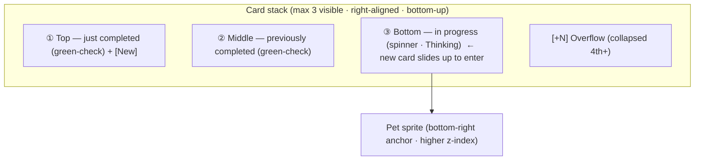
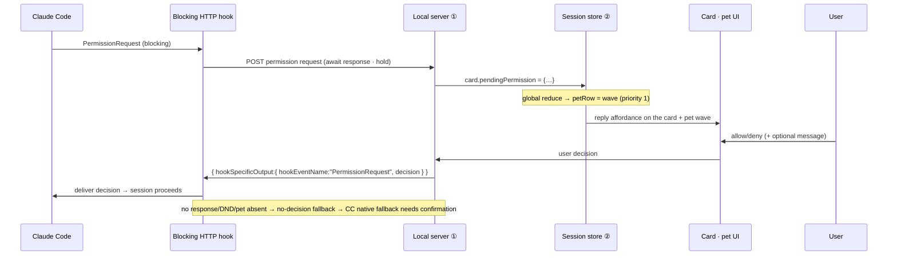
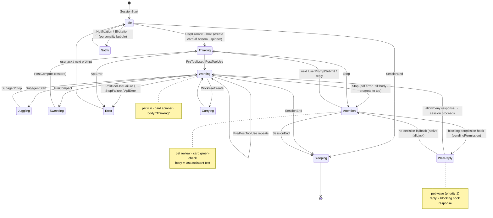
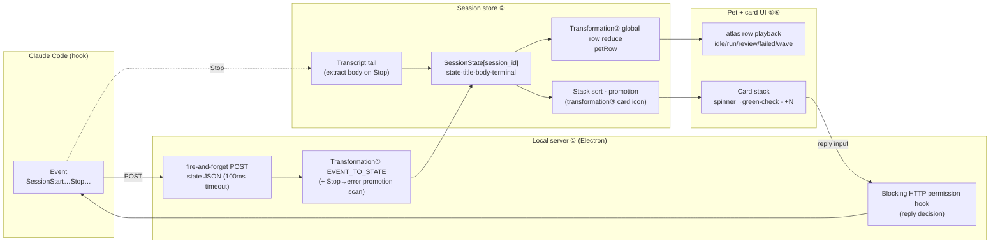

# State Engine (State Machine)

> Basis: official [Claude Code hooks](https://docs.anthropic.com/en/docs/claude-code/hooks) documentation (`EVENT_TO_STATE` and reply `Verified`) · [`refs/codex-pet-ux-teardown.md`](../../refs/codex-pet-ux-teardown.md) (observed sprite rows, card icons, stacking rules) · asset format [`refs/README.md`](../../refs/README.md) (atlas 8×9 · 192×208 `Verified`)
> Related: [01-architecture/overview.md](../01-architecture/overview.md) · [02-asset-compat/codex-pet-assets.md](../02-asset-compat/codex-pet-assets.md) · [04-pet-ui/pet-and-cards.md](../04-pet-ui/pet-and-cards.md) · [05-claude-integration/claude-code-hooks.md](../05-claude-integration/claude-code-hooks.md) · [ADR-0001](../adr/0001-electron-over-tauri.md) · [ADR-0004](../adr/0004-reply-via-blocking-hook.md)

This document pins down **three transformations** at an implementable level of detail.

1. **Claude Code event → pet state**: normalizes the events fired by the command hook into a single state vocabulary (`EVENT_TO_STATE`, `Verified`).
2. **Pet state → atlas animation row**: maps the normalized state to a single row (loop) of the spritesheet.
3. **Session = card**: one `session_id` is one card. Multiple sessions become a stack. State determines the card icon, body, and stack position.

All three transformations must be **pure functions** (same input → same output, no side effects). Side effects (starting an animation, sliding a card, the POST response) are performed by a separate layer after the state changes. This keeps testing and review easy.

One-line definitions of terms: in this document, **event** = the `event` field of the Claude Code hook payload, **state** = the normalized pet state vocabulary, **row** = the vertical atlas index (animation clip), and **card** = the speech-bubble UI for a single session.

---

## 0. Data Model (Session = Card)

These are the two core records the state engine works with. A developer should be able to implement [session store ②](../01-architecture/overview.md#containers-level-2) from these two tables alone.

### 0.1 `SessionState` (session = one card)

A value in a map keyed by `session_id`. **One card = one of these records.**

| Field | Type | Source event | Description |
|---|---|---|---|
| `sessionId` | string | all events | Card identifier (map key). Assigned by Claude Code `Verified` |
| `state` | `PetState` (§1.1) | all events | Current state normalized via `EVENT_TO_STATE` |
| `title` | string | UserPromptSubmit/Stop | Card title. `session_title` ▸ `custom-title`/`agent-name` ▸ first line of the prompt (≤40 chars, secrets stripped) `Verified` |
| `body` | string | Stop | Card body. Last assistant text from the transcript tail (≤2200 chars). Extracted once at the end of the turn, not streamed `Verified` |
| `bodyLabel` | enum | progress state | The status word to display while the body is undetermined (`Thinking`, etc., §3.2) |
| `contextPct` | number\|null | all events | Context usage percentage parsed from the transcript `Verified` |
| `terminal` | object | all events | `source_pid`·`agent_pid`·`pid_chain`·`tmux_socket`/`tmux_client`·`wt_hwnd`·`editor`. Used to focus the relevant terminal when replying `Verified` |
| `updatedAt` | epoch ms | all events | For sorting and expiry. The recency sort key |
| `createdAt` | epoch ms | first event | Card creation time |
| `pendingPermission` | object\|null | blocking HTTP hook | A permission request awaiting a reply (§5). `null` if none |

> **Invariant**: the `session_id` → card mapping is 1:1. When a new event arrives with the same `session_id`, **update the existing record rather than creating a new card**. `title`·`body`·`terminal` are not overwritten with empty values (e.g., PreToolUse changes only `state` and does not clear `title`). Design decision.

### 0.2 `PetWidgetState` (global widget = one pet + stack)

There is exactly one pet on screen. That single pet's animation is determined by a **single priority that consolidates all session states** (§2.2). The key asymmetry is that there are N cards but only one pet.

| Field | Type | Description |
|---|---|---|
| `petRow` | `AtlasRow` (§1.2) | The atlas row the pet is currently playing. The result of the global priority reduce |
| `cards` | `SessionState[]` | The list of cards sorted by `updatedAt` or by the promotion rules (§4) |
| `visibleCount` | int | The number of cards shown expanded on screen (max 3, §4) |
| `overflowCount` | int | The count collapsed into the `+N` badge = `max(0, cards.length - visibleCount)` |

---

## 1. State and Row Vocabularies

### 1.1 Pet states (`PetState`) — normalized state vocabulary for Claude Code hook events `Verified`

A state vocabulary derived from the official Claude Code hook events. **This is the actual state model we must replicate.**

| `PetState` | Meaning | Progress |
|---|---|---|
| `idle` | Session alive but no work (waiting) | Static |
| `sleeping` | Session ended | Static (slow) |
| `thinking` | Prompt received, before response starts | Progress |
| `working` | Tool running (most common) | Progress |
| `juggling` | Subagent active | Progress |
| `sweeping` | Context compaction in progress | Progress |
| `error` | Tool failure / Stop failure / API error | Terminal (error) |
| `attention` | **Done, waiting for user** (Stop) | Terminal (done/waiting) |
| `notification` | Notification / elicitation | Eventful |
| `carrying` | Worktree creation | Eventful |

### 1.2 Atlas rows (`AtlasRow`) — physical spritesheet rows `Verified`

Asset format (`Verified`, [`refs/README.md`](../../refs/README.md)): `spritesheet.webp` **1536×1872, 8×9 atlas, 192×208/frame**. **Row = state, column = frame (8 of them)**. The renderer traverses one row left→right and loops it.

| Row idx | `AtlasRow` name (official) | sy (px) | Frames per row | Notes |
|---|---|---|---|---|
| 0 | `idle` | 0 | 8 | Matches observed idle: effectively a 2-frame ping-pong A↔B `Verified` |
| 1 | `running-right` | 208 | 8 | Working (facing right) |
| 2 | `running-left` | 416 | 8 | Working (facing left) |
| 3 | `waving` | 624 | 8 | Hand wave + ^_^ greeting beat (cat_105) `Verified` |
| 4 | `jumping` | 832 | 8 | Jump / special beat |
| 5 | `failed` | 1040 | 8 | Failure / error |
| 6 | `waiting` | 1248 | 8 | **Waiting for input** (clock state row) |
| 7 | `running` | 1456 | 8 | Working / running. The typing/working bob is presumed to be part of the running family |
| 8 | `review` | 1664 | 8 | Review ready/done (done, green-check) |

> 9 rows = 9 official states (`Verified`, [`refs/codex-pet-deep-research.md`](../../refs/codex-pet-deep-research.md) — openai/codex#20863 · openai/skills `hatch-pet`). The row order above is fixed. The loader derives the row count from the image (`rows = imageHeight / 208`), so it is safe even if rows are added. Coordinate formulas: `sx = frame * 192`, `sy = rowIdx * 208`. Canvas `drawImage(sheet, sx, sy, 192, 208, dx, dy, w, h)` or CSS `background-position: -{sx}px -{sy}px`.

---

## 2. Transformations ① + ②: Event → State → Row

### 2.1 Master mapping table (implementation reference)

A developer can implement the hook handler and the row selector simultaneously from this single table. The `EVENT_TO_STATE` column is `Verified` (official hook events); the atlas row mapping is observation plus design.

| Claude event | → `PetState` | → `AtlasRow` | Row cadence | Card icon (§3) | Card behavior (§4) |
|---|---|---|---|---|---|
| `SessionStart` | `idle` | `idle` | ~1.4s ping-pong | none | No card (only registers the session) |
| `SessionEnd` | `sleeping` | `idle` | Slow (~2.5s) | none | Stack quiets · expiry candidate |
| `UserPromptSubmit` | `thinking` | `running` | ~0.9s bob | **spinner** | **Create new card at the bottom**, `body`=`bodyLabel:"Thinking"` |
| `PreToolUse` | `working` | `running` | ~0.9s bob | **spinner** | Keep in progress |
| `PostToolUse` | `working` | `running` | ~0.9s bob | **spinner** | Keep in progress |
| `SubagentStart` | `juggling` | `running` | ~0.7s (fast) | **spinner** | Keep in progress |
| `SubagentStop` | `working` | `running` | ~0.9s bob | **spinner** | Keep in progress |
| `PreCompact` | `sweeping` | `idle` | Special (slow bob) | **spinner** | Keep in progress (`bodyLabel:"Compacting"`) |
| `PostCompact` | `thinking`\|`idle` | `running`\|`idle` | Depends on context | spinner\|none | Restore the previous state |
| `PostToolUseFailure` | `error` | `failed` | Play once, then hold | **error icon** `Inferred` | Show error · red tone |
| `StopFailure` | `error` | `failed` | Play once, then hold | **error icon** `Inferred` | Show error |
| `ApiError` | `error` | `failed` | Play once, then hold | **error icon** `Inferred` | Show error |
| **`Stop`** | **`attention`** | `review` | Calm hold | **green-check** (or clock) | **Fill body + promote to top + `New` badge** |
| `Notification` | `notification` | `waving` | ~0.75s once | notification dot | Triggers a gray personality bubble `Inferred` |
| `Elicitation` | `notification` | `waving` | ~0.75s once | notification dot | Triggers a gray personality bubble `Inferred` |
| `WorktreeCreate` | `carrying` | `jumping` | ~0.75s once | none | Beat-style display |

> **The two faces of `Stop` (important edge case `Verified`)**: Claude also **fires a normal `Stop`** on API errors, but leaves an `isApiErrorMessage` assistant entry in the transcript. The `Stop` handler must therefore **scan the transcript tail and, if an error entry is present, promote `Stop` → `error`** (confirmed against the official transcript schema). In other words, the `Stop → attention` in the table above applies only after confirming "not an error."

### 2.2 Row selection: one pet, N cards (global priority reduce)

With multiple sessions, several cards may be in different states at once (e.g., card A is `working`, card B is `attention`). Since there is **only one pet**, the pet's `petRow` must reduce all session states to one. We use a **priority reduce** — the most "active/urgent" state dominates the pet.

| Priority | Condition (if any session) | `petRow` | Rationale |
|---|---|---|---|
| 1 (highest) | Awaiting reply (`pendingPermission`) or `notification` | `waving` | A required user action takes top priority — the pet calls out |
| 2 | `error` | `failed` | Failures should stand out |
| 3 | Any of `working`/`thinking`/`juggling`/`sweeping`/`carrying` | `running` | Shows that "work in progress" is alive |
| 4 | All `attention` (all done, no outstanding permissions) | `review` | Calm completion |
| 5 (lowest) | All `idle`/`sleeping` | `idle` | Waiting |

```
petRow = reduce(sessions):
  if any(s.pendingPermission || s.state == notification): return waving
  if any(s.state == error):                                return failed
  if any(s.state in {working,thinking,juggling,sweeping,carrying}): return running
  if any(s.state == attention):                            return review
  return idle
```

> The key point is that **card icons are per-session, while the pet row is global**. Even if card B shows a spinner (`working`) and card A shows a green-check (`attention`), the pet plays `running` per priority 3. Card icons follow the per-session mapping in §3 directly (no reduce).

### 2.3 Row playback modes (loop vs one-shot)

| Mode | Applicable rows | Behavior |
|---|---|---|
| **Infinite loop** | `idle`, `running`, `review` (slow) | Continuously cycle 8 frames (or ping-pong) |
| **Play once, then hold** | `failed` | Hold on the last frame (the error does not flash) |
| **Play once, then return** | `waving`, `jumping` | When the beat ends, return to the next row computed by the §2.2 reduce |

`idle` is observed as a 2-frame ping-pong (A↔B, ~1.4s) and `running` is a 6–8 frame typing bob (~0.9s) (`Verified`, [teardown §1.3](../../refs/codex-pet-ux-teardown.md)). To save resources while idle, `idle` throttles its frames ([NFR performance](../01-architecture/overview.md#non-functional-requirements-nfr)).

---

## 3. Transformation ③: State → Card Icon and Body

### 3.1 State → card icon

The status slot at the top-right of the card. Only two were **directly observed in our recording: the spinner and the green-check**. The clock (waiting) and error are slots by design, but card-level rendering of them was not observed (`Inferred`, [teardown §3](../../refs/codex-pet-ux-teardown.md)).

| Card icon | Applicable `PetState` | Shape/color (`Inferred`) | Confidence |
|---|---|---|---|
| **spinner** | `thinking`·`working`·`juggling`·`sweeping` | Thin gray spinning ring #8A8A8E~#B0B0B6, ~0.55s/revolution | `Verified` (observed) |
| **green-check** | `attention` (done, not error) | Filled green circle + white check #22C55E~#2EA043 | `Verified` (observed) |
| **clock** (waiting) | A variant of `attention` (awaiting an unresolved permission) | Gray clock — a slot by design | `Inferred` (not observed in recording) |
| **error** | `error` | Red warning icon | `Inferred` (not observed in recording) |
| (no icon) | `idle`·`sleeping`·`carrying` | — | — |

> **The key transition signal is spinner → green-check** (`Verified`, cat_021→022·cat_069·burst F07→F08). As the body fills via token streaming (`Thinking` → the actual answer), the spinner turns into a check. In our implementation the body is **extracted once at `Stop`** rather than streamed (§0.1), so the transition happens at the single-frame boundary of the `Stop` handler.

### 3.2 State → card body/label

Before the body (`body`) is finalized (before `Stop` is reached), a status-word label (`bodyLabel`) is displayed in the body's place (faint gray #5A5A60~#8A8A90).

| `PetState` | Body display | Source |
|---|---|---|
| `thinking`·`working`·`juggling` | `Thinking` (label) | Progress status word `Verified` (observed) |
| `sweeping` | `Compacting` (label) | Compaction in progress `Inferred` |
| `attention` (done) | **The last assistant text** (≤2200 chars, wrapped to 2–3 lines) | Transcript tail `Verified` |
| `error` | A one-line error summary | `Inferred` |
| `carrying` | `Creating worktree` (label) | `Inferred` |

Body extraction rule (`Verified`, official transcript schema): read the **last 256KB** of `~/.claude/projects/<proj>/<session_id>.jsonl` and take the **last assistant text** message. Skip `tool_use`, subagent, and API-error messages. After normalization, clamp to 2200 chars. → **The body is captured at the end of the turn and is not streamed.**

---

## 4. Stacking Rules (Multiple Sessions = Card Stack)

When there are multiple sessions, cards stack vertically above the pet (right-aligned, single column, bottom-up). Observation-based (`Verified`, [teardown §4](../../refs/codex-pet-ux-teardown.md)).

| Rule | Value | Confidence |
|---|---|---|
| Max visible | **3 cards**. Anything beyond overflows | `Verified` (observed up to 3) |
| Overflow | Collapsed into a `+N` pill (bottom corner), `overflow-y:auto` scroll | `Verified` |
| Growth direction | Bottom-up above the pet. New cards slide up + fade in at the bottom (near the pet) | `Verified` |
| New card entry | A new in-progress (spinner) task enters at the **bottom** | `Verified` |
| Completion promotion | On `Stop` (green-check), **promote to the top** + `New` badge; demote existing completed cards to the middle | `Verified` (cat_068~070) |
| Reorder animation | ~0.25s vertical slide (FLIP) | `Verified` (burst F11~F13) |

**Sort key (implementation)**: card sorting is not a simple descending `updatedAt` — it follows the **promotion rules**. A card that just transitioned to `attention` is moved to the top, and in-progress (spinner) cards are kept near the bottom. Recommended sort function:

```
sortKey(card):
  primary   = (card transitioned-to attention this tick) ? 0 : 1   // just completed → top
  secondary = -card.updatedAt                                       // most recent first
  return (primary, secondary)
visible = sorted[0..3]; overflow = sorted[3..]
```



---

## 5. Reply = State Transition (Blocking Permission Hook)

A reply is not a separate channel — it is **part of the state engine**. It is a synchronous path that opens only when Claude asks for a permission/decision. At that moment the relevant card's `pendingPermission` is filled and the pet calls out with `waving` (priority 1, §2.2) (`Verified`, [ADR-0004](../adr/0004-reply-via-blocking-hook.md)).



| State aspect | Rule |
|---|---|
| Entry | Receive the blocking HTTP hook → set `card.pendingPermission` → pet `waving` |
| Card icon | Expose a clock or a reply affordance (reply pill / input field) |
| Response | Respond to the hook with `{ hookSpecificOutput:{ hookEventName:"PermissionRequest", decision:{ behavior, message? } } }`. **No key injection (tmux/osascript)** `Verified` |
| Fallback | No response/DND/pet absent → no-decision fallback. The best representation among 204 / connection close in Claude Code is to be settled by smoke test |
| Exit | After responding, `pendingPermission = null`; the session proceeds with the next event (`working`/`Stop`) |

> Free-form input (the agent fully idle, no open hook) is handled by **focusing the relevant terminal** instead of key injection (accepted for v1, `Verified`). Terminal identification uses `SessionState.terminal` (§0.1).

---

## 6. Unified State Diagram

The full lifecycle of one session (= card). Represents only event → state transitions (row mapping is in §2.1, icons in §3).



---

## 7. Full Pipeline (Event → Pet + Cards)



---

## 8. Honest Trade-offs / Open Questions

| Item | Assessment |
|---|---|
| Body is not streamed | We extract once at `Stop` (the official transcript is per-turn `Verified`). Codex fills the body via token streaming and shows a spinner→check transition (`Verified`, [teardown §3](../../refs/codex-pet-ux-teardown.md)). **We show only the `Thinking` label while in progress and fill the body all at once on completion** — one notch lower in fidelity. v2 could approximate this with incremental transcript tailing (design decision). |
| `clock` (waiting) icon | The `Stop=attention` (done/waiting) state exists (`Verified`), but a card-level clock was not observed in our 106-second recording (`Inferred`). Only green-check is confirmed for rendering — the clock needs verification via additional capture. |
| `error` card icon | `EVENT_TO_STATE` includes `error` (`Verified`), but a red error icon was not observed in the recording (`Inferred`). Implemented with the `failed` row + a temporary warning icon, to be replaced once actually observed. |
| Global row reduce | Having one pet summarize N sessions by priority (§2.2) is our design decision. The pet's row behavior with multiple Codex sessions was not observed — the priority table is a reasonable assumption. |
| Special row mapping | The row indices for `waiting`/`failed`/`jumping`/`review` are fixed by the official order (`Verified`), but their exact motion and triggers were not observed in our recording (`Inferred`). `Notification`→`waving` and `WorktreeCreate`→`jumping` are tentative, meaning-based assignments. |
| `sweeping`→`idle` row | There is no compaction-specific row in the atlas, so it falls back to `idle` (slow). Progress indication is reinforced by the card spinner. |

---

## Appendix A. Quick Reference — One-line Event Lookup

A compact table a developer can use directly in a hook handler (details in §2.1).

| event | state | row | icon |
|---|---|---|---|
| SessionStart | idle | idle | — |
| SessionEnd | sleeping | idle | — |
| UserPromptSubmit | thinking | run | spinner |
| PreToolUse | working | run | spinner |
| PostToolUse | working | run | spinner |
| SubagentStart | juggling | run | spinner |
| SubagentStop | working | run | spinner |
| PreCompact | sweeping | idle | spinner |
| PostCompact | thinking\|idle | run\|idle | spinner\|— |
| PostToolUseFailure | error | failed | error |
| StopFailure | error | failed | error |
| ApiError | error | failed | error |
| Stop | attention | review | green-check |
| Notification | notification | wave | notification dot |
| Elicitation | notification | wave | notification dot |
| WorktreeCreate | carrying | jump | — |
