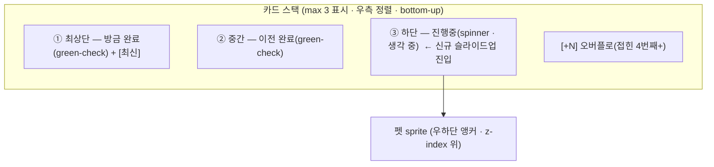
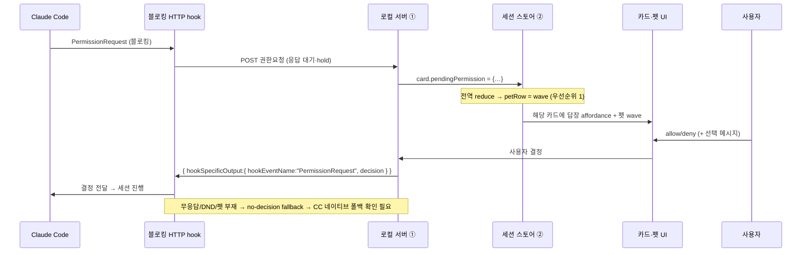
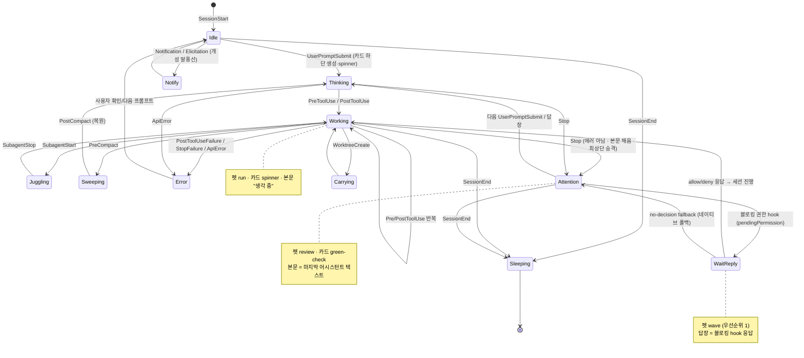
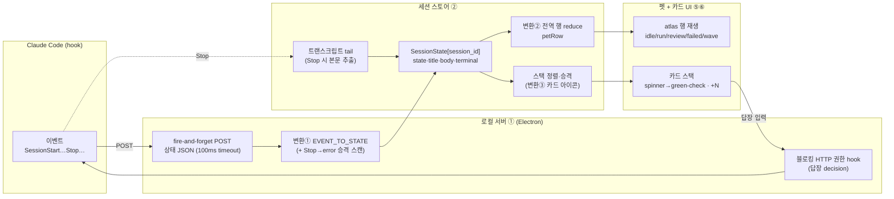

# 상태 엔진 (State Machine)

> 근거: 공식 [Claude Code hooks](https://docs.anthropic.com/en/docs/claude-code/hooks) 문서(`EVENT_TO_STATE`·답장 `확인`) · [`refs/codex-pet-ux-teardown.md`](../../refs/codex-pet-ux-teardown.md) (관찰된 sprite 행·카드 아이콘·스택 규칙) · 에셋 포맷 [`refs/README.md`](../../refs/README.md) (atlas 8×9 · 192×208 `확인`)
> 관련: [01-architecture/overview.md](../01-architecture/overview.md) · [02-asset-compat/codex-pet-assets.md](../02-asset-compat/codex-pet-assets.md) · [04-pet-ui/pet-and-cards.md](../04-pet-ui/pet-and-cards.md) · [05-claude-integration/claude-code-hooks.md](../05-claude-integration/claude-code-hooks.md) · [ADR-0001](../adr/0001-electron-over-tauri.md) · [ADR-0004](../adr/0004-reply-via-blocking-hook.md)

이 문서는 **세 개의 변환**을 구현 가능한 수준으로 고정한다.

1. **Claude Code 이벤트 → 펫 상태**: 커맨드 hook이 쏘는 이벤트를 단일 상태 어휘로 정규화한다(`EVENT_TO_STATE`, `확인`).
2. **펫 상태 → atlas 애니메이션 행**: 정규화된 상태를 spritesheet의 한 행(루프)으로 매핑한다.
3. **세션 = 카드**: `session_id` 하나가 카드 하나다. 다세션은 스택이 된다. 상태가 카드 아이콘·본문·스택 위치를 결정한다.

이 세 변환은 모두 **순수 함수**여야 한다(같은 입력 → 같은 출력, 부수효과 없음). 부수효과(애니메이션 시작, 카드 슬라이드, POST 응답)는 상태가 바뀐 뒤 별도 레이어가 수행한다. 그래야 테스트와 리뷰가 쉽다.

용어 한 줄 정의: 본 문서에서 **이벤트(event)** = Claude Code hook 페이로드의 `event` 필드, **상태(state)** = 정규화된 펫 상태 어휘, **행(row)** = atlas 세로 인덱스(애니메이션 클립), **카드(card)** = 한 세션의 말풍선 UI.

---

## 0. 데이터 모델 (세션 = 카드)

상태 엔진이 다루는 두 개의 핵심 레코드다. 개발자는 이 두 표만으로 [세션 스토어 ②](../01-architecture/overview.md#컨테이너-level-2)를 구현할 수 있어야 한다.

### 0.1 `SessionState` (세션 = 카드 1개)

`session_id`를 키로 하는 맵의 값. **카드 한 장 = 이 레코드 하나**다.

| 필드 | 타입 | 출처 이벤트 | 설명 |
|---|---|---|---|
| `sessionId` | string | 모든 이벤트 | 카드 식별자(맵 키). Claude Code가 부여 `확인` |
| `state` | `PetState` (§1.1) | 모든 이벤트 | `EVENT_TO_STATE`로 정규화된 현재 상태 |
| `title` | string | UserPromptSubmit/Stop | 카드 제목. `session_title` ▸ `custom-title`/`agent-name` ▸ 프롬프트 첫 줄(≤40자, secret 제거) `확인` |
| `body` | string | Stop | 카드 본문. 트랜스크립트 tail의 마지막 어시스턴트 텍스트(≤2200자). turn 끝에서 1회 추출, 스트리밍 아님 `확인` |
| `bodyLabel` | enum | 진행 상태 | 본문 미확정 시 표시할 상태어(`생각 중` 등, §3.2) |
| `contextPct` | number\|null | 모든 이벤트 | 트랜스크립트에서 파싱한 컨텍스트 사용률 `확인` |
| `terminal` | object | 모든 이벤트 | `source_pid`·`agent_pid`·`pid_chain`·`tmux_socket`/`tmux_client`·`wt_hwnd`·`editor`. 답장 시 해당 터미널 focus용 `확인` |
| `updatedAt` | epoch ms | 모든 이벤트 | 정렬·만료용. 최신 정렬 기준 |
| `createdAt` | epoch ms | 첫 이벤트 | 카드 생성 시각 |
| `pendingPermission` | object\|null | 블로킹 HTTP hook | 답장 대기 중인 권한 요청(§5). 없으면 `null` |

> **불변식**: `session_id` → 카드는 1:1이다. 같은 `session_id`로 새 이벤트가 오면 **새 카드를 만들지 않고 기존 레코드를 갱신**한다. `title`·`body`·`terminal`은 빈 값을 덮어쓰지 않는다(예: PreToolUse는 `state`만 바꾸고 `title`을 지우지 않음). 설계 결정.

### 0.2 `PetWidgetState` (위젯 전역 = 펫 1마리 + 스택)

펫은 화면에 한 마리다. 그 한 마리의 애니메이션은 **모든 세션 상태를 종합한 단일 우선순위**로 결정된다(§2.2). 카드는 N장이지만 펫은 1마리라는 점이 핵심 비대칭이다.

| 필드 | 타입 | 설명 |
|---|---|---|
| `petRow` | `AtlasRow` (§1.2) | 지금 펫이 재생 중인 atlas 행. 전역 우선순위 reduce 결과 |
| `cards` | `SessionState[]` | `updatedAt` 또는 승격 규칙으로 정렬된 카드 목록(§4) |
| `visibleCount` | int | 화면에 펼쳐 보일 카드 수(최대 3, §4) |
| `overflowCount` | int | `+N` 배지로 접힌 수 = `max(0, cards.length - visibleCount)` |

---

## 1. 상태·행 어휘

### 1.1 펫 상태 (`PetState`) — Claude Code hook 이벤트의 정규화 상태 어휘 `확인`

Claude Code 공식 hook 이벤트에서 도출한 상태 어휘다. **이것이 복제해야 할 실제 상태 모델**이다.

| `PetState` | 의미 | 진행성 |
|---|---|---|
| `idle` | 세션 살아있으나 작업 없음(대기) | 정적 |
| `sleeping` | 세션 종료 | 정적(저속) |
| `thinking` | 프롬프트 받음, 응답 시작 전 | 진행 |
| `working` | 도구 실행 중(가장 흔함) | 진행 |
| `juggling` | 서브에이전트 가동 중 | 진행 |
| `sweeping` | 컨텍스트 컴팩션 중 | 진행 |
| `error` | 도구 실패 / Stop 실패 / API 에러 | 종결(에러) |
| `attention` | **완료, 사용자 대기**(Stop) | 종결(완료/대기) |
| `notification` | 알림 / elicitation | 이벤트성 |
| `carrying` | worktree 생성 | 이벤트성 |

### 1.2 atlas 행 (`AtlasRow`) — spritesheet 물리 행 `확인`

에셋 포맷(`확인`, [`refs/README.md`](../../refs/README.md)): `spritesheet.webp` **1536×1872, 8×9 atlas, 192×208/frame**. **행(row) = 상태, 열(column) = 프레임(8장)**. 렌더러는 한 행을 좌→우로 순회하며 루프한다.

| 행 idx | `AtlasRow` 이름 (공식) | sy (px) | 행 frame 수 | 비고 |
|---|---|---|---|---|
| 0 | `idle` | 0 | 8 | 관찰 idle 일치: 실효 2프레임 ping-pong A↔B `확인` |
| 1 | `running-right` | 208 | 8 | 작업 중(우향) |
| 2 | `running-left` | 416 | 8 | 작업 중(좌향) |
| 3 | `waving` | 624 | 8 | 손 흔들기 + ^_^ 인사 비트(cat_105) `확인` |
| 4 | `jumping` | 832 | 8 | 점프/특수 비트 |
| 5 | `failed` | 1040 | 8 | 실패/에러 |
| 6 | `waiting` | 1248 | 8 | **입력 대기**(clock 상태 행) |
| 7 | `running` | 1456 | 8 | 작업/실행. typing/working bob이 running 계열로 추정 |
| 8 | `review` | 1664 | 8 | 검토 준비/완료(done, green-check) |

> 9행 = 9개 공식 상태다(`확인`, [`refs/codex-pet-deep-research.md`](../../refs/codex-pet-deep-research.md) — openai/codex#20863 · openai/skills `hatch-pet`). 행 순서는 위 고정. 로더는 행 수를 이미지에서 유도(`rows = imageHeight / 208`)하므로 행이 늘어도 안전하다. 좌표 공식: `sx = frame * 192`, `sy = rowIdx * 208`. 캔버스 `drawImage(sheet, sx, sy, 192, 208, dx, dy, w, h)` 또는 CSS `background-position: -{sx}px -{sy}px`.

---

## 2. 변환 ① + ②: 이벤트 → 상태 → 행

### 2.1 마스터 매핑 표 (구현 기준)

개발자는 이 한 표로 hook 핸들러와 행 셀렉터를 동시에 구현할 수 있다. `EVENT_TO_STATE` 열은 `확인`(공식 hook 이벤트), atlas 행 매핑은 관찰 + 설계다.

| Claude 이벤트 | → `PetState` | → `AtlasRow` | 행 케이던스 | 카드 아이콘(§3) | 카드 동작(§4) |
|---|---|---|---|---|---|
| `SessionStart` | `idle` | `idle` | ~1.4s ping-pong | 없음 | 카드 없음(세션만 등록) |
| `SessionEnd` | `sleeping` | `idle` | 저속(~2.5s) | 없음 | 스택 잠잠·만료 후보 |
| `UserPromptSubmit` | `thinking` | `running` | ~0.9s bob | **spinner** | **신규 카드 하단 생성**, `body`=`bodyLabel:"생각 중"` |
| `PreToolUse` | `working` | `running` | ~0.9s bob | **spinner** | 진행중 유지 |
| `PostToolUse` | `working` | `running` | ~0.9s bob | **spinner** | 진행중 유지 |
| `SubagentStart` | `juggling` | `running` | ~0.7s(빠름) | **spinner** | 진행중 유지 |
| `SubagentStop` | `working` | `running` | ~0.9s bob | **spinner** | 진행중 유지 |
| `PreCompact` | `sweeping` | `idle` | 특수(저속 bob) | **spinner** | 진행중 유지(`bodyLabel:"정리 중"`) |
| `PostCompact` | `thinking`\|`idle` | `running`\|`idle` | 상황 따름 | spinner\|없음 | 직전 상태 복원 |
| `PostToolUseFailure` | `error` | `failed` | 1회 재생 후 정지 | **error 아이콘** `추정` | 에러 표시·붉은 톤 |
| `StopFailure` | `error` | `failed` | 1회 재생 후 정지 | **error 아이콘** `추정` | 에러 표시 |
| `ApiError` | `error` | `failed` | 1회 재생 후 정지 | **error 아이콘** `추정` | 에러 표시 |
| **`Stop`** | **`attention`** | `review` | 평온 hold | **green-check**(또는 clock) | **본문 채움 + 최상단 승격 + `최신` 배지** |
| `Notification` | `notification` | `waving` | ~0.75s 1회 | 알림 점 | 회색 개성 말풍선 트리거 `추정` |
| `Elicitation` | `notification` | `waving` | ~0.75s 1회 | 알림 점 | 회색 개성 말풍선 트리거 `추정` |
| `WorktreeCreate` | `carrying` | `jumping` | ~0.75s 1회 | 없음 | 비트성 표시 |

> **`Stop`의 두 얼굴(중요 edge case `확인`)**: Claude는 API 에러 시에도 **정상 `Stop`을 발생**시키되 트랜스크립트에 `isApiErrorMessage` 어시스턴트 엔트리를 남긴다. 따라서 `Stop` 핸들러는 **트랜스크립트 tail을 스캔해 에러 엔트리가 있으면 `Stop` → `error`로 승격**해야 한다(공식 transcript 스키마에서 확인). 즉 위 표의 `Stop → attention`은 "에러 아님" 확인 후 적용된다.

### 2.2 행 선택: 펫은 1마리, 카드는 N장 (전역 우선순위 reduce)

다세션이면 여러 카드가 동시에 서로 다른 상태일 수 있다(예: 카드 A는 `working`, 카드 B는 `attention`). 펫은 **한 마리**이므로 펫의 `petRow`는 모든 세션 상태를 하나로 줄여야 한다. **우선순위 reduce**를 쓴다 — 가장 "활동적/긴급한" 상태가 펫을 지배한다.

| 우선순위 | 조건(어느 한 세션이라도) | `petRow` | 근거 |
|---|---|---|---|
| 1 (최상) | 답장 대기(`pendingPermission`) 또는 `notification` | `waving` | 사용자 행동 요구가 최우선 — 펫이 부른다 |
| 2 | `error` | `failed` | 실패는 눈에 띄어야 함 |
| 3 | `working`/`thinking`/`juggling`/`sweeping`/`carrying` 중 하나라도 | `running` | "일하는 중"이 살아있음을 보여줌 |
| 4 | 전부 `attention`(모두 완료, 미해결 권한 없음) | `review` | 완료 평온 |
| 5 (최하) | 전부 `idle`/`sleeping` | `idle` | 대기 |

```
petRow = reduce(sessions):
  if any(s.pendingPermission || s.state == notification): return waving
  if any(s.state == error):                                return failed
  if any(s.state in {working,thinking,juggling,sweeping,carrying}): return running
  if any(s.state == attention):                            return review
  return idle
```

> **카드 아이콘은 세션별, 펫 행은 전역**이라는 점이 핵심이다. 카드 B가 spinner(`working`)이고 카드 A가 green-check(`attention`)여도 펫은 우선순위 3에 따라 `running`을 돈다. 카드 아이콘은 §3의 세션별 매핑을 그대로 따른다(reduce 안 함).

### 2.3 행 재생 모드 (loop vs one-shot)

| 모드 | 적용 행 | 동작 |
|---|---|---|
| **무한 루프** | `idle`, `running`, `review`(저속) | 8프레임(또는 ping-pong) 계속 순회 |
| **1회 재생 후 정지** | `failed` | 끝 프레임에서 hold(에러는 깜빡이지 않음) |
| **1회 재생 후 복귀** | `waving`, `jumping` | 비트 끝나면 §2.2 reduce로 산출한 다음 행으로 복귀 |

`idle`은 관찰상 2프레임 ping-pong(A↔B, ~1.4s)이고 `running`은 6–8프레임 typing bob(~0.9s)이다(`확인`, [teardown §1.3](../../refs/codex-pet-ux-teardown.md)). 유휴 시 자원 절약을 위해 `idle`은 프레임 throttle한다([NFR 성능](../01-architecture/overview.md#비기능-요구사항-nfr)).

---

## 3. 변환 ③: 상태 → 카드 아이콘·본문

### 3.1 상태 → 카드 아이콘

카드 우상단 상태 슬롯. 본 녹화에서 **직접 관찰된 것은 spinner와 green-check 두 가지**다. clock(대기)·error는 설계상 슬롯이나 카드 레벨 렌더는 미관찰(`추정`, [teardown §3](../../refs/codex-pet-ux-teardown.md)).

| 카드 아이콘 | 적용 `PetState` | 모양·색(`추정`) | 신뢰도 |
|---|---|---|---|
| **spinner** | `thinking`·`working`·`juggling`·`sweeping` | 얇은 회색 회전 링 #8A8A8E~#B0B0B6, ~0.55s/바퀴 | `확인`(관찰) |
| **green-check** | `attention`(완료, 에러 아님) | 채워진 초록 원+흰 체크 #22C55E~#2EA043 | `확인`(관찰) |
| **clock**(대기) | `attention`의 변형(미해결 권한 대기) | 회색 시계 — 설계상 슬롯 | `추정`(녹화 미관찰) |
| **error** | `error` | 붉은 경고 아이콘 | `추정`(녹화 미관찰) |
| (아이콘 없음) | `idle`·`sleeping`·`carrying` | — | — |

> **핵심 전이 신호는 spinner → green-check**다(`확인`, cat_021→022·cat_069·버스트 F07→F08). 본문이 토큰 스트리밍으로 채워지며(`생각 중` → 실제 답변) spinner가 체크로 바뀐다. 우리 구현에서는 본문이 스트리밍이 아니라 **`Stop` 시 1회 추출**이므로(§0.1), 전이는 `Stop` 핸들러 1프레임 경계에서 일어난다.

### 3.2 상태 → 카드 본문/라벨

본문(`body`)이 확정되기 전(`Stop` 도달 전)에는 상태어 라벨(`bodyLabel`)을 본문 자리에 표시한다(흐린 회색 #5A5A60~#8A8A90).

| `PetState` | 본문 표시 | 출처 |
|---|---|---|
| `thinking`·`working`·`juggling` | `생각 중` (라벨) | 진행 상태어 `확인`(관찰) |
| `sweeping` | `정리 중` (라벨) | 컴팩션 진행 `추정` |
| `attention`(완료) | **마지막 어시스턴트 텍스트**(≤2200자, 2–3줄 래핑) | 트랜스크립트 tail `확인` |
| `error` | 에러 요약 한 줄 | `추정` |
| `carrying` | `worktree 생성` (라벨) | `추정` |

본문 추출 규칙(`확인`, 공식 transcript 스키마): `~/.claude/projects/<proj>/<session_id>.jsonl`의 **끝 256KB**를 읽어 **마지막 어시스턴트 텍스트** 메시지를 취한다. `tool_use`·서브에이전트·API-error 메시지는 건너뛴다. 정규화 후 2200자로 clamp. → **본문은 turn 끝에 잡히며 스트리밍이 아니다**.

---

## 4. 스택 규칙 (다세션 = 카드 스택)

세션이 여럿이면 카드가 펫 위로 세로 스택된다(우측 정렬, 단일 컬럼, bottom-up). 관찰 기반(`확인`, [teardown §4](../../refs/codex-pet-ux-teardown.md)).

| 규칙 | 값 | 신뢰도 |
|---|---|---|
| 최대 표시 | **3장**. 초과는 오버플로 | `확인`(3장까지 관찰) |
| 오버플로 | `+N` pill(하단 모서리)로 접힘, `overflow-y:auto` 스크롤 | `확인` |
| 성장 방향 | 펫 위로 bottom-up. 신규는 하단(펫 근처) 슬라이드업+fade-in | `확인` |
| 신규 카드 진입 | 진행중(spinner) 신규 작업은 **하단** 진입 | `확인` |
| 완료 승격 | `Stop`(green-check) 시 **최상단 승격** + `최신` 배지, 기존 완료 카드 중간 강등 | `확인`(cat_068~070) |
| 재정렬 애니메이션 | ~0.25s 세로 슬라이드(FLIP) | `확인`(버스트 F11~F13) |

**정렬 키(구현)**: 카드 정렬은 단순 `updatedAt` 내림차순이 아니라 **승격 규칙**을 따른다 — 방금 `attention`으로 전이한 카드를 최상단으로 올리고, 진행중(spinner) 카드는 하단 근처에 둔다. 권장 정렬 함수:

```
sortKey(card):
  primary   = (card transitioned-to attention this tick) ? 0 : 1   // 방금 완료 → 맨 위
  secondary = -card.updatedAt                                       // 최신 우선
  return (primary, secondary)
visible = sorted[0..3]; overflow = sorted[3..]
```



---

## 5. 답장 = 상태 전이 (블로킹 권한 hook)

답장은 별도 채널이 아니라 **상태 엔진의 일부**다. Claude가 권한/결정을 물을 때만 열리는 동기 경로이며, 그 순간 해당 카드의 `pendingPermission`이 채워지고 펫이 `waving`(우선순위 1, §2.2)로 부른다(`확인`, [ADR-0004](../adr/0004-reply-via-blocking-hook.md)).



| 상태 측면 | 규칙 |
|---|---|
| 진입 | 블로킹 HTTP hook 수신 → `card.pendingPermission` set → 펫 `waving` |
| 카드 아이콘 | clock 또는 답장 affordance(reply pill/입력칸) 노출 |
| 응답 | `{ hookSpecificOutput:{ hookEventName:"PermissionRequest", decision:{ behavior, message? } } }`로 hook 응답. **키 주입(tmux/osascript) 없음** `확인` |
| 폴백 | 무응답/DND/펫 부재 → no-decision fallback. Claude Code에서 204/연결종료 중 최적 표현은 smoke test로 확정 |
| 종료 | 응답 후 `pendingPermission = null`, 세션은 다음 이벤트(`working`/`Stop`)로 진행 |

> 자유 입력(에이전트가 완전 idle, 열린 hook 없음)은 키 주입 대신 **해당 터미널 focus**로 처리한다(v1 수용, `확인`). 터미널 식별은 `SessionState.terminal`(§0.1)을 쓴다.

---

## 6. 통합 상태 다이어그램

한 세션(=카드)의 전체 라이프사이클. 이벤트 → 상태 전이만 표현(행 매핑은 §2.1, 아이콘은 §3).



---

## 7. 전체 파이프라인 (이벤트 → 펫 + 카드)



---

## 8. 정직한 트레이드오프 / 미해결

| 항목 | 평가 |
|---|---|
| 본문이 스트리밍 아님 | 우리는 `Stop` 시 1회 추출(공식 transcript는 turn 단위 `확인`). Codex는 토큰 스트리밍으로 본문이 차오르며 spinner→check 전이를 보임(`확인`, [teardown §3](../../refs/codex-pet-ux-teardown.md)). **우리는 진행 중엔 `생각 중` 라벨만, 완료 시 본문 한 번에 채움** — 충실도가 한 단계 낮다. v2에서 트랜스크립트 incremental tail로 근사 가능(설계 결정). |
| `clock`(대기) 아이콘 | `Stop=attention`(완료/대기) 상태는 존재하나(`확인`) 카드 레벨 clock은 본 106초 녹화 미관찰(`추정`). green-check만 확정 렌더 — clock은 추가 캡처로 검증 필요. |
| `error` 카드 아이콘 | `EVENT_TO_STATE`에 `error`는 있으나(`확인`) 붉은 에러 아이콘은 녹화 미관찰(`추정`). `failed` 행 + 임시 경고 아이콘으로 구현, 실관찰 시 교체. |
| 전역 행 reduce | 펫 1마리가 N세션을 우선순위로 요약(§2.2)하는 건 우리 설계 결정이다. Codex 다세션 시 펫 행 동작은 미관찰 — 우선순위 표는 합리적 가정. |
| 특수 행 매핑 | `waiting`/`failed`/`jumping`/`review` 행 인덱스는 공식 순서로 확정(`확인`)이나, 정확한 모션·트리거는 본 녹화 미관찰(`추정`). `Notification`→`waving`, `WorktreeCreate`→`jumping`는 의미 기반 잠정 배정. |
| `sweeping`→`idle` 행 | 컴팩션 전용 행이 atlas에 없어 `idle`(저속)로 대체. 진행 표시는 카드 spinner로 보강. |

---

## 부록 A. 빠른 참조 — 이벤트 한 줄 룩업

개발자가 hook 핸들러에서 그대로 쓸 수 있는 압축 표(상세는 §2.1).

| event | state | row | icon |
|---|---|---|---|
| SessionStart | idle | idle | — |
| SessionEnd | sleeping | idle | — |
| UserPromptSubmit | thinking | run | spinner |
| PreToolUse | working | run | spinner |
| PostToolUse | working | run | spinner |
| SubagentStart | juggling | run | spinner |
| SubagentStop | working | run | spinner |
| PreCompact | sweeping | idle | spinner |
| PostCompact | thinking\|idle | run\|idle | spinner\|— |
| PostToolUseFailure | error | failed | error |
| StopFailure | error | failed | error |
| ApiError | error | failed | error |
| Stop | attention | review | green-check |
| Notification | notification | wave | 알림점 |
| Elicitation | notification | wave | 알림점 |
| WorktreeCreate | carrying | jump | — |
