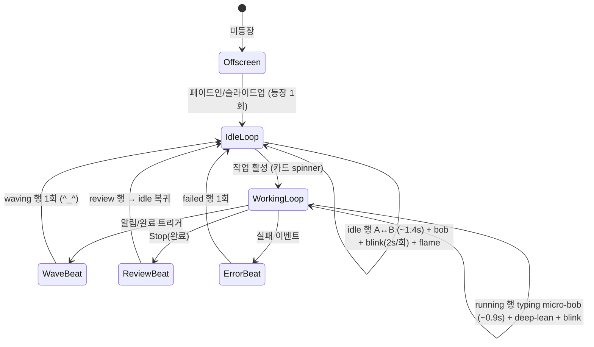
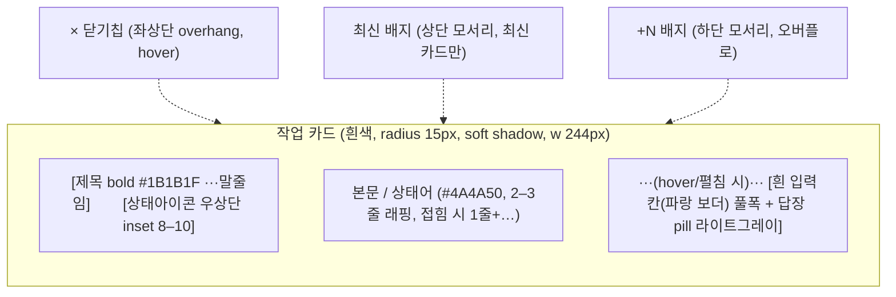
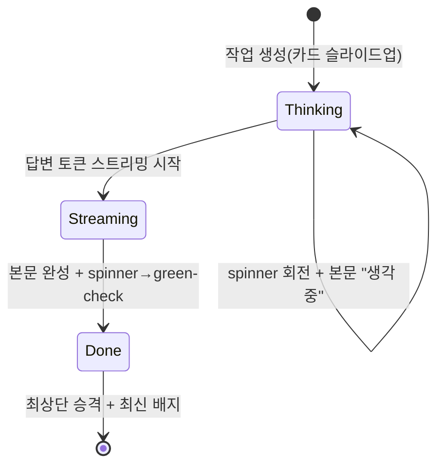
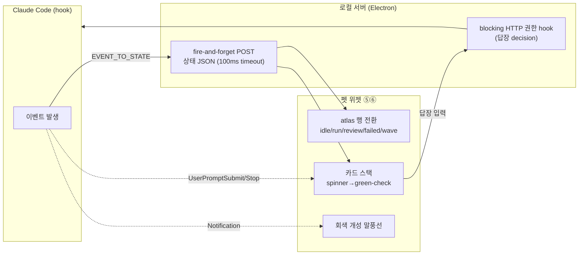
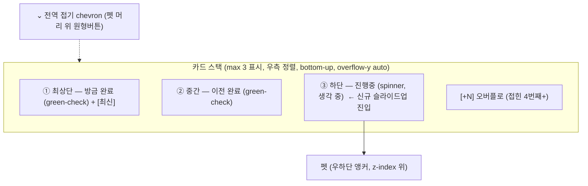
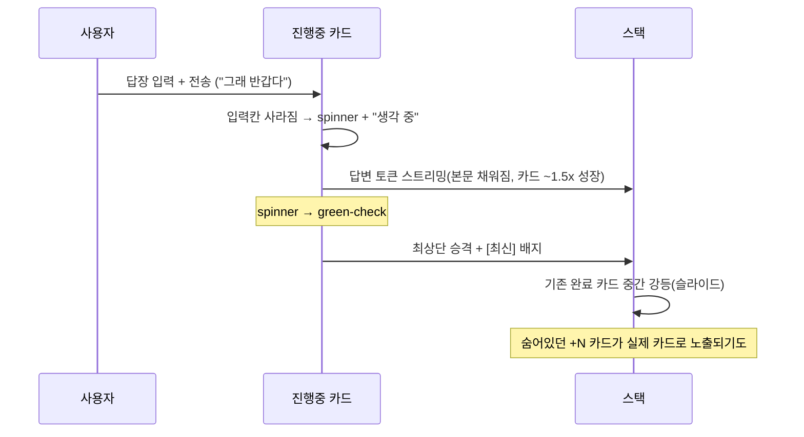
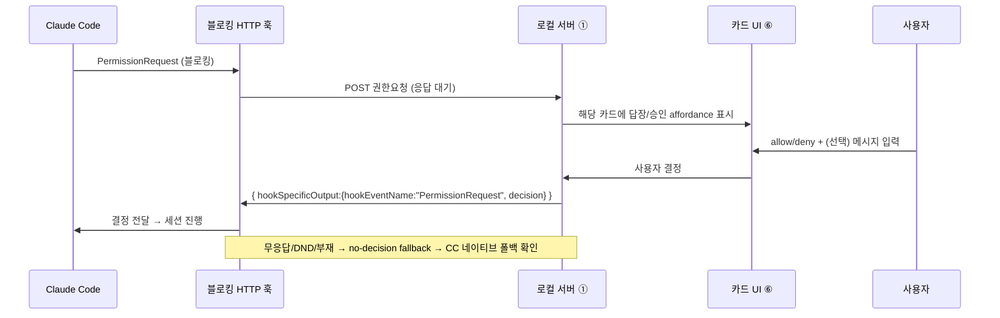
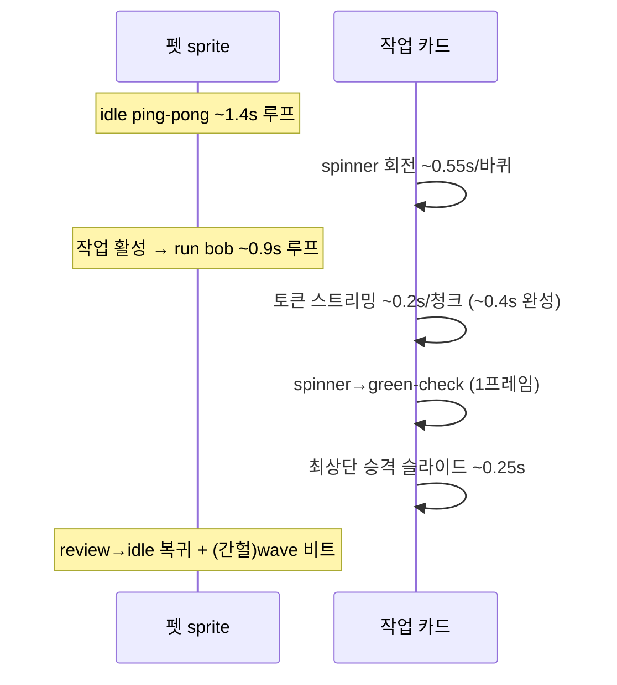

# 펫·카드 UI 구현 명세 (Pet & Cards)

> **근거**: [`refs/codex-pet-ux-teardown.md`](../../refs/codex-pet-ux-teardown.md) (Codex 펫 화면녹화 분석 — 본 문서의 모든 px/hex/타이밍 기준점) · [`refs/sample-pet/`](../../refs/README.md) (`nezu` 실제 에셋 — atlas 규격) · 공식 [Claude Code hooks](https://docs.anthropic.com/en/docs/claude-code/hooks) 문서 (상태 매핑·답장)
> **관련 문서**: [01-architecture/overview.md](../01-architecture/overview.md) (컴포넌트 ⑤⑥ 위치·데이터 흐름) · [02-asset-compat/codex-pet-assets.md](../02-asset-compat/codex-pet-assets.md) (에셋 로더·atlas 파싱) · [03-state-engine/state-machine.md](../03-state-engine/state-machine.md) (이벤트→상태) · [05-claude-integration/claude-code-hooks.md](../05-claude-integration/claude-code-hooks.md) (훅·답장 응답) · [ADR-0001](../adr/0001-electron-over-tauri.md) (Electron 셸)
> **충실도 주의**: 모든 절대 px·hex는 다크테마·2x retina·압축 크롭에서 추정한 **1차 클론 기준값**이다(±2–4px / ±10 휘도). 본 문서는 이 값을 CSS 변수로 토큰화해 구현 후 실측 보정하는 것을 전제로 한다. `추정`/`확인` 라벨은 [`teardown`](../../refs/codex-pet-ux-teardown.md)의 판정을 그대로 승계한다.

이 문서는 **컴포넌트 ⑤ 펫 창 + ⑥ 카드 스택 UI**([overview](../01-architecture/overview.md))를 개발자가 표만 보고 구현할 수 있는 수준으로 고정한다. Codex 데스크탑 렌더러는 비공개(minified)이고 매니페스트/스프라이트시트 포맷만 공개이므로 UI는 관찰 기반 재구성이며, 이 프로젝트의 **핵심 차별 가치**다. 셸은 Electron이고([ADR-0001](../adr/0001-electron-over-tauri.md)), **세션 1개 = 카드 1장, 다세션 = 스택**이 불변식이다.

---

## 0. 설계 토큰 (구현 진입점)

모든 측정·색은 CSS custom property로 집중 관리한다. 개발자는 아래 토큰을 한 곳에 정의하고, 이후 표들은 이 토큰을 참조한다. retina 보정 시 토큰만 고치면 전 컴포넌트에 전파된다.

```css
:root {
  /* ── 카드 컨테이너 ── */
  --card-w:            244px;   /* 240–250, 크롭폭의 ~43% */
  --card-min-h:        56px;
  --card-radius:       15px;    /* 14–16 다수결 */
  --card-pad-x:        15px;    /* 14–16 */
  --card-pad-y:        13px;    /* 12–14 */
  --card-gap:          10px;    /* 8–12 카드 간 세로 gap */
  --card-bg:           #FBFBFC; /* #FDFDFD~#F8F8FA */
  --card-shadow:       0 4px 12px rgba(0,0,0,0.30);

  /* ── 타이포 ──
     크기는 Retina 2x 화면녹화 프레임 실측(÷2): 본문 글자높이 ~11.5px·줄간격 16px,
     제목 글자높이 ~13.5px, 카드 폭 246px. → 본문 12px / 제목 13.5px / lh 1.35 로 확정.
     --ui-scale = 시스템 종속 단일 노브. 모든 글자 크기를 calc(px * var(--ui-scale))로 묶는다.
     실제 Electron 빌드가 OS 디스플레이 스케일·접근성 텍스트 크기에서 이 값을 주입(§2.1 "폰트 패밀리 & 시스템 종속" 참고).
     브라우저는 system-font 키워드(menu/caption…)를 16px로 고정하므로 CSS만으론 OS 크기를 못 읽음 `확인`. */
  --ui-scale:          1;
  --title-size:        calc(13.5px * var(--ui-scale)); /* 실측 제목 글자높이 ~13.5 */
  --title-weight:      680;     /* 600–700 semibold */
  --title-color:       #1B1B1F; /* #1A1A1E~#202020 */
  --body-size:         calc(12px * var(--ui-scale));   /* 실측 본문 ~11.5–12, 줄간격 16=12*1.33 */
  --body-weight:       400;
  --body-lh:           1.35;
  --body-color:        #4A4A50; /* #3A3A3C~#6B6B72 */
  --label-color:       #72727A; /* 상태 라벨 #5A5A60~#8A8A90 */

  /* ── 상태/배지/컨트롤 ── */
  --check-green:       #22C55E; /* #22C55E~#2EA043 */
  --spinner-track:     rgba(138,138,142,0.25);
  --spinner-head:      #9A9AA0; /* #8A8A8E~#B0B0B6 */
  --reply-pill-bg:     #D4D6DB; /* 라이트 그레이 pill — 원본 재대조 정정(과거 다크 오기) */
  --reply-pill-fg:     #6A6E76; /* 그레이 텍스트 */
  --input-bg:          #FCFCFD; /* 흰 입력칸(카드와 동일 톤) — 정정(과거 다크 오기) */
  --input-border:      #CDD0D6; /* 기본 회색 보더 */
  --input-placeholder: #9AA0A6;
  --input-focus:       #3B82F6; /* 파랑 focus 보더 */
  --close-chip-bg:     #E5E5EA;
  --close-chip-fg:     #6A6A6A;
  --chevron-color:     #6A6A6A;
  --badge-latest-bg:   #ECECEC; --badge-latest-fg: #6B6B6B;
  --badge-plusn-bg:    #3A3F4B; --badge-plusn-fg:  #C9D1D9;

  /* ── 회색 개성 말풍선 ── */
  --bubble-bg:         #EAEAEE; /* #E8E8EC~#ECECF0 */
  --bubble-fg:         #3A3A40;
  --bubble-radius:     17px;    /* 16–18 pill에 가까움 */

  /* ── 펫 창 ── */
  --pet-sprite-w:      192px;   /* atlas 프레임 native */
  --pet-sprite-h:      208px;
  --pet-css-w:         108px;   /* 95–120 CSS */
  --pet-margin-r:      12px;    /* 10–15 */
}
```

> **색 다수결 메모**: 카드는 **흰색**이 정설이다. 저해상 일부 판독의 다크 카드(#1C1C24)는 압축 아티팩트로 본다(2x retina 줌인 검증). `추정`(최고해상도 다수결, [teardown §0](../../refs/codex-pet-ux-teardown.md)).

---

## 1. 펫 창 렌더링 (컴포넌트 ⑤)

### 1.1 창 속성

Electron `BrowserWindow` 단일 투명 창에 펫 sprite와 카드 스택을 함께 합성한다. 비활성·always-on-top·click-through는 내장 `type:'panel'` + `setIgnoreMouseEvents` 커서 토글로 구현한다([07 build-plan](../07-implementation/build-plan.md) 검증, [ADR-0001](../adr/0001-electron-over-tauri.md)).

| 속성 | 값 | 구현 | 신뢰도 |
|---|---|---|---|
| 위치 | 화면 **우하단 코너 고정 앵커** | `screen.getPrimaryDisplay().workArea` 기준 bottom-right, `--pet-margin-r` | `확인`(전 구간 일관) |
| sprite 크기 | CSS `--pet-css-w` (95–120px), native 192×208 | atlas 프레임을 CSS 스케일 다운 | `추정` |
| always-on-top | 상시 최상단(풀스크린·전 Space 위) | `type:'panel'` + `win.setAlwaysOnTop(true,'screen-saver')` | `확인`(Electron API) |
| 투명 배경 | sprite·카드가 배경 없이 합성 | `transparent:true, frame:false, hasShadow:false` | `추정` |
| click-through | 펫·카드 외 영역 입력 통과 | `setIgnoreMouseEvents(true,{forward:true})` + hover 영역만 토글 | 설계 결정 |
| 드래그 | 위젯 reposition (녹화 미관찰, 위젯 관례로 둠) | `-webkit-app-region:drag` 또는 커스텀 드래그 핸들 | `추정`(미관찰) |
| 하단 도크 | 펫 발/노트북 밑변이 OS 작업표시줄 칩 줄 바로 위 | bottom 앵커 + 안전 마진 | `확인` |

> **z-index 불변식**: 펫 sprite는 카드 스택보다 **위(또는 동급)** 레이어다. 카드에 클리핑되지 않고 **카드 하단을 덮는다**. 카드 컨테이너는 펫 sprite의 위쪽 영역에만 stack-up하고, 펫은 별도 sprite 레이어로 항상 전경 합성한다. `확인`([teardown §1.1](../../refs/codex-pet-ux-teardown.md)).

### 1.2 펫 캐릭터 (에셋 호환)

본 영상 펫은 [`refs/sample-pet/`](../../refs/README.md)의 `nezu`와 동일 모티프(귀멸의 칼날 '네즈코' 픽셀 치비)다(`확인` — 에셋 폴더). 캐릭터는 **하드엣지 픽셀아트(안티앨리어싱 없음)**이므로 스케일 시 `image-rendering:pixelated` 필수. 색 팔레트는 [부록 A](#부록-a-색-팔레트-요약)를 참조하되, 렌더는 atlas 프레임을 그대로 그리고 우리가 색을 칠하지 않는다(네이티브 에셋 충실).

```
~/.codex/pets/<slug>/
├── pet.json          { id, displayName, description, spritesheetPath, kind }
└── spritesheet.webp  1536×1872, 8열×9행 atlas, 192×208/frame
```

`pet.json` 스키마와 로더 검증은 [02-asset-compat](../02-asset-compat/codex-pet-assets.md)에서 정의한다. 본 문서는 **렌더 소비자** 관점만 다룬다.

### 1.3 atlas 애니메이션

atlas는 **8열(프레임) × 9행(상태)**. 행 인덱스 = 상태, 열 인덱스 = 프레임(0–7). 렌더러는 한 행을 좌→우 순회하며 루프한다. `확인`([sample-pet](../../refs/README.md) 포맷).

| 행 | 상태(공식) | 클론 용도 | 루프 케이던스 |
|---|---|---|---|
| 0 | `idle` | 유휴 (호흡 bob) | A↔B ping-pong ~1.2–1.6s (0.6–0.8Hz) |
| 1 | `running-right` | working (우향) | micro-bob ~0.75–1.0s |
| 2 | `running-left` | working (좌향) | micro-bob ~0.75–1.0s |
| 3 | `waving` | 인사/알림 (^_^ + 손 흔들기) | ~6프레임/~0.75s 1회 비트 |
| 4 | `jumping` | carrying/worktree (점프) | 1회 비트 |
| 5 | `failed` | 에러 (스카울) | 1회 비트 후 idle 복귀 |
| 6 | `waiting` | 입력 대기 (clock) | 저속 루프 |
| 7 | `running` | working/typing (노트북 deep-lean) | micro-bob ~0.75–1.0s (6–8프레임) |
| 8 | `review` | 완료/검토 (평온·행복) | idle류 저속 루프 |

> 9행 = 9개 공식 상태(`확인`, [`refs/codex-pet-deep-research.md`](../../refs/codex-pet-deep-research.md)). 화면녹화에서 직접 관찰된 펫 비트는 idle·waving·typing(running 계열)이고, 나머지 행은 공식 순서 기준이다(typing의 정확한 running 행 인덱스는 `추정`).

**렌더 권장**: sprite는 DOM 위 별도 `<canvas>` 레이어. 프레임 전환은 `drawImage(sheet, col*192, row*208, 192, 208, 0,0, w,h)`. 상태→행 매핑 후 rAF 타이머로 프레임 인덱스를 진행한다. idle은 2프레임 ping-pong(느림 ~1.4s), working은 빠른 bob(~0.9s). 유휴 시 프레임 throttle로 자원 절약([overview NFR](../01-architecture/overview.md)).

| 미세 비트 | 측정 | 구현 메모 | 신뢰도 |
|---|---|---|---|
| idle bob | 머리·상체 1–4px 상하 | 프레임 A↔B 자체가 bob 포함 | `확인`(버스트 px-diff) |
| blink | 눈 감김 ~125–250ms (1–2프레임), ~2s/회 | idle에선 더 드묾(2s간 0회 관찰) | `확인` |
| working deep-lean | idle보다 상체가 노트북으로 더 깊이 | `running` 행 자체에 포함 | `확인` |
| 불꽃/엠버 flicker | 우측 하단 주황-빨강 파티클 ~2–3프레임 점멸 | atlas 프레임에 포함(별도 파티클 불필요) | `확인` |
| wave/peek | 흰 손바닥 들기 + ^_^ | `waving` 행 1회 재생 후 idle 복귀 | `확인`(cat_105) |



펫은 화면을 가로질러 이동하지 않는다(walk 없음). 제자리 sprite 애니메이션만 하며, 등장 시 페이드인/슬라이드업 1회만 translate한다. `확인`.

---

## 2. 카드 해부학 (컴포넌트 ⑥)

작업 카드는 **우측 정렬된 둥근 흰색 토스트/말풍선**이다. 한 작업(턴)당 한 장 = **세션 1개 = 카드 1장**([overview](../01-architecture/overview.md)). 제목(굵게) + 본문(상태어 또는 스트리밍 텍스트) + 우상단 상태 아이콘이 기본 구성이다.

### 2.1 요소·측정·스타일 (구현 표)

개발자는 이 표만으로 카드 1장을 만들 수 있다. 모든 값은 [§0 토큰](#0-설계-토큰-구현-진입점)을 참조한다.

| 요소 | 측정 (CSS) | 색 토큰 | radius | 폰트 | 비고 |
|---|---|---|---|---|---|
| **카드 컨테이너** | w `--card-w`(246), min-h `--card-min-h`(56), 본문 줄수 따라 **내용 높이로 성장** | `--card-bg` | `--card-radius`(15) | — | 우측 정렬, `--card-shadow`. 스택을 flex 컬럼으로 쌓을 때 카드에 **`flex:none`(shrink 금지)** 필수 — 안 그러면 flex가 카드를 `min-height`로 찌그러뜨려 본문 마지막 줄이 카드 밖으로 삐져나가 잘린다(상하 패딩도 깨짐) |
| **제목** | 1줄, 폭 초과 시 `text-overflow:ellipsis` | `--title-color` | — | `--title-size`(13.5) / `--title-weight`(680) | `white-space:nowrap; overflow:hidden` |
| **본문** | 2–3줄 래핑 허용, lh `--body-lh`(1.35→16px@12) | `--body-color` | — | `--body-size`(12) / 400 | `display:-webkit-box; -webkit-line-clamp:3` (접힘 시 1줄+`…`) |
| **상태 라벨** (`생각 중`) | 본문 자리 1줄 | `--label-color` | — | ~12 / 400 | 진행중 카드에서 본문 대신 표시 |
| **상태 아이콘** | 지름 16–20, 우상단 inset 8–10 | §2.3 | — | — | spinner / green-check |
| **답장 pill** | h 28–30, w 44–52 | `--reply-pill-bg` / `--reply-pill-fg` | h/2 (pill) | ~12 | hover/펼침 시 노출 |
| **인라인 입력칸** | h ~38, 펼침 시 풀폭 | **흰** `--input-bg` + 회색 `--input-border`, placeholder `--input-placeholder`, focus 파랑 `--input-focus` | 11 | ~12.5 | 펼친 카드 내부 |
| **닫기(×) 칩** | 원형 16–18, 좌상단 모서리 **overhang(절반 바깥)** | `--close-chip-bg` + `--close-chip-fg` × | 원 | — | hover 시 노출 |
| **펼치기 chevron** | `>`(우) 또는 `⌄`(아래) | `--chevron-color` | — | — | hover/우측 shoulder |
| **최신 배지** | h ~16, 상단 모서리 걸침 | `--badge-latest-bg` / `--badge-latest-fg` | h/2 (pill) | ~11 | 최신(보통 최상단) 카드만 |
| **+N 배지** | h ~16, 하단 중앙 모서리 걸침 | `--badge-plusn-bg` / `--badge-plusn-fg` | h/2 (pill) | ~11 | 접힌 카드 수 |

> **drop shadow 상세**: `0 4px 12px rgba(0,0,0,0.25~0.35)`, blur 12–16px, opacity 15–25%. 다크 배경 위 부드러운 elevation(토스트 느낌). `--card-shadow` 토큰이 중앙값. `추정`.

#### 폰트 패밀리 & 시스템 종속 (`--ui-scale`)

- **패밀리 = OS 네이티브 UI 폰트.** `-apple-system, BlinkMacSystemFont, "SF Pro Text", system-ui, "Segoe UI", sans-serif`. macOS에서는 SF Pro로 해석되어 시스템 컨트롤과 같은 글자체가 된다(직접 폰트를 번들하지 않음 = Codex 방식). 글자체는 자동으로 시스템에 종속된다.
- **크기 = 고정 px × `--ui-scale`.** 본문/제목/pill/입력칸의 `font-size`를 전부 `calc(<px> * var(--ui-scale))`로 묶어, 변수 하나로 카드 전체 타이포가 비례 리스케일된다. 카드 높이는 내용·줄수에 따라 자동 증가하므로 별도 조정 불필요.
- **시스템 크기 종속의 한계 `확인`.** 브라우저는 보안(핑거프린팅 방지)상 `font: menu|caption|message-box…` 시스템 폰트 키워드를 전부 `16px Arial`로 고정한다(측정 검증). 따라서 **순수 CSS만으로는 OS의 UI/접근성 텍스트 크기를 읽어올 수 없다.**
- **실제 빌드의 종속 경로.** Electron 렌더러는 OS에 접근 가능하므로, 메인 프로세스가 디스플레이 스케일(`screen.getPrimaryDisplay().scaleFactor`)·접근성 텍스트 크기를 읽어 `--ui-scale`로 주입한다. 사용자가 시스템 글자 크기를 키우면 펫 카드도 따라 커진다. (프로토타입은 이 경로가 없으므로 목 패널의 "UI 배율" 슬라이더로 동일 노브를 시연한다.)

### 2.2 카드 레이아웃



**본문 텍스트 출처**: 카드 제목 = `session_title` 또는 프롬프트 첫줄. 카드 본문 = 트랜스크립트 JSONL(`~/.claude/projects/<proj>/<session>.jsonl`) 끝부분의 **마지막 어시스턴트 텍스트**(Stop 시 추출). `확인`([teardown §8](../../refs/codex-pet-ux-teardown.md), [05-claude-integration](../05-claude-integration/claude-code-hooks.md)).

실제 관찰 예시: 완료 본문 `"좋습니다. 필요한 거 있으면 바로 이어서 보겠습니다."`, 진행중 본문 `생각 중`(상태어 1줄). 제목 `Longmemeval-s 점수 보고`, `docs: promote techspec int…`(말줄임), `근데 conductive network 이거…`(구어체).

### 2.3 상태 아이콘

카드 우상단 슬롯이 작업 상태를 표현한다. 녹화에서 직접 관찰된 것은 **spinner**와 **green-check** 둘뿐이다(clock 미관찰).

| 아이콘 | 모양 | 색 | 의미 | 펫 행 매핑 | 신뢰도 |
|---|---|---|---|---|---|
| **spinner** | 얇은 원형 로딩 링 (open arc 회전) | `--spinner-track` + `--spinner-head` | 진행 중 (생각 중/working) | `running` (deep-lean bob) | `확인` |
| **green-check** | 채워진 초록 원 + 흰 체크 | `--check-green` (#22C55E~#2EA043 변동) | 완료/성공 | `review`→`idle` 복귀 | `확인` |
| **clock** | 카드 아이콘 미관찰(설계상 존재) | — | 입력 대기 | 펫 `waiting`(6) 행 `확인` · 카드 아이콘 `추정` |
| **chevron** | 회색 V/`>` (아이콘 아닌 컨트롤) | `--chevron-color` | 펼치기/접기 | — | — |

**spinner 구현**: CSS `conic-gradient` 또는 SVG `stroke-dasharray` 회전, `~0.5–0.6s/바퀴`(4–5프레임마다 1/4턴). **green-check 구현**: 인라인 SVG 원+체크. 전이는 1프레임 경계에서 spinner→check 스왑(본문 완성과 동시).



> **clock 메모**: `EVENT_TO_STATE`상 `Stop=attention`(완료/대기)이 존재하므로 clock 슬롯은 설계상 합당하나, 106초 녹화엔 카드 레벨 clock 프레임이 없었다. 추가 캡처로 검증 필요([§7 미해결](#7-미해결-질문)). `추정`.

---

## 3. Claude Code 매핑 (이벤트 → 상태 → 카드)

확립된 `EVENT_TO_STATE`(`확인`, [03-state-engine](../03-state-engine/state-machine.md))를 펫 atlas 행/카드 아이콘에 매핑한다. 커맨드 hook이 상태 JSON을 로컬 서버로 **fire-and-forget POST**(100ms timeout, 펫 꺼져있으면 무해)한다. 상태 엔진 상세는 [03-state-engine](../03-state-engine/state-machine.md).

| Claude 이벤트 | 상태 | 펫 행 | 카드 아이콘 | 카드 동작 |
|---|---|---|---|---|
| SessionStart | idle | `idle` | — | 카드 없음/대기 |
| SessionEnd | sleeping | `idle`(저속) | — | 스택 잠잠 |
| UserPromptSubmit | thinking | `running` | **spinner** | 신규 카드 하단 생성, 본문 `생각 중` |
| PreToolUse / PostToolUse | working | `running` | **spinner** | 진행중 유지 |
| SubagentStart | juggling | `running`(빠름) | **spinner** | 진행중 |
| SubagentStop | working | `running` | **spinner** | 진행중 |
| PreCompact | sweeping | `idle`/특수 | **spinner** | 진행중 |
| PostCompact | thinking\|idle | `idle`/`running` | spinner/— | |
| PostToolUseFailure / StopFailure / ApiError | error | `failed` | 에러(미관찰) | 에러 표시 |
| **Stop** | **attention**(완료/대기) | `review` | **green-check**(또는 clock) | 본문=마지막 어시스턴트 텍스트, **최상단 승격 + 최신 배지** |
| Notification / Elicitation | notification | `waving` | (알림) | **회색 개성 말풍선** 트리거 추정 |
| WorktreeCreate | carrying | `jumping` | — | |



**카드 라이프사이클**: `UserPromptSubmit`(thinking) → 하단 spinner 카드 생성 → `PreToolUse/PostToolUse`(working) 동안 spinner 유지·본문 `생각 중` → `Stop`(attention) 시 트랜스크립트 tail에서 마지막 어시스턴트 텍스트를 본문에 채우고 **spinner→green-check + 최상단 승격 + 최신 배지**.

---

## 4. 스택 규칙 (다세션)

카드는 펫 위쪽으로 **세로 스택**된다(우측 정렬, 단일 컬럼, bottom-up). 컨테이너는 flex-column이고 새 카드는 하단(펫 근처)에서 슬라이드업한다.

| 규칙 | 값 | 구현 | 신뢰도 |
|---|---|---|---|
| **최대 표시 수** | 동시 최대 **3장** | 4번째+는 오버플로 | `확인`(3장까지 관찰) |
| **오버플로 +N** | 초과분은 하단 모서리 `+N` pill로 collapse | 컨테이너 `overflow-y:auto`, ≥3장 시 세로 스크롤바 | `확인`(최대 `+1` 관찰) |
| **성장 방향** | bottom-up. 신규는 하단 슬라이드업+fade-in → 기존 push-up | `flex-direction:column-reverse` 또는 정렬 후 transform | `확인` |
| **신규 카드 위치** | 진행중(spinner) 신규는 **하단** 진입 | — | `확인` |
| **완료 승격** | green-check 시 **최상단 승격**, 기존 완료는 중간 강등(재정렬 슬라이드) | FLIP 애니메이션 권장 | `확인`(cat_068~070) |
| **최신 배지** | 가장 최근(보통 방금 완료된 최상단) 카드 상단 모서리에 `최신` pill | — | `확인` |
| **재정렬 슬라이드** | ~2프레임(~0.25s) 세로 슬라이드, 전이 중 상단 경계 클리핑 | `transition:transform 0.25s` | `확인`(버스트 F11~F13) |



스택 전이 풀 사이클(cat_091~100 / 버스트 F01~F16):



> **FLIP 권장**: 승격/강등 재정렬은 First-Last-Invert-Play로 구현해야 부드럽다. 카드에 안정적 `key`(=`session_id`)를 부여하고, 정렬 변경 후 이전 좌표 대비 transform을 역산해 0.25s 슬라이드.

---

## 5. 인터랙션

### 5.1 hover-to-reveal

카드 위 마우스 진입 시 두 컨트롤이 페이드인(즉각 in/out, 커서 이탈 시 사라짐):

- **닫기(×) 칩**: 좌상단 모서리 overhang(절반 바깥). 흰/연회색 원 + 회색 ×. hover 시 초록 톤 강조 순간 포착(cat_038).
- **답장 pill** 또는 **펼치기 chevron(`>`)**: 카드 우측 edge/shoulder.

click-through 창이므로 hover 감지는 **펫·카드 bounding box에서만** `setIgnoreMouseEvents(false)`로 토글한다(나머지 영역은 입력 통과 유지).

### 5.2 답장 (click-to-expand reply)

`답장` pill 클릭 → 카드가 **제자리에서 세로로 펼쳐지며**(in-place expand, 높이 성장 → 스택 push-down) 인라인 답장 컴포저가 본문 아래 등장:

- 풀폭 둥근 **흰** 입력칸(placeholder `답장`, radius ~11px, h ~38px, `--input-bg`, 파랑 focus 보더)
- 우측 채워진 `답장` 전송 pill(`--reply-pill-bg`)
- 포커스 시 **파랑 focus ring**(`--input-focus` #3B82F6) + I-beam caret + caret blink(~0.5s 토글)

입력 예시: `그래 반갑다` 타이핑 후 전송 → 카드가 `생각 중`(spinner) 전환(cat_097~098).

### 5.3 펼치기 chevron (본문 펼침)

완료 카드 우상단/우측 `⌄`(아래)/`>`(우) chevron 토글로 본문 **펼침↔접힘**. 접힘 = 1줄 + `…`(`-webkit-line-clamp:1`), 펼침 = 전문(clamp 해제 + 높이 transition). cat_091~097: docs 카드 PR 전문 펼침/접힘.

### 5.4 전역 접기 chevron

펫 머리 **바로 위** 상시 원형 chevron-down 버튼(지름 30–36px, 반투명 다크/연회색 원 + 회색 `⌄`, soft shadow). 스택 전체 접기 / scroll-to-bottom / jump-to-latest 컨트롤로 추정. 녹화 내 토글 발동 미관찰. `추정`.

> hover 시 우하단에 대각선 resize 핸들(↗↙)이 추가 노출됨 — 위젯 리사이즈 그립, 닫기×와 별개. `확인`(cat_101~106).

### 5.5 답장 백엔드 동작

답장 텍스트는 **blocking HTTP 권한 hook 응답**으로 Claude에 전달된다:
`{ hookSpecificOutput: { hookEventName:"PermissionRequest", decision:{ behavior:"allow"|"deny", message? } } }`.
키 주입(tmux/osascript) **없음**. 무응답/DND/펫 부재 시 allow/deny를 만들지 않는 no-decision fallback으로
Claude 네이티브 프롬프트를 살린다. 정확한 204/연결종료 동작은 구현 smoke test로 확정한다. 카드의 `답장`은
Codex의 approve/redirect 모멘트에 대응한다. `확인`([05-claude-integration](../05-claude-integration/claude-code-hooks.md), [overview 흐름2](../01-architecture/overview.md)).



### 5.6 pet.json 이벤트 매핑 (hover/drag → 애니메이션) — 포워드 호환

현재 펫(`nezu`)엔 인터랙션→애니메이션 매핑이 없고 Codex도 타이밍을 앱이 하드코딩한다(`확인`). 단 [openai/codex#20863](https://github.com/openai/codex/issues/20863)이 pet.json에 선택적 `animation.events`(예 `{"hover":"jumping","drag":"waving"}`)를 제안 중이다(미출시 `확인`). 스키마 상세는 [02 §2.3](../02-asset-compat/codex-pet-assets.md). 펫 창(컴포넌트 ⑤)은 이를 **honor + 디폴트 제공**한다:

| 인터랙션 | pet.json `events` 있을 때 | 없을 때(우리 디폴트) |
|---|---|---|
| **hover**(펫 위 마우스) | `events.hover` 애니메이션 **1회 재생**(once) 후 현재 상태 행 복귀 | `waving` 행 1회(있으면), 없으면 무동작 |
| **drag**(펫 끌기) | `events.drag` 재생 | `jumping` 행(있으면) |
| (정의 안 된 이벤트) | 무시 | 무시 |

- **우선순위**: pet.json `events` > 우리 디폴트. agent-state 행(예 `working`)이 활성이어도 hover one-shot은 그 위에 잠깐 오버라이드했다가 복귀한다(`idleFallback` 의미론).
- **무해 원칙 유지**: 인터랙션 애니메이션은 **순수 클라이언트 연출** — Claude Code엔 어떤 신호도 보내지 않는다([overview NFR](../01-architecture/overview.md)).

---

## 6. 개성 회색 말풍선

> ⚠️ **재분류 (적대적 리뷰 반영)**: 아래 "별도 회색 말풍선"은 [teardown §0](../../refs/codex-pet-ux-teardown.md)이 **클론 제외**로 분류한 **좌측 패널(레이어 B = 별도 컴포저·대화 UI)** 영역에서 관찰됐다. `반갑다`/`그래그래`는 펫 대사가 아니라 **사용자가 친 대화 메시지**로 보여 **펫 위젯 기능이 아닐 공산이 크다** → v1에서는 **보류**한다. 펫 personality의 확실한 근거는 **카드 본문 톤**(아래 2번)뿐이다 ([§7 미해결 질문](#7-미해결-질문)).

펫의 personality 표현(관찰):

1. **별도 회색 말풍선**(tail 없는 둥근 pill): 펫 등장 직후(T≈14s) `반갑다`, `그래그래` 같은 짧은 구어체 대사가 회전 노출. `--bubble-bg`, radius `--bubble-radius`(17), 텍스트 `--bubble-fg`, ~14px regular. 아래에 복사(겹친 사각형) 아이콘 동반되기도.
2. **카드 본문의 페르소나 톤**: 본문 자체가 친근한 1인칭 한국어(`반갑습니다`, `좋습니다`, `바로 처리하겠습니다`). 진행중 라벨 `생각 중`도 회색 개성 표현.

| 요소 | 값 |
|---|---|
| 회색 말풍선 bg | `--bubble-bg` (#E8E8EC~#ECECF0) |
| 회색 말풍선 텍스트 | `--bubble-fg` (#3A3A40) |
| radius | `--bubble-radius` (16–18, pill에 가까움) |
| 복사 아이콘 | 겹친 사각형 라인 #9A9AA0 |
| 등장 빈도 | 산발적(이벤트성), 작업 카드와 분리된 독립 버블 |

> **트리거 메모**: 회색 말풍선은 영상 전반부(T<20s)에 집중되고 중후반엔 미등장. **상시가 아니라 이벤트성**(등장/인사 = `Notification`/`SessionStart` 추정)으로 트리거된다. 어떤 이벤트가 정확히 트리거하는지는 불확실([§7](#7-미해결-질문)). `추정`.

---

## 7. 애니메이션 타이밍 (구현 표)

| 애니메이션 | 주기/지속 | 구현 | 신뢰도 |
|---|---|---|---|
| 펫 idle ping-pong (A↔B) | ~1.2–1.6s (포즈당 0.6–0.8s) | rAF, 2프레임 토글 | `추정`(반-사이클) |
| 펫 working micro-bob | ~0.75–1.0s (6–8프레임) | rAF, `running` 행 루프 | `확인` |
| 펫 blink | 1회 125–250ms, ~2s/회 | atlas 프레임 포함 | `확인` |
| 펫 불꽃 flicker | ~2–3프레임(0.25–0.4s) | atlas 포함 | `확인` |
| 펫 등장 | 페이드인/슬라이드업 1회 | `transition:transform+opacity` | `확인` |
| 펫 wave/peek 비트 | ~6프레임(~0.75s) | `waving` 행 1회 | `확인` |
| 카드 spinner 회전 | ~0.5–0.6s/바퀴 | CSS `@keyframes spin` | `확인`(버스트) |
| 카드 토큰 스트리밍 | 청크당 0.13–0.25s, 전체 ~0.4s | 본문 점진 append | `확인` |
| 카드 등장 슬라이드업+fade | 하단 진입 | `transform:translateY + opacity` | `확인` |
| 스택 재정렬 슬라이드 | ~2프레임(~0.25s) | FLIP transform | `확인` |
| spinner→green-check | 본문 완성과 동시(1프레임 경계) | 아이콘 스왑 | `확인` |
| caret blink | ~0.5s 토글 | 네이티브 caret | `확인` |
| hover 칩 페이드 | 즉각 in/out | `transition:opacity` | `확인` |



---

## 8. 클론 트레이드오프 (정직한 평가)

| 항목 | 난이도 | 비고 |
|---|---|---|
| 카드(rounded box + shadow + status slot + chevron) | **쉬움** | "딱 HTML/CSS" (배경 문서가 직접 확인) |
| spinner / green-check 전이 | 쉬움 | CSS spinner + SVG check 스왑 |
| 스택 재정렬/슬라이드/+N | **중간** | flex-column gap + FLIP + `overflow-y:auto` |
| 인라인 답장(입력→권한 응답) | **중간** | UI는 쉬우나 백엔드는 blocking HTTP 권한 hook 의존(권한 경계에서만 동작) |
| 펫 atlas 애니메이션 | 중간 | sprite 레이어 + 행 루프. 비공개 렌더러 재현 |
| click-through hover 토글 | 중간 | bounding box 단위 `setIgnoreMouseEvents` 정밀 토글 필요 |
| 회색 말풍선 트리거 | 중간 | 트리거 이벤트 불확실(§7) |
| clock(대기) 아이콘 | **불확실** | 녹화 미관찰 — 별도 캡처 검증 |
| 드래그/투명/always-on-top | 중간 | Electron 내장 `type:'panel'` + 옵션 |

### 7. 미해결 질문

> 절번호 중복은 의도적이 아니며, 아래 미해결 항목을 트레이드오프와 함께 보기 위해 부록 전 단계에 둔다.

- **clock(대기) 아이콘**: `Stop=attention`의 '대기' 분기가 카드에서 어떻게 렌더되는가? 별도 캡처 필요.
- **회색 말풍선 트리거**: 정확히 어떤 이벤트(`Notification`? `SessionStart`?)가 개성 버블을 띄우는가?
- **전역 접기 chevron 동작**: 접기/scroll-to-bottom/jump 중 무엇인가? 토글 발동 캡처 필요.
- **에러 카드 아이콘**: `failed` 상태의 카드 아이콘 모양(녹화 미관찰).
- **드래그 reposition**: 위젯 이동이 실제 지원되는지(녹화 미관찰).

---

## 부록 A. 색 팔레트 요약 (`추정`)

| 토큰 | hex |
|---|---|
| 에디터/패널 배경(다크) | #16161E~#21222E |
| 카드 배경(흰) `--card-bg` | #FDFDFD~#F8F8FA |
| 카드 제목 `--title-color` | #1A1A1E |
| 카드 본문 `--body-color` | #3A3A3C~#6B6B72 |
| 상태 라벨 `--label-color` | #5A5A60~#8A8A90 |
| green-check `--check-green` | #22C55E~#2EA043 |
| spinner 링 `--spinner-head` | #8A8A8E~#B0B0B6 |
| 답장 pill bg `--reply-pill-bg` | #30363D~#3A3F4B |
| 입력 활성 border `--input-focus` | #3B82F6 / #7FA8FF |
| 최신/+N pill | #ECECEC(밝은) / #4B5563(어두운) |
| 회색 말풍선 `--bubble-bg`/`--bubble-fg` | bg #E8E8EC / 텍스트 #3A3A40 |
| 펫 머리(뿌리→끝) | #21222E → #CB5021 |
| 펫 기모노 핑크 | #F4A6C0 / #E89AB0 |
| 펫 볼터치 | #F49AB0 / #F5ACAD |
| 펫 눈(아이리스) | #E0509B~#E84B8F + 흰 하이라이트 |
| 펫 피부 | #FDDEC1 |
| 펫 대나무 재갈 | 초록 #7FA64A + 크림 #E8E0B0 |
| 펫 불꽃 | #FF7A1A~#E23A2A |

> 펫 색은 atlas 프레임을 그대로 그리므로 **참조용**이다(우리가 칠하지 않음). 카드/UI 색만 토큰으로 직접 구현한다.

## 부록 B. 구현 체크리스트

1. **[§0] 토큰 정의** → CSS custom property 한 파일.
2. **[§2.1] 카드 1장** → 제목·본문·상태아이콘만으로 정적 렌더. `--card-*` 토큰 검증.
3. **[§2.3] spinner/green-check** → 두 상태 스왑.
4. **[§4] 스택** → flex-column, max 3, `+N`, `overflow-y:auto`, FLIP 재정렬.
5. **[§5.1–5.3] hover/답장/펼침** → click-through 토글 + 인라인 컴포저 + chevron.
6. **[§1] 펫 창** → 투명 always-on-top + atlas canvas 렌더(행 매핑).
7. **[§3] 이벤트 배선** → 로컬 서버 상태 POST → 행/아이콘 전환.
8. **[§5.5] 답장 역채널** → blocking HTTP 권한 hook 응답.
9. **[§7] 보정** → 원본 영상 native(1200×1100, 2x) 대조로 px/hex 실측 보정.
