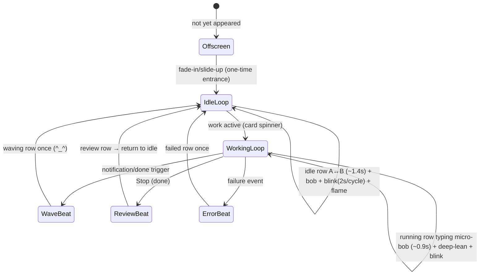
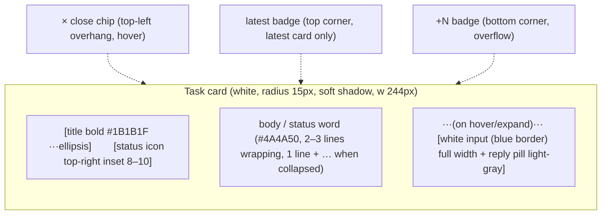
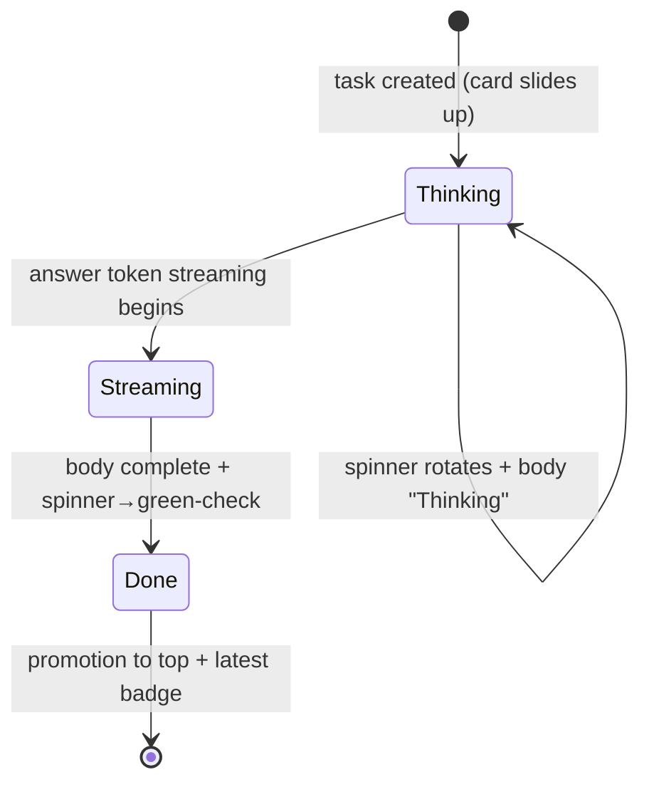
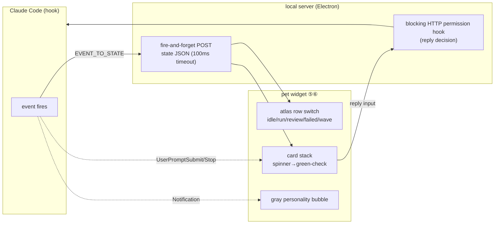
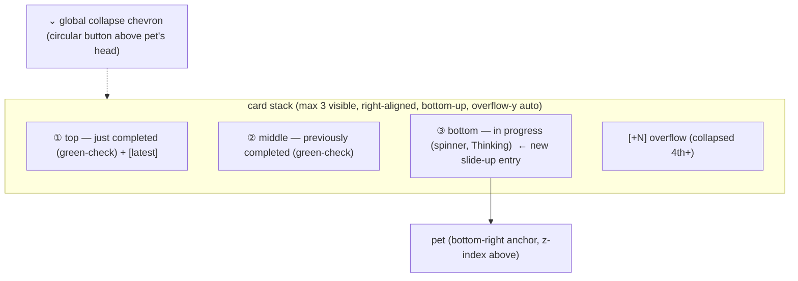
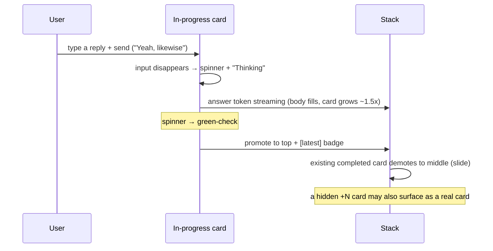
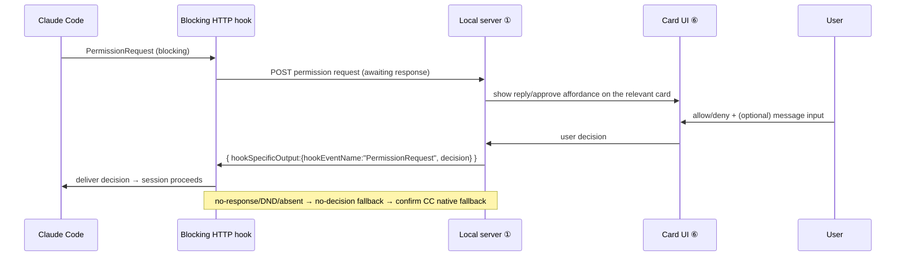
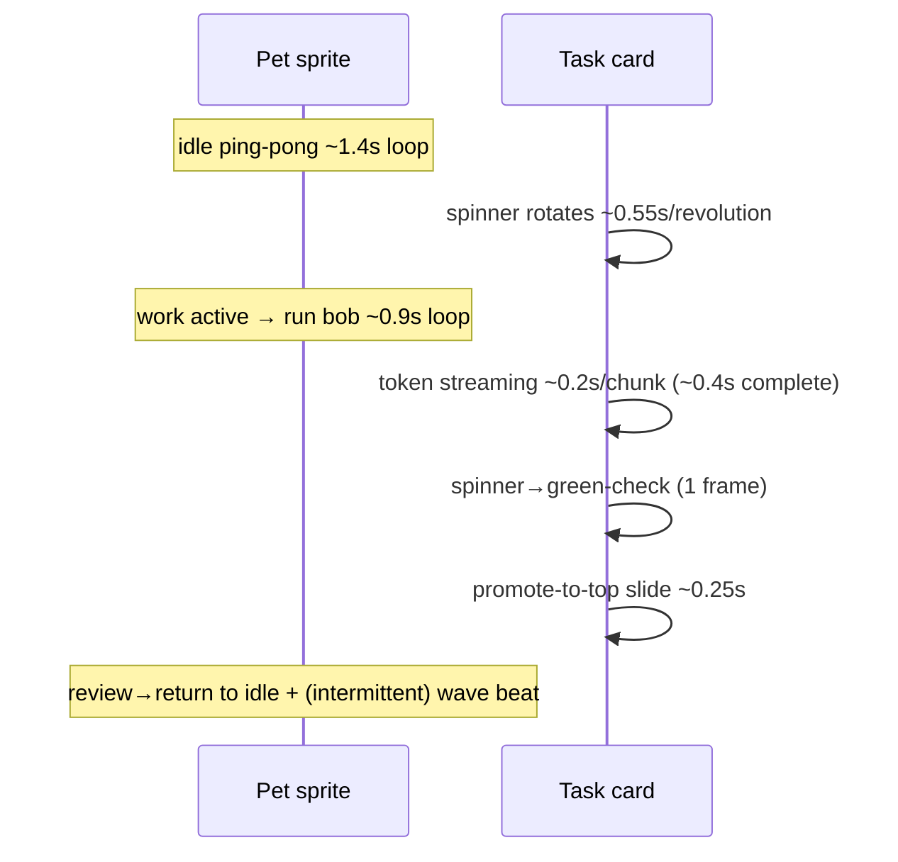

# Pet & Cards UI Implementation Spec (Pet & Cards)

> **Basis**: [`refs/codex-pet-ux-teardown.md`](../../refs/codex-pet-ux-teardown.md) (analysis of the Codex pet screen recording — the reference point for every px/hex/timing value in this document) · [`refs/sample-pet/`](../../refs/README.md) (`nezu` real assets — atlas spec) · official [Claude Code hooks](https://docs.anthropic.com/en/docs/claude-code/hooks) docs (state mapping and replies)
> **Related docs**: [01-architecture/overview.md](../01-architecture/overview.md) (placement of components ⑤⑥ and data flow) · [02-asset-compat/codex-pet-assets.md](../02-asset-compat/codex-pet-assets.md) (asset loader and atlas parsing) · [03-state-engine/state-machine.md](../03-state-engine/state-machine.md) (events → state) · [05-claude-integration/claude-code-hooks.md](../05-claude-integration/claude-code-hooks.md) (hooks and reply responses) · [ADR-0001](../adr/0001-electron-over-tauri.md) (Electron shell)
> **Fidelity caveat**: Every absolute px and hex value is a **first-pass clone reference value** inferred from a dark-theme, 2x retina, compressed crop (±2–4px / ±10 luminance). This document assumes these values are tokenized as CSS variables and then corrected against real measurements after implementation. The `Inferred`/`Verified` labels are carried over verbatim from the judgments in the [`teardown`](../../refs/codex-pet-ux-teardown.md).

This document locks down **component ⑤ the pet window + ⑥ the card stack UI** ([overview](../01-architecture/overview.md)) to a level where a developer can implement it from the tables alone. The Codex desktop renderer is closed (minified) and only the manifest/spritesheet format is public, so the UI is an observation-based reconstruction — and the **core differentiating value** of this project. The shell is Electron ([ADR-0001](../adr/0001-electron-over-tauri.md)), and the invariant is **one session = one card, multiple sessions = a stack**.

---

## 0. Design Tokens (Implementation Entry Point)

All measurements and colors are centrally managed as CSS custom properties. The developer defines the tokens below in one place, and the tables that follow reference these tokens. When correcting for retina, fixing the token alone propagates the change to every component.

```css
:root {
  /* ── Card container ── */
  --card-w:            244px;   /* 240–250, ~43% of crop width */
  --card-min-h:        56px;
  --card-radius:       15px;    /* 14–16 by majority */
  --card-pad-x:        15px;    /* 14–16 */
  --card-pad-y:        13px;    /* 12–14 */
  --card-gap:          10px;    /* 8–12 vertical gap between cards */
  --card-bg:           #FBFBFC; /* #FDFDFD~#F8F8FA */
  --card-shadow:       0 4px 12px rgba(0,0,0,0.30);

  /* ── Typography ──
     Sizes are measured from Retina 2x screen-recording frames (÷2): body glyph height ~11.5px, line spacing 16px,
     title glyph height ~13.5px, card width 246px. → finalized as body 12px / title 13.5px / lh 1.35.
     --ui-scale = a single system-dependent knob. It groups all font sizes via calc(px * var(--ui-scale)).
     The real Electron build injects this value from the OS display scale and accessibility text size (see §2.1 "Font family & system dependence").
     Browsers fix the system-font keywords (menu/caption…) to 16px, so OS size cannot be read from CSS alone `Verified`. */
  --ui-scale:          1;
  --title-size:        calc(13.5px * var(--ui-scale)); /* measured title glyph height ~13.5 */
  --title-weight:      680;     /* 600–700 semibold */
  --title-color:       #1B1B1F; /* #1A1A1E~#202020 */
  --body-size:         calc(12px * var(--ui-scale));   /* measured body ~11.5–12, line spacing 16=12*1.33 */
  --body-weight:       400;
  --body-lh:           1.35;
  --body-color:        #4A4A50; /* #3A3A3C~#6B6B72 */
  --label-color:       #72727A; /* status label #5A5A60~#8A8A90 */

  /* ── State/badge/control ── */
  --check-green:       #22C55E; /* #22C55E~#2EA043 */
  --spinner-track:     rgba(138,138,142,0.25);
  --spinner-head:      #9A9AA0; /* #8A8A8E~#B0B0B6 */
  --reply-pill-bg:     #D4D6DB; /* light-gray pill — corrected after re-checking the original (previously mis-noted as dark) */
  --reply-pill-fg:     #6A6E76; /* gray text */
  --input-bg:          #FCFCFD; /* white input field (same tone as the card) — corrected (previously mis-noted as dark) */
  --input-border:      #CDD0D6; /* default gray border */
  --input-placeholder: #9AA0A6;
  --input-focus:       #3B82F6; /* blue focus border */
  --close-chip-bg:     #E5E5EA;
  --close-chip-fg:     #6A6A6A;
  --chevron-color:     #6A6A6A;
  --badge-latest-bg:   #ECECEC; --badge-latest-fg: #6B6B6B;
  --badge-plusn-bg:    #3A3F4B; --badge-plusn-fg:  #C9D1D9;

  /* ── Gray personality bubble ── */
  --bubble-bg:         #EAEAEE; /* #E8E8EC~#ECECF0 */
  --bubble-fg:         #3A3A40;
  --bubble-radius:     17px;    /* 16–18, close to a pill */

  /* ── Pet window ── */
  --pet-sprite-w:      192px;   /* native atlas frame */
  --pet-sprite-h:      208px;
  --pet-css-w:         108px;   /* 95–120 CSS */
  --pet-margin-r:      12px;    /* 10–15 */
}
```

> **Color majority note**: The card is **white** by consensus. The dark card (#1C1C24) read off some low-resolution frames is treated as a compression artifact (verified via 2x retina zoom-in). `Inferred` (majority vote at highest resolution, [teardown §0](../../refs/codex-pet-ux-teardown.md)).

---

## 1. Pet Window Rendering (Component ⑤)

### 1.1 Window properties

A single transparent Electron `BrowserWindow` composites the pet sprite and the card stack together. Inactive, always-on-top, and click-through are implemented with the built-in `type:'panel'` + a `setIgnoreMouseEvents` cursor toggle ([07 build-plan](../07-implementation/build-plan.md) validation, [ADR-0001](../adr/0001-electron-over-tauri.md)).

| Property | Value | Implementation | Confidence |
|---|---|---|---|
| Position | **Fixed anchor at the screen's bottom-right corner** | bottom-right relative to `screen.getPrimaryDisplay().workArea`, `--pet-margin-r` | `Verified` (consistent throughout) |
| sprite size | CSS `--pet-css-w` (95–120px), native 192×208 | atlas frame scaled down via CSS | `Inferred` |
| always-on-top | Always topmost (above fullscreen and all Spaces) | `type:'panel'` + `win.setAlwaysOnTop(true,'screen-saver')` | `Verified` (Electron API) |
| transparent background | sprite and cards composited without a background | `transparent:true, frame:false, hasShadow:false` | `Inferred` |
| click-through | input passes through outside the pet and cards | `setIgnoreMouseEvents(true,{forward:true})` + toggle only over hover regions | design decision |
| drag | widget reposition (not observed in the recording, left as a widget convention) | `-webkit-app-region:drag` or a custom drag handle | `Inferred` (unobserved) |
| bottom dock | the pet's feet/laptop bottom edge sits just above the OS taskbar chip row | bottom anchor + safe margin | `Verified` |

> **z-index invariant**: The pet sprite is a layer **above (or equal to)** the card stack. It is not clipped by the cards and **covers the bottom of the cards**. The card container stacks up only in the region above the pet sprite, and the pet is always composited in the foreground as a separate sprite layer. `Verified` ([teardown §1.1](../../refs/codex-pet-ux-teardown.md)).

### 1.2 Pet character (asset compatibility)

The pet in this footage shares the same motif (`nezu` — a pixel chibi of "Nezuko" from Demon Slayer) as the one in [`refs/sample-pet/`](../../refs/README.md) (`Verified` — asset folder). The character is **hard-edge pixel art (no anti-aliasing)**, so `image-rendering:pixelated` is mandatory when scaling. Refer to the color palette in [Appendix A](#appendix-a-color-palette-summary), but the renderer draws the atlas frames as-is and we do not paint colors ourselves (faithful to the native assets).

```
~/.codex/pets/<slug>/
├── pet.json          { id, displayName, description, spritesheetPath, kind }
└── spritesheet.webp  1536×1872, 8-col × 9-row atlas, 192×208/frame
```

The `pet.json` schema and loader validation are defined in [02-asset-compat](../02-asset-compat/codex-pet-assets.md). This document covers only the **render consumer** perspective.

### 1.3 atlas animation

The atlas is **8 columns (frames) × 9 rows (states)**. Row index = state, column index = frame (0–7). The renderer traverses one row left → right and loops it. `Verified` ([sample-pet](../../refs/README.md) format).

| Row | State (official) | Clone use | Loop cadence |
|---|---|---|---|
| 0 | `idle` | idle (breathing bob) | A↔B ping-pong ~1.2–1.6s (0.6–0.8Hz) |
| 1 | `running-right` | working (rightward) | micro-bob ~0.75–1.0s |
| 2 | `running-left` | working (leftward) | micro-bob ~0.75–1.0s |
| 3 | `waving` | greeting/notification (^_^ + hand wave) | ~6 frames/~0.75s, one-shot beat |
| 4 | `jumping` | carrying/worktree (jump) | one-shot beat |
| 5 | `failed` | error (scowl) | one-shot beat, then return to idle |
| 6 | `waiting` | awaiting input (clock) | slow loop |
| 7 | `running` | working/typing (laptop deep-lean) | micro-bob ~0.75–1.0s (6–8 frames) |
| 8 | `review` | done/review (calm, happy) | idle-like slow loop |

> 9 rows = 9 official states (`Verified`, [`refs/codex-pet-deep-research.md`](../../refs/codex-pet-deep-research.md)). The pet beats directly observed in the screen recording are idle, waving, and typing (the running family); the remaining rows follow the official ordering (the exact running row index for typing is `Inferred`).

**Render recommendation**: The sprite is a separate `<canvas>` layer over the DOM. Frame transitions use `drawImage(sheet, col*192, row*208, 192, 208, 0,0, w,h)`. After mapping state → row, an rAF timer advances the frame index. idle is a 2-frame ping-pong (slow ~1.4s), working is a fast bob (~0.9s). While idle, throttle frames to save resources ([overview NFR](../01-architecture/overview.md)).

| Micro-beat | Measurement | Implementation note | Confidence |
|---|---|---|---|
| idle bob | head/torso 1–4px vertical | frames A↔B inherently include the bob | `Verified` (burst px-diff) |
| blink | eye-close ~125–250ms (1–2 frames), ~2s/cycle | rarer in idle (0 occurrences observed over 2s) | `Verified` |
| working deep-lean | torso leans deeper toward the laptop than in idle | included in the `running` row itself | `Verified` |
| flame/ember flicker | orange-red particles flickering at bottom-right ~2–3 frames | included in the atlas frames (no separate particle system needed) | `Verified` |
| wave/peek | raised white palm + ^_^ | play the `waving` row once, then return to idle | `Verified` (cat_105) |



The pet does not move across the screen (no walking). It performs only in-place sprite animation, and the only translate is a one-time fade-in/slide-up on entrance. `Verified`.

---

## 2. Card Anatomy (Component ⑥)

A task card is a **right-aligned, rounded white toast/speech bubble**. One per task (turn) = **one session = one card** ([overview](../01-architecture/overview.md)). The default composition is a title (bold) + body (a status word or streaming text) + a status icon in the top-right.

### 2.1 Elements, measurements, styles (implementation table)

A developer can build a single card from this table alone. All values reference the [§0 tokens](#0-design-tokens-implementation-entry-point).

| Element | Measurement (CSS) | Color token | radius | Font | Notes |
|---|---|---|---|---|---|
| **Card container** | w `--card-w`(246), min-h `--card-min-h`(56), **grows to content height** as body lines increase | `--card-bg` | `--card-radius`(15) | — | right-aligned, `--card-shadow`. When stacking cards in a flex column, the card **must have `flex:none` (no shrinking)** — otherwise flex crushes the card to `min-height`, the last body line spills out of the card and gets clipped (and the top/bottom padding breaks too) |
| **Title** | 1 line, `text-overflow:ellipsis` when it overflows the width | `--title-color` | — | `--title-size`(13.5) / `--title-weight`(680) | `white-space:nowrap; overflow:hidden` |
| **Body** | 2–3 lines of wrapping allowed, lh `--body-lh`(1.35→16px@12) | `--body-color` | — | `--body-size`(12) / 400 | `display:-webkit-box; -webkit-line-clamp:3` (1 line + `…` when collapsed) |
| **Status label** (`Thinking`) | 1 line in the body slot | `--label-color` | — | ~12 / 400 | shown instead of the body on in-progress cards |
| **Status icon** | diameter 16–20, top-right inset 8–10 | §2.3 | — | — | spinner / green-check |
| **Reply pill** | h 28–30, w 44–52 | `--reply-pill-bg` / `--reply-pill-fg` | h/2 (pill) | ~12 | revealed on hover/expand |
| **Inline input field** | h ~38, full width when expanded | **white** `--input-bg` + gray `--input-border`, placeholder `--input-placeholder`, blue focus `--input-focus` | 11 | ~12.5 | inside the expanded card |
| **Close (×) chip** | circle 16–18, top-left corner **overhang (half outside)** | `--close-chip-bg` + `--close-chip-fg` × | circle | — | revealed on hover |
| **Expand chevron** | `>` (right) or `⌄` (down) | `--chevron-color` | — | — | hover/right shoulder |
| **Latest badge** | h ~16, straddling the top corner | `--badge-latest-bg` / `--badge-latest-fg` | h/2 (pill) | ~11 | only on the latest (usually topmost) card |
| **+N badge** | h ~16, straddling the bottom-center corner | `--badge-plusn-bg` / `--badge-plusn-fg` | h/2 (pill) | ~11 | count of collapsed cards |

> **drop shadow detail**: `0 4px 12px rgba(0,0,0,0.25~0.35)`, blur 12–16px, opacity 15–25%. A soft elevation over a dark background (toast feel). The `--card-shadow` token is the median value. `Inferred`.

#### Font family & system dependence (`--ui-scale`)

- **Family = the OS native UI font.** `-apple-system, BlinkMacSystemFont, "SF Pro Text", system-ui, "Segoe UI", sans-serif`. On macOS this resolves to SF Pro, matching the typeface of system controls (no font is bundled directly = the Codex approach). The typeface is automatically system-dependent.
- **Size = fixed px × `--ui-scale`.** The `font-size` of the body/title/pill/input is all grouped via `calc(<px> * var(--ui-scale))`, so a single variable proportionally rescales the entire card's typography. Card height grows automatically with content/line count, so no separate adjustment is needed.
- **Limit of system-size dependence `Verified`.** For security (anti-fingerprinting), browsers fix all system-font keywords `font: menu|caption|message-box…` to `16px Arial` (measurement-verified). Therefore **the OS's UI/accessibility text size cannot be read from pure CSS alone.**
- **The real build's dependence path.** The Electron renderer can access the OS, so the main process reads the display scale (`screen.getPrimaryDisplay().scaleFactor`) and the accessibility text size and injects them as `--ui-scale`. When the user increases the system font size, the pet cards grow accordingly. (The prototype lacks this path, so the mock panel's "UI scale" slider demonstrates the same knob.)

### 2.2 Card layout



**Body text source**: Card title = `session_title` or the first line of the prompt. Card body = the **last assistant text** from the tail of the transcript JSONL (`~/.claude/projects/<proj>/<session>.jsonl`) (extracted on Stop). `Verified` ([teardown §8](../../refs/codex-pet-ux-teardown.md), [05-claude-integration](../05-claude-integration/claude-code-hooks.md)).

Real observed examples: done body `"Sounds good. I'll pick it right back up if you need anything."`, in-progress body `Thinking` (single status-word line). Titles `Longmemeval-s score report`, `docs: promote techspec int…` (ellipsized), `So this conductive network thing…` (colloquial).

### 2.3 Status icons

The card's top-right slot expresses the task state. The only ones directly observed in the recording are the **spinner** and the **green-check** (clock not observed).

| Icon | Shape | Color | Meaning | Pet row mapping | Confidence |
|---|---|---|---|---|---|
| **spinner** | thin circular loading ring (rotating open arc) | `--spinner-track` + `--spinner-head` | in progress (thinking/working) | `running` (deep-lean bob) | `Verified` |
| **green-check** | filled green circle + white check | `--check-green` (#22C55E~#2EA043 varies) | done/success | `review` → return to `idle` | `Verified` |
| **clock** | card icon not observed (exists by design) | — | awaiting input | pet `waiting`(6) row `Verified` · card icon `Inferred` |
| **chevron** | gray V/`>` (a control, not an icon) | `--chevron-color` | expand/collapse | — | — |

**spinner implementation**: CSS `conic-gradient` or SVG `stroke-dasharray` rotation, `~0.5–0.6s/revolution` (a quarter turn every 4–5 frames). **green-check implementation**: inline SVG circle + check. The transition swaps spinner→check on a single-frame boundary (simultaneous with body completion).



> **clock note**: Since `Stop=attention` (done/waiting) exists in `EVENT_TO_STATE`, a clock slot is reasonable by design, but there was no card-level clock frame in the 106-second recording. Needs verification with additional capture ([§7 unresolved](#7-unresolved-questions)). `Inferred`.

---

## 3. Claude Code Mapping (Event → State → Card)

We map the established `EVENT_TO_STATE` (`Verified`, [03-state-engine](../03-state-engine/state-machine.md)) onto pet atlas rows / card icons. A command hook does a **fire-and-forget POST** of the state JSON to the local server (100ms timeout, harmless if the pet is off). State-engine details are in [03-state-engine](../03-state-engine/state-machine.md).

| Claude event | State | Pet row | Card icon | Card action |
|---|---|---|---|---|
| SessionStart | idle | `idle` | — | no card / standby |
| SessionEnd | sleeping | `idle` (slow) | — | stack quiet |
| UserPromptSubmit | thinking | `running` | **spinner** | create new card at bottom, body `Thinking` |
| PreToolUse / PostToolUse | working | `running` | **spinner** | stay in progress |
| SubagentStart | juggling | `running` (fast) | **spinner** | in progress |
| SubagentStop | working | `running` | **spinner** | in progress |
| PreCompact | sweeping | `idle`/special | **spinner** | in progress |
| PostCompact | thinking\|idle | `idle`/`running` | spinner/— | |
| PostToolUseFailure / StopFailure / ApiError | error | `failed` | error (not observed) | show error |
| **Stop** | **attention** (done/waiting) | `review` | **green-check** (or clock) | body = last assistant text, **promote to top + latest badge** |
| Notification / Elicitation | notification | `waving` | (notification) | **gray personality bubble** trigger (inferred) |
| WorktreeCreate | carrying | `jumping` | — | |



**Card lifecycle**: `UserPromptSubmit` (thinking) → create a spinner card at the bottom → keep the spinner and body `Thinking` during `PreToolUse/PostToolUse` (working) → on `Stop` (attention), fill the body with the last assistant text from the transcript tail and **spinner→green-check + promote to top + latest badge**.

---

## 4. Stack Rules (Multiple Sessions)

Cards **stack vertically** above the pet (right-aligned, single column, bottom-up). The container is a flex column and new cards slide up from the bottom (near the pet).

| Rule | Value | Implementation | Confidence |
|---|---|---|---|
| **Max visible count** | up to **3 at once** | the 4th+ overflow | `Verified` (up to 3 observed) |
| **Overflow +N** | collapse the excess into a `+N` pill at the bottom corner | container `overflow-y:auto`, vertical scrollbar at ≥3 cards | `Verified` (up to `+1` observed) |
| **Growth direction** | bottom-up. new cards slide up + fade in at the bottom → existing cards pushed up | `flex-direction:column-reverse` or transform after sorting | `Verified` |
| **New card position** | a new in-progress (spinner) card enters at the **bottom** | — | `Verified` |
| **Completion promotion** | on green-check, **promote to top**; existing completed cards demote to the middle (reorder slide) | FLIP animation recommended | `Verified` (cat_068~070) |
| **Latest badge** | a `latest` pill on the top corner of the most recent (usually the just-completed topmost) card | — | `Verified` |
| **Reorder slide** | ~2 frames (~0.25s) vertical slide, top-edge clipping during the transition | `transition:transform 0.25s` | `Verified` (burst F11~F13) |



Full stack-transition cycle (cat_091~100 / burst F01~F16):



> **FLIP recommendation**: The promote/demote reorder must be implemented as First-Last-Invert-Play to be smooth. Give each card a stable `key` (= `session_id`), and after the sort changes, compute the inverse transform against the previous coordinates for a 0.25s slide.

---

## 5. Interactions

### 5.1 hover-to-reveal

On mouse-enter over a card, two controls fade in (immediate in/out, disappearing when the cursor leaves):

- **Close (×) chip**: top-left corner overhang (half outside). White/light-gray circle + gray ×. A momentary green-tone highlight on hover was caught (cat_038).
- **Reply pill** or **expand chevron (`>`)**: card's right edge/shoulder.

Because the window is click-through, hover detection toggles `setIgnoreMouseEvents(false)` **only within the pet/card bounding boxes** (the rest of the area keeps passing input through).

### 5.2 Reply (click-to-expand reply)

Click the `reply` pill → the card **expands vertically in place** (in-place expand, height grows → stack pushes down) and an inline reply composer appears below the body:

- A full-width rounded **white** input field (placeholder `reply`, radius ~11px, h ~38px, `--input-bg`, blue focus border)
- A filled `reply` send pill on the right (`--reply-pill-bg`)
- On focus, a **blue focus ring** (`--input-focus` #3B82F6) + I-beam caret + caret blink (~0.5s toggle)

Input example: type `Yeah, likewise` then send → the card transitions to `Thinking` (spinner) (cat_097~098).

### 5.3 Expand chevron (body expansion)

On a completed card, toggle the `⌄` (down) / `>` (right) chevron at the top-right/right to **expand↔collapse** the body. Collapsed = 1 line + `…` (`-webkit-line-clamp:1`), expanded = full text (clamp removed + height transition). cat_091~097: the docs card's PR full text expanding/collapsing.

### 5.4 Global collapse chevron

A persistent circular chevron-down button **directly above** the pet's head (diameter 30–36px, semi-transparent dark/light-gray circle + gray `⌄`, soft shadow). Inferred to be a collapse-all-stack / scroll-to-bottom / jump-to-latest control. No toggle activation was observed in the recording. `Inferred`.

> On hover, a diagonal resize handle (↗↙) additionally appears at the bottom-right — a widget resize grip, separate from the close ×. `Verified` (cat_101~106).

### 5.5 Reply backend behavior

The reply text is delivered to Claude as the **response to a blocking HTTP permission hook**:
`{ hookSpecificOutput: { hookEventName:"PermissionRequest", decision:{ behavior:"allow"|"deny", message? } } }`.
There is **no** key injection (tmux/osascript). On no-response/DND/pet-absent, a no-decision fallback that produces neither allow nor deny keeps
Claude's native prompt alive. The exact 204/connection-close behavior is finalized via an implementation smoke test. The card's `reply`
corresponds to Codex's approve/redirect moment. `Verified` ([05-claude-integration](../05-claude-integration/claude-code-hooks.md), [overview flow 2](../01-architecture/overview.md)).



### 5.6 pet.json event mapping (hover/drag → animation) — forward-compatible

The current pet (`nezu`) has no interaction→animation mapping, and Codex also hardcodes the timing in the app (`Verified`). However, [openai/codex#20863](https://github.com/openai/codex/issues/20863) is proposing an optional `animation.events` in pet.json (e.g. `{"hover":"jumping","drag":"waving"}`) (not yet shipped `Verified`). Schema details in [02 §2.3](../02-asset-compat/codex-pet-assets.md). The pet window (component ⑤) both **honors it + provides defaults**:

| Interaction | When pet.json `events` present | When absent (our default) |
|---|---|---|
| **hover** (mouse over the pet) | **play once** the `events.hover` animation, then return to the current state row | `waving` row once (if present), otherwise no-op |
| **drag** (dragging the pet) | play `events.drag` | `jumping` row (if present) |
| (undefined event) | ignore | ignore |

- **Priority**: pet.json `events` > our default. Even when an agent-state row (e.g. `working`) is active, a hover one-shot briefly overrides on top of it and then returns (`idleFallback` semantics).
- **Keeping the harmlessness principle**: interaction animations are **pure client-side presentation** — no signal is sent to Claude Code ([overview NFR](../01-architecture/overview.md)).

---

## 6. Personality Gray Bubble

> ⚠️ **Reclassification (adversarial review applied)**: The "separate gray bubble" below was observed in the **left panel (layer B = a separate composer/conversation UI)** area, which [teardown §0](../../refs/codex-pet-ux-teardown.md) classified as **out of clone scope**. `Nice to meet you`/`Yeah yeah` appear to be **conversation messages typed by the user**, not pet dialogue, so they are **likely not a pet-widget feature** → **deferred** for v1. The only solid basis for pet personality is the **card body tone** (item 2 below) ([§7 unresolved questions](#7-unresolved-questions)).

Pet personality expressions (observed):

1. **Separate gray bubble** (rounded, tail-less pill): right after the pet appears (T≈14s), short colloquial lines like `Nice to meet you`, `Yeah yeah` rotate into view. `--bubble-bg`, radius `--bubble-radius`(17), text `--bubble-fg`, ~14px regular. Sometimes accompanied by a copy (overlapping rectangles) icon below.
2. **Persona tone in the card body**: the body itself is friendly first-person Korean (`Nice to meet you`, `Sounds good`, `I'll handle it right away`). The in-progress label `Thinking` is also a gray-personality expression.

| Element | Value |
|---|---|
| Gray bubble bg | `--bubble-bg` (#E8E8EC~#ECECF0) |
| Gray bubble text | `--bubble-fg` (#3A3A40) |
| radius | `--bubble-radius` (16–18, close to a pill) |
| Copy icon | overlapping rectangle lines #9A9AA0 |
| Appearance frequency | sporadic (event-driven), an independent bubble separate from task cards |

> **Trigger note**: The gray bubble is concentrated in the first part of the video (T<20s) and does not appear in the mid-to-late part. It is triggered **event-driven, not always-on** (appearance/greeting = inferred `Notification`/`SessionStart`). Exactly which event triggers it is uncertain ([§7](#7-unresolved-questions)). `Inferred`.

---

## 7. Animation Timing (Implementation Table)

| Animation | Period/duration | Implementation | Confidence |
|---|---|---|---|
| pet idle ping-pong (A↔B) | ~1.2–1.6s (0.6–0.8s per pose) | rAF, 2-frame toggle | `Inferred` (half-cycle) |
| pet working micro-bob | ~0.75–1.0s (6–8 frames) | rAF, `running` row loop | `Verified` |
| pet blink | once 125–250ms, ~2s/cycle | included in atlas frames | `Verified` |
| pet flame flicker | ~2–3 frames (0.25–0.4s) | included in atlas | `Verified` |
| pet entrance | fade-in/slide-up once | `transition:transform+opacity` | `Verified` |
| pet wave/peek beat | ~6 frames (~0.75s) | `waving` row once | `Verified` |
| card spinner rotation | ~0.5–0.6s/revolution | CSS `@keyframes spin` | `Verified` (burst) |
| card token streaming | 0.13–0.25s per chunk, ~0.4s total | gradual body append | `Verified` |
| card entrance slide-up + fade | bottom entry | `transform:translateY + opacity` | `Verified` |
| stack reorder slide | ~2 frames (~0.25s) | FLIP transform | `Verified` |
| spinner→green-check | simultaneous with body completion (single-frame boundary) | icon swap | `Verified` |
| caret blink | ~0.5s toggle | native caret | `Verified` |
| hover chip fade | immediate in/out | `transition:opacity` | `Verified` |



---

## 8. Clone Trade-offs (Honest Assessment)

| Item | Difficulty | Notes |
|---|---|---|
| Card (rounded box + shadow + status slot + chevron) | **Easy** | "just HTML/CSS" (directly confirmed by the background docs) |
| spinner / green-check transition | Easy | CSS spinner + SVG check swap |
| Stack reorder/slide/+N | **Medium** | flex-column gap + FLIP + `overflow-y:auto` |
| Inline reply (input → permission response) | **Medium** | UI is easy, but the backend depends on the blocking HTTP permission hook (only works at a permission boundary) |
| Pet atlas animation | Medium | sprite layer + row loop. Reproducing the closed renderer |
| Click-through hover toggle | Medium | needs precise per-bounding-box `setIgnoreMouseEvents` toggling |
| Gray bubble trigger | Medium | trigger event uncertain (§7) |
| clock (waiting) icon | **Uncertain** | not observed in the recording — needs separate capture verification |
| Drag/transparent/always-on-top | Medium | Electron built-in `type:'panel'` + options |

### 7. Unresolved Questions

> The duplicate section number is intentional; it is placed before the appendix so these unresolved items can be viewed alongside the trade-offs.

- **clock (waiting) icon**: How is the 'waiting' branch of `Stop=attention` rendered on the card? Needs a separate capture.
- **Gray bubble trigger**: Exactly which event (`Notification`? `SessionStart`?) raises the personality bubble?
- **Global collapse chevron behavior**: Is it collapse / scroll-to-bottom / jump? Needs a capture of the toggle activation.
- **Error card icon**: The card icon shape for the `failed` state (not observed in the recording).
- **Drag reposition**: Whether widget movement is actually supported (not observed in the recording).

---

## Appendix A. Color Palette Summary (`Inferred`)

| Token | hex |
|---|---|
| Editor/panel background (dark) | #16161E~#21222E |
| Card background (white) `--card-bg` | #FDFDFD~#F8F8FA |
| Card title `--title-color` | #1A1A1E |
| Card body `--body-color` | #3A3A3C~#6B6B72 |
| Status label `--label-color` | #5A5A60~#8A8A90 |
| green-check `--check-green` | #22C55E~#2EA043 |
| spinner ring `--spinner-head` | #8A8A8E~#B0B0B6 |
| Reply pill bg `--reply-pill-bg` | #30363D~#3A3F4B |
| Input active border `--input-focus` | #3B82F6 / #7FA8FF |
| Latest/+N pill | #ECECEC (light) / #4B5563 (dark) |
| Gray bubble `--bubble-bg`/`--bubble-fg` | bg #E8E8EC / text #3A3A40 |
| Pet hair (root→tip) | #21222E → #CB5021 |
| Pet kimono pink | #F4A6C0 / #E89AB0 |
| Pet cheek blush | #F49AB0 / #F5ACAD |
| Pet eye (iris) | #E0509B~#E84B8F + white highlight |
| Pet skin | #FDDEC1 |
| Pet bamboo gag | green #7FA64A + cream #E8E0B0 |
| Pet flame | #FF7A1A~#E23A2A |

> Pet colors are **for reference only** since the renderer draws the atlas frames as-is (we don't paint them). Only the card/UI colors are implemented directly as tokens.

## Appendix B. Implementation Checklist

1. **[§0] Define tokens** → one CSS custom property file.
2. **[§2.1] One card** → static render from title/body/status icon alone. Validate `--card-*` tokens.
3. **[§2.3] spinner/green-check** → swap the two states.
4. **[§4] Stack** → flex-column, max 3, `+N`, `overflow-y:auto`, FLIP reorder.
5. **[§5.1–5.3] hover/reply/expand** → click-through toggle + inline composer + chevron.
6. **[§1] Pet window** → transparent always-on-top + atlas canvas render (row mapping).
7. **[§3] Event wiring** → local server state POST → row/icon switch.
8. **[§5.5] Reply back-channel** → blocking HTTP permission hook response.
9. **[§7] Calibration** → correct px/hex against the original video native (1200×1100, 2x) for real measurements.
