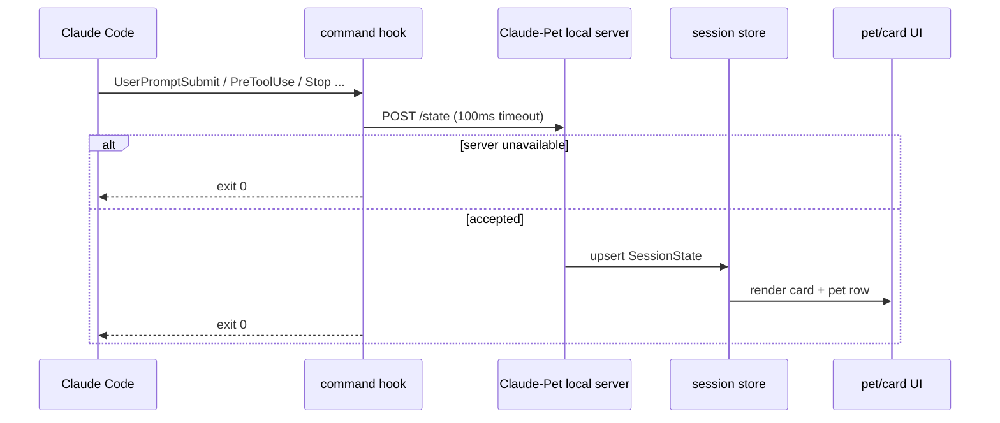
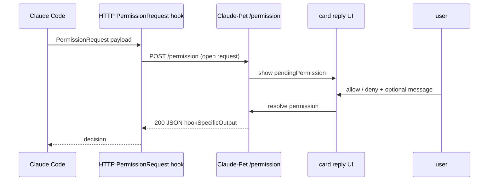

# Claude Code Integration: Hooks and Local Server Protocol

> Basis: Anthropic official [Claude Code hooks](https://docs.anthropic.com/en/docs/claude-code/hooks) · [settings](https://docs.anthropic.com/en/docs/claude-code/settings), OpenAI official [Codex app settings](https://developers.openai.com/codex/app/settings) · [app commands](https://developers.openai.com/codex/app/commands) · [hooks](https://developers.openai.com/codex/hooks) · [MCP](https://developers.openai.com/codex/mcp) · [app server](https://developers.openai.com/codex/app-server)
> Related: [architecture overview](../01-architecture/overview.md), [state machine](../03-state-engine/state-machine.md), [ADR-0004](../adr/0004-reply-via-blocking-hook.md)

Claude-Pet does not patch Claude Code. Through Claude Code's official hook surface, it handles **observation via a command hook** and **replies via a blocking HTTP `PermissionRequest` hook**. This design has two goals:

1. Claude Code does not slow down or stall even when the pet is turned off.
2. Inline replies are delivered solely through the open hook response, never through terminal key injection.

## 1. Confirming the official surface

| Area | What's confirmed | Credibility |
|---|---|---|
| Claude Code hooks | Per-event matchers/hooks are configured in the settings JSON. Command hooks and HTTP hooks are the official paths. | `Verified` |
| Claude Code HTTP hooks | The hook payload is POSTed to an HTTP endpoint. A 2xx JSON body is interpreted as hook output. | `Verified` |
| Claude Code common payload | The claim that every event provides an **exact common field set** such as `session_id`/`transcript_path`/`cwd` was **refuted as over-specification (0-3)**. Capture the actual payload per event and confirm field presence. | `Inferred` (empirical capture required) |
| `PermissionRequest` output | Returns an event-specific output with `hookSpecificOutput.hookEventName="PermissionRequest"` plus a nested `decision.behavior(allow\|deny)`. **Interactive only** (not emitted under `-p` → headless uses the flat `permissionDecision` of `PreToolUse`). | `Verified` |
| OpenAI Codex pets | The Codex App officially documents Settings > Appearance > Pets and the `/pet` command. | `Verified` |
| OpenAI app server | The Codex App Server officially documents JSON-RPC 2.0 and schema generation. | `Verified` |
| OpenAI pet runtime schema | No public documentation of the pet overlay's internal card/state protocol schema was found. | `Verified` (absence confirmed) |

The OpenAI side serves as a **point of comparison**. While Codex documents its pet UX and its app/server/hook/MCP surface, the actual path by which Claude-Pet communicates with Claude Code is the Anthropic Claude Code hooks.

## 2. Installation location and configuration principles

By default, the Claude-Pet installer registers hooks in the user settings.

| Setting | Value |
|---|---|
| Target file | `~/.claude/settings.json` first. Per-project opt-in comes later. |
| state hook | Command hook. Handles every observation event briefly. |
| permission hook | HTTP hook. Registered at `http://127.0.0.1:<port>/permission`. |
| allowlist | Adds the localhost URL to the Anthropic settings HTTP hook allowlist. |
| timeout | The state POST targets 100ms; the permission timeout is set long enough to give the user time to decide. |
| uninstall | Removes only the matchers/hooks that Claude-Pet added. The user's existing hooks are preserved. |

Writing settings must be idempotent. It must not register the same hook twice, and it cleans up prior entries when the port or path changes.

## 3. Observation path: command hook -> `/state`

The command hook receives the Claude Code event payload and sends state to the local server. This POST is **best-effort**. Even on failure, the hook exits with `exit 0`.



### 3.1 Hook event mapping

The mapping derived from the official Claude Code hook events is the baseline. For state semantics and atlas rows, the [state-machine](../03-state-engine/state-machine.md) is the authoritative document.

| Hook event | `PetState` | Notes |
|---|---|---|
| `SessionStart` | `idle` | Session registration |
| `SessionEnd` | `sleeping` | Expiry candidate |
| `UserPromptSubmit` | `thinking` | Create/update card |
| `PreToolUse`, `PostToolUse` | `working` | Keep spinner |
| `PostToolUseFailure`, `StopFailure`, `ApiError` | `error` | Failure |
| `Stop` | `attention` or `error` | Promoted to `error` if an API error entry is found in the transcript tail |
| `SubagentStart` | `juggling` | In-progress state |
| `SubagentStop` | `working` | Return to in-progress state |
| `PreCompact` | `sweeping` | Compaction in progress |
| `PostCompact` | `thinking` or `idle` | Based on the prior state |
| `Notification`, `Elicitation` | `notification` | Requires user attention |
| `WorktreeCreate` | `carrying` | One-off event |

### 3.2 `/state` request body

The Claude-Pet internal protocol is explicitly versioned.

```json
{
  "protocol": "claude-pet.state.v1",
  "source": "claude-code",
  "event": "Stop",
  "sessionId": "b1d0...",
  "cwd": "/repo",
  "transcriptPath": "/Users/me/.claude/projects/.../session.jsonl",
  "state": "attention",
  "title": "Review PR #216",
  "body": "last assistant text",
  "contextPct": 55.4,
  "terminal": {
    "sourcePid": 1234,
    "agentPid": 5678,
    "tmuxSocket": null,
    "tmuxClient": null,
    "editor": "terminal"
  },
  "observedAt": "2026-06-14T00:00:00.000+09:00"
}
```

| Field | Rule |
|---|---|
| `protocol` | Guards against breaking changes. Starts at v1. |
| `event` | The original Claude Code hook event name. |
| `sessionId` | Claude Code `session_id`. The card's primary key. |
| `transcriptPath` | Claude Code `transcript_path`. Used for Stop-time body extraction. |
| `state` | The `PetState` first computed by the hook script. The server may re-validate Stop edge cases. |
| `title` | In the order `session_title` -> transcript title -> first line of the prompt. Secret redaction is mandatory. |
| `body` | Populated only at Stop. Left empty while in progress. |
| `terminal` | An identifier used solely to focus the terminal on free-form input while idle. Not used for key injection. |

### 3.3 Transcript tail

Only at the Stop moment, the end of the transcript JSONL is read to populate the card body with the last assistant text. The v1 defaults start with a cap of **256KB tail · body clamped to 2200 characters** (adjustable).

Filter rules:

| Item | Handling |
|---|---|
| assistant text | Use the last valid text as the body |
| tool_use | Excluded from body candidates |
| subagent/system-only message | Excluded from body candidates |
| API error marker | Basis for the `Stop -> error` promotion |
| secrets/path tokens | Redacted before displaying title/body |

## 4. Reply path: HTTP `PermissionRequest` -> `/permission`

When Claude Code requests a permission decision, an HTTP hook request opens. The Claude-Pet server **holds** this HTTP request, and when the user makes a choice in the UI, it returns the decision to Claude Code via that response body.



### 4.1 `/permission` response body

The response for Claude Code uses the event-specific output envelope.

```json
{
  "hookSpecificOutput": {
    "hookEventName": "PermissionRequest",
    "decision": {
      "behavior": "allow",
      "message": "allow this file only"
    }
  }
}
```

| Value | Meaning | Credibility |
|---|---|---|
| `behavior: "allow"` | Allows the requested tool/action. | `Verified` |
| `behavior: "deny"` | Denies it. | `Verified` |
| `updatedInput` | Substitutes the tool input (course correction). | `Verified` |
| `updatedPermissions` (`setMode`) | Changes the mode. Use **`acceptEdits` only** (`bypassPermissions` was dropped in 2.1.110+). | `Verified` |
| `message` | A reason/course-correction string. **The message field within decision is unverified by source** → confirm with an actual response at build time. | `Inferred` |

The response pattern of `hookSpecificOutput.hookEventName="PermissionRequest"` plus a nested `decision.behavior(allow|deny)` is `Verified`. **Blocking holds only with a 2xx + JSON body** (a status code alone is insufficient); a non-2xx/timeout/connection failure is treated as a non-blocking error and execution proceeds, `Verified` → smoke test without fail whether the §4.2 fallback prevents accidental auto-approval.

### 4.2 No-decision fallback

Claude-Pet must not synthesize an allow/deny when the user has not answered. The fallback must be **no-decision**.

| Situation | Behavior |
|---|---|
| App not running | The hook's HTTP connection fails or times out. Must fall back to Claude Code's default path. |
| DND/disabled | Does not hold the connection; handles it as no-decision. |
| User timeout | Handles it as no-decision and then clears the card's `pendingPermission`. |
| Server error | 5xx or connection close. Does not manufacture an allow/deny. |

Caution: when the server closes the connection or returns a 204 no-decision on DND/disabled/failure, Claude Code's `PermissionRequest` is assumed to fall back to the native prompt, `Inferred` (per-version behavior undetermined). Therefore, until Claude-Pet's v1 implementation **confirms via a separate smoke test whether a 204 produces the fallback expected by Claude Code**, ADR-0004's fallback test is kept as a release gate.

## 5. Local server endpoints

| Endpoint | Method | Purpose | Response |
|---|---|---|---|
| `/healthz` | GET | Hook installer and smoke test | `200 {"ok":true,"protocol":"claude-pet.v1"}` |
| `/state` | POST | Receive command hook state | Always responds fast with `204` |
| `/permission` | POST | HTTP hook hold/resolve | `200 JSON` on decision, fallback on no-decision |
| `/permission/:id/resolve` | POST | UI -> server internal resolve | `204` |

The external interface binds to loopback only. The default is `127.0.0.1`; the port is probed on conflict, but settings and the health check share the same value.

## 6. Security and harmlessness

| Risk | Policy |
|---|---|
| Permission resolve called from the external web | Loopback bind, random request id, same-process UI channel preferred |
| Sensitive info in the hook payload | Title/body redaction, log caps, debug log opt-in |
| Claude Code latency | `/state` 100ms timeout + `exit 0`; only `/permission` blocks |
| Incorrect auto-approval | Timeout/DND/error are no-decision. No allow default. |
| Key injection risk | Replies go through the hook response only. Free-form input while idle goes only as far as terminal focus. |

## 7. Pre-implementation smoke tests

1. Install a command hook in `settings.json` and confirm that `UserPromptSubmit -> /state` arrives.
2. With the app off, confirm that the command hook returns `exit 0` within 100ms.
3. Confirm that on `PermissionRequest`, an `allow` response body is actually reflected in Claude Code.
4. Confirm that `deny + message` is delivered correctly to the terminal.
5. Confirm that the Claude Code native prompt fallback is alive under DND / app absence / no-decision.
6. Confirm that with a Stop API-error transcript, the result is `error` rather than `attention`.

## 8. Remaining uncertainties

| Item | Current status | Resolution |
|---|---|---|
| The optimal HTTP representation of Claude Code no-decision | The official docs describe HTTP hook behavior, but the native prompt fallback UX needs a smoke test | Test against each actual Claude Code version |
| Free-form input in the idle state | There is no official open hook, so text cannot be pushed into the agent | Limited to terminal focus |
| OpenAI Codex pet internal protocol | No public schema | Continue observation-based reimplementation |
| error/clock card icon | Not observed in the currently available footage | Add captures for one error case and for permission-waiting/clock |
