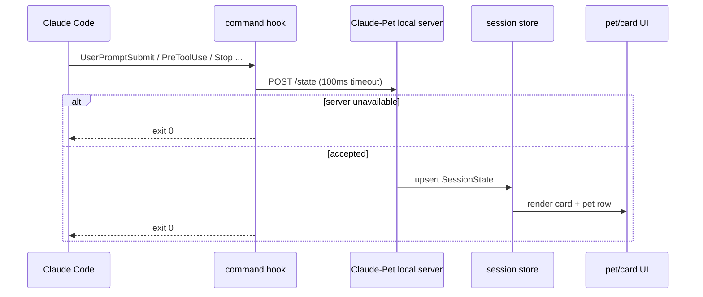
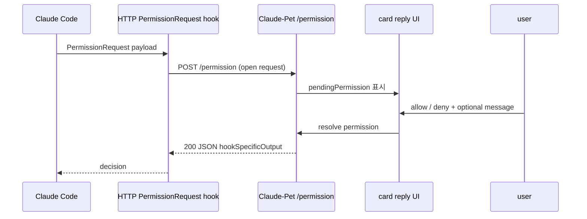

# Claude Code 연동: 훅·로컬 서버 프로토콜

> 근거: Anthropic 공식 [Claude Code hooks](https://docs.anthropic.com/en/docs/claude-code/hooks) · [settings](https://docs.anthropic.com/en/docs/claude-code/settings), OpenAI 공식 [Codex app settings](https://developers.openai.com/codex/app/settings) · [app commands](https://developers.openai.com/codex/app/commands) · [hooks](https://developers.openai.com/codex/hooks) · [MCP](https://developers.openai.com/codex/mcp) · [app server](https://developers.openai.com/codex/app-server)
> 관련: [architecture overview](../01-architecture/overview.md), [state machine](../03-state-engine/state-machine.md), [ADR-0004](../adr/0004-reply-via-blocking-hook.md)

Claude-Pet은 Claude Code를 패치하지 않는다. Claude Code의 공식 hook surface를 통해 **관찰은 command hook**, **답장은 blocking HTTP `PermissionRequest` hook**으로 처리한다. 이 구조의 목표는 두 가지다.

1. 펫이 꺼져 있어도 Claude Code가 느려지거나 멈추지 않는다.
2. 인라인 답장은 터미널 키 주입이 아니라 열린 hook 응답으로만 전달한다.

## 1. 공식 surface 확인

| 영역 | 확인 내용 | 신뢰도 |
|---|---|---|
| Claude Code hooks | settings JSON에서 event별 matcher/hook을 구성한다. command hook과 HTTP hook이 공식 경로다. | `확인` |
| Claude Code HTTP hooks | HTTP endpoint로 hook payload를 POST한다. 2xx JSON body는 hook output으로 해석된다. | `확인` |
| Claude Code common payload | 이벤트가 `session_id`/`transcript_path`/`cwd` 등을 제공한다는 **정확한 공통 필드 집합 주장은 과명세로 반박됨(0-3)**. 이벤트별로 실제 페이로드를 캡처해 필드 존재를 확인할 것. | `추정`(경험적 캡처 필요) |
| `PermissionRequest` output | event-specific output으로 `hookSpecificOutput.hookEventName="PermissionRequest"` + 중첩 `decision.behavior(allow\|deny)`를 반환. **인터랙티브 전용**(`-p` 미발화 → 헤드리스는 `PreToolUse`의 평면 `permissionDecision`). | `확인` |
| OpenAI Codex pets | Codex App은 Settings > Appearance > Pets와 `/pet` command를 공식 문서화한다. | `확인` |
| OpenAI app server | Codex App Server는 JSON-RPC 2.0과 schema generation을 공식 문서화한다. | `확인` |
| OpenAI pet runtime schema | 공개 문서에서 pet overlay의 내부 card/state protocol schema는 찾지 못했다. | `확인`(부재 확인) |

OpenAI 쪽은 **비교 기준**이다. Codex가 pet UX와 app/server/hook/MCP surface를 문서화하지만, Claude-Pet이 Claude Code와 통신하는 실제 경로는 Anthropic Claude Code hooks다.

## 2. 설치 위치와 설정 원칙

Claude-Pet installer는 기본적으로 사용자 settings에 hook을 등록한다.

| 설정 | 값 |
|---|---|
| 대상 파일 | `~/.claude/settings.json` 우선. 프로젝트 단위 opt-in은 후속. |
| state hook | command hook. 모든 관찰 event를 짧게 처리한다. |
| permission hook | HTTP hook. `http://127.0.0.1:<port>/permission`으로 등록한다. |
| allowlist | Anthropic settings의 HTTP hook allowlist에 localhost URL을 추가한다. |
| timeout | state POST는 100ms 목표, permission은 사용자가 결정할 시간을 줄 만큼 길게 잡는다. |
| uninstall | Claude-Pet이 추가한 matcher/hook만 제거한다. 사용자의 기존 hooks는 보존한다. |

설정 쓰기는 idempotent해야 한다. 같은 hook을 중복 등록하지 않고, 포트·경로 변경 시 이전 항목을 정리한다.

## 3. 관찰 경로: command hook -> `/state`

command hook은 Claude Code 이벤트 payload를 받아 로컬 서버로 상태를 보낸다. 이 POST는 **best-effort**다. 실패해도 hook은 `exit 0`으로 종료한다.



### 3.1 Hook event mapping

공식 Claude Code hook 이벤트에서 도출한 mapping을 기준으로 한다. 상태 의미와 atlas row는 [state-machine](../03-state-engine/state-machine.md)이 권위 문서다.

| Hook event | `PetState` | 비고 |
|---|---|---|
| `SessionStart` | `idle` | 세션 등록 |
| `SessionEnd` | `sleeping` | 만료 후보 |
| `UserPromptSubmit` | `thinking` | 카드 생성/갱신 |
| `PreToolUse`, `PostToolUse` | `working` | spinner 유지 |
| `PostToolUseFailure`, `StopFailure`, `ApiError` | `error` | 실패 |
| `Stop` | `attention` 또는 `error` | transcript tail에서 API error entry를 발견하면 `error`로 승격 |
| `SubagentStart` | `juggling` | 진행 상태 |
| `SubagentStop` | `working` | 진행 상태 복귀 |
| `PreCompact` | `sweeping` | compact 진행 |
| `PostCompact` | `thinking` 또는 `idle` | 직전 상태 기반 |
| `Notification`, `Elicitation` | `notification` | 사용자 주의 |
| `WorktreeCreate` | `carrying` | 이벤트성 |

### 3.2 `/state` request body

Claude-Pet 내부 protocol은 명시적으로 versioning한다.

```json
{
  "protocol": "claude-pet.state.v1",
  "source": "claude-code",
  "event": "Stop",
  "sessionId": "b1d0...",
  "cwd": "/repo",
  "transcriptPath": "/Users/me/.claude/projects/.../session.jsonl",
  "state": "attention",
  "title": "Review PR #216",
  "body": "마지막 assistant 텍스트",
  "contextPct": 55.4,
  "terminal": {
    "sourcePid": 1234,
    "agentPid": 5678,
    "tmuxSocket": null,
    "tmuxClient": null,
    "editor": "terminal"
  },
  "observedAt": "2026-06-14T00:00:00.000+09:00"
}
```

| 필드 | 규칙 |
|---|---|
| `protocol` | breaking change 방지용. v1에서 시작한다. |
| `event` | 원본 Claude Code hook event 이름. |
| `sessionId` | Claude Code `session_id`. 카드의 primary key. |
| `transcriptPath` | Claude Code `transcript_path`. Stop-time body 추출에 쓴다. |
| `state` | hook script가 1차 산출한 `PetState`. 서버가 Stop edge case를 다시 검증해도 된다. |
| `title` | `session_title` -> transcript title -> prompt 첫 줄 순서. secret redaction 필수. |
| `body` | Stop에서만 채운다. 진행 중에는 비운다. |
| `terminal` | idle 자유 입력 때 포커스만 하기 위한 식별자. 키 주입에는 쓰지 않는다. |

### 3.3 Transcript tail

Stop 시점에만 transcript JSONL 끝부분을 읽어 마지막 assistant text를 card body로 채운다. v1 기본 상한은 **tail 256KB · 본문 2200자 clamp**(조정 가능)로 시작한다.

필터 규칙:

| 항목 | 처리 |
|---|---|
| assistant text | 마지막 유효 텍스트를 body로 사용 |
| tool_use | body 후보에서 제외 |
| subagent/system-only message | body 후보에서 제외 |
| API error marker | `Stop -> error` 승격 근거 |
| secrets/path tokens | title/body 표시 전 redaction |

## 4. 답장 경로: HTTP `PermissionRequest` -> `/permission`

Claude Code가 권한 결정을 요청할 때 HTTP hook 요청이 열린다. Claude-Pet 서버는 이 HTTP 요청을 **hold**하고, UI에서 사용자가 선택하면 그 응답 body로 Claude Code에 결정을 돌려준다.



### 4.1 `/permission` response body

Claude Code용 응답은 event-specific output envelope를 쓴다.

```json
{
  "hookSpecificOutput": {
    "hookEventName": "PermissionRequest",
    "decision": {
      "behavior": "allow",
      "message": "이 파일만 허용"
    }
  }
}
```

| 값 | 의미 | 신뢰도 |
|---|---|---|
| `behavior: "allow"` | 요청된 도구/동작을 허용한다. | `확인` |
| `behavior: "deny"` | 거절한다. | `확인` |
| `updatedInput` | 도구 입력을 치환(방향 수정). | `확인` |
| `updatedPermissions`(`setMode`) | 모드 변경. **`acceptEdits`만** 사용(`bypassPermissions`는 2.1.110+ 드롭). | `확인` |
| `message` | 사유/방향 수정 문자열. **decision 내 message 필드는 출처로 미검증** → 빌드 시 실제 응답으로 확인. | `추정` |

`hookSpecificOutput.hookEventName="PermissionRequest"` + 중첩 `decision.behavior(allow|deny)` 응답 패턴 `확인`. **차단은 2xx + JSON 본문으로만 성립**(상태코드만으론 불가); non-2xx/timeout/연결실패는 non-blocking 에러로 처리되어 실행이 진행된다 `확인` → §4.2 fallback이 자동 허용 사고를 막는지 반드시 smoke test.

### 4.2 No-decision fallback

Claude-Pet은 사용자가 답하지 않았는데 allow/deny를 합성하면 안 된다. 폴백은 **no-decision**이어야 한다.

| 상황 | 동작 |
|---|---|
| 앱 미실행 | hook HTTP 연결 실패 또는 timeout. Claude Code 기본 경로로 돌아가야 한다. |
| DND/disabled | 연결을 hold하지 않고 no-decision 처리한다. |
| 사용자 timeout | no-decision 처리 후 card `pendingPermission`을 지운다. |
| 서버 오류 | 5xx 또는 연결 종료. allow/deny를 만들지 않는다. |

주의: DND/disabled/failure 시 서버가 연결을 닫거나 204 no-decision을 반환하면 Claude Code `PermissionRequest`가 native prompt fallback으로 돌아가는 것으로 본다 `추정`(버전별 동작 미확정). 따라서 Claude-Pet의 v1 구현은 **204가 Claude Code에서 기대한 fallback을 만드는지 별도 smoke test로 확인**하기 전까지, ADR-0004의 fallback 테스트를 release gate로 둔다.

## 5. 로컬 서버 endpoint

| Endpoint | Method | 목적 | 응답 |
|---|---|---|---|
| `/healthz` | GET | hook installer와 smoke test | `200 {"ok":true,"protocol":"claude-pet.v1"}` |
| `/state` | POST | command hook 상태 수신 | 항상 빠르게 `204` |
| `/permission` | POST | HTTP hook hold/resolve | 결정 시 `200 JSON`, no-decision 시 fallback |
| `/permission/:id/resolve` | POST | UI -> 서버 내부 resolve | `204` |

외부 인터페이스는 loopback만 바인딩한다. 기본은 `127.0.0.1`, 포트는 충돌 시 탐색하되 settings와 health check가 같은 값을 공유한다.

## 6. 보안·무해성

| 리스크 | 정책 |
|---|---|
| 외부 웹에서 permission resolve 호출 | loopback bind, random request id, same-process UI channel 우선 |
| hook payload에 민감 정보 포함 | title/body redaction, 로그 상한, debug log opt-in |
| Claude Code 지연 | `/state` 100ms timeout + `exit 0`; `/permission`만 blocking |
| 잘못된 자동 승인 | timeout/DND/error는 no-decision. allow default 금지 |
| 키 주입 위험 | 답장은 hook 응답만. idle 자유 입력은 터미널 focus까지만 |

## 7. 구현 전 smoke tests

1. `settings.json`에 command hook을 설치하고 `UserPromptSubmit -> /state`가 들어오는지 확인한다.
2. 앱을 끈 상태에서 command hook이 100ms 안에 `exit 0`인지 확인한다.
3. `PermissionRequest`에서 `allow` 응답 body가 Claude Code에 실제로 반영되는지 확인한다.
4. `deny + message`가 터미널에 올바르게 전달되는지 확인한다.
5. DND/앱 부재/no-decision에서 Claude Code native prompt fallback이 살아있는지 확인한다.
6. Stop API-error transcript를 넣었을 때 `attention`이 아니라 `error`가 되는지 확인한다.

## 8. 남은 불확실성

| 항목 | 현재 상태 | 해소 방법 |
|---|---|---|
| Claude Code no-decision의 최적 HTTP 표현 | 공식 문서는 HTTP hook 동작을 설명하지만 native prompt fallback UX는 smoke test 필요 | 실제 Claude Code 버전별 테스트 |
| idle 상태 자유 입력 | 공식 열린 hook이 없으므로 에이전트에 텍스트를 밀어 넣을 수 없음 | 터미널 focus로 제한 |
| OpenAI Codex pet 내부 protocol | 공개 schema 없음 | 관찰 기반 재구현 유지 |
| error/clock card icon | 현재 제공 영상에서 미관찰 | 에러 1회, 권한 대기/clock 캡처 추가 |
